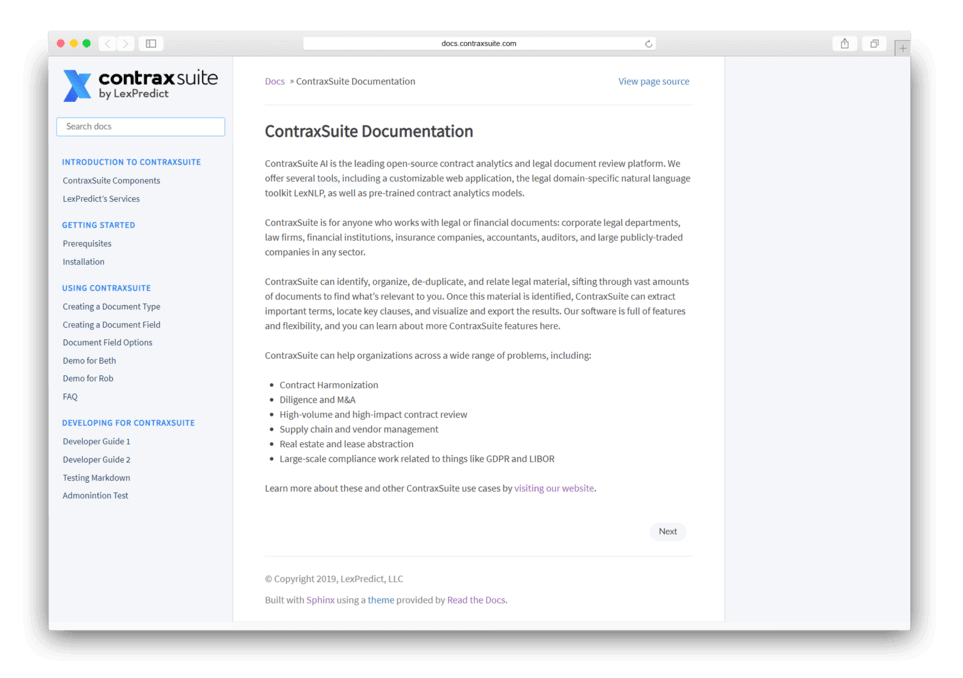
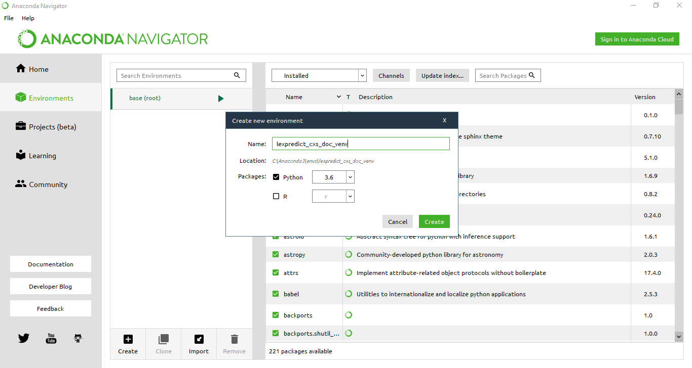
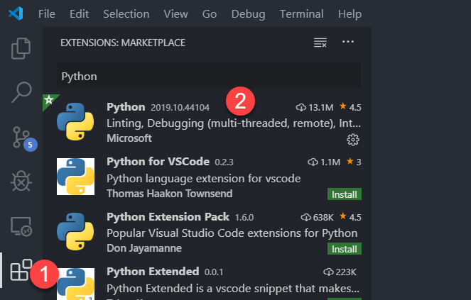

# ContraxSuite Sphinx Documentation

This guide aims to help documentation writers configure their local environment so they may contribute how-to guides to the ContraxSuite documentation corpus. ContraxSuite uses [Sphinx](https://www.sphinx-doc.org/en/master/) to generate static documentation pages.



### Table of Contents
- [ContraxSuite Sphinx Documentation](#contraxsuite-sphinx-documentation)
    - [Table of Contents](#table-of-contents)
    - [Project Links](#project-links)
    - [Sphinx](#sphinx)
    - [Assumptions](#assumptions)
    - [Downloading the Documentation](#downloading-the-documentation)
    - [Configuring Virtual Environments](#configuring-virtual-environments)
    - [Configuring Visual Studio Code](#configuring-visual-studio-code)
    - [Installing Sphinx](#installing-sphinx)
    - [Editing and Adding Files](#editing-and-adding-files)
    - [Adding Tables](#adding-tables)
    - [Developers Only: Attaching Django to Sphinx](#developers-only-attaching-django-to-sphinx)
    - [Committing Changes](#committing-changes)
    - [File Organization](#file-organization)
    - [Resources](#resources)
    - [Style Guide](#style-guide)
    - [Work in Progress](#work-in-progress)

### Project Links

[CS-4402](https://lexpredict.atlassian.net/browse/CS-4402) // [Google Drive](https://drive.google.com/drive/folders/1k2VnvDqbLt7_Qy9XbzR7EhH7DHdPAmBl) // [Google Slides Presentation](https://docs.google.com/presentation/d/1D6Pj4C94m353yAkR81Y5Mfximz6hl1Frt3zVQ6WJI_I/edit)

### Sphinx

> Sphinx is a tool that makes it easy to create intelligent and beautiful documentation, written by Georg Brandl and licensed under the BSD license.
> It was originally created for the Python documentation, and it has excellent facilities for the documentation of software projects in a range of languages.

Source: [sphinx-doc](https://www.sphinx-doc.org/en/master/)

The Sphinx-generated HTML pages will host the following information:

1. ContraxSuite installation and configuration directions
2. User guides
3. Supplementatal development guides
4. Django ORM documentation 

### Assumptions

Documentation writers must have the following software installed:

* [Windows 10](https://www.microsoft.com/en-us/windows/get-windows-10)
* [Anaconda 3](https://www.anaconda.com/distribution/#download-section)
* [GitHub Desktop](https://desktop.github.com/)
* [Visual Studio Code](https://code.visualstudio.com/)

Please install these programs using the above hyperlinks if you have not done so already.

*Note:* While a documentation writer can respectively substitute Anaconda, GitHub Desktop, and VS Code with pip, git, and any other text editor, this guide largely assumes the former.

---

### Downloading the Documentation

*With [GitHub Desktop](https://desktop.github.com/)*

Screenshots coming!

1. Clone the [lexpredict-contraxsuite-services](https://github.com/LexPredict/lexpredict-contraxsuite-services) repository. ([Help](https://help.github.com/en/desktop/contributing-to-projects/cloning-a-repository-from-github-desktop))
2. Switch to the [CS-4402](https://github.com/LexPredict/lexpredict-contraxsuite-services/tree/CS-4402/) branch. ([Help](https://help.github.com/en/desktop/contributing-to-projects/switching-between-branches))

*With `git` in a terminal shell*

1. Clone the [lexpredict-contraxsuite-services](https://github.com/LexPredict/lexpredict-contraxsuite-services) repository.
```
git clone https://github.com/LexPredict/lexpredict-contraxsuite-services.git
```
2. Switch to the [CS-4402](https://github.com/LexPredict/lexpredict-contraxsuite-services/tree/CS-4402/) branch.
```
git checkout CS-4402
```

---

### Configuring Virtual Environments

*With Anaconda*

1. Open Anaconda Navigator.
2. Select "Environments" on the left-hand side.
3. At the bottom of the screen, click "Create". 
4. Name the new virtual environment something like `lexpredict_env` and make sure to use Python 3.6.



*With Python 3.6's [`venv`](https://docs.python.org/3.6/library/venv.html)*

```
python3 -m venv /path/to/new/virtual/environment
```
---

### Configuring Visual Studio Code

1. Open Visual Studio Code. 
2. Install the following extensions ([Help](https://code.visualstudio.com/docs/editor/extension-gallery)):
    - Python (Microsoft) ([Help](https://marketplace.visualstudio.com/items?itemName=ms-python.python))
    - Markdown All in One (Yu Zhang) ([Help](https://marketplace.visualstudio.com/items?itemName=yzhang.markdown-all-in-one))



3. Choose your Python virtual environmentment using the Python extension. 
   1. `File > Open Folder... ` and navigate to the `lexpredict-contraxsuite-services/documentation/docs` directory.
   2. In VS Code's File Explorer, open the `source` directory.
   3. Single-click the `conf.py` file.
   4. Running along the bottom of the VS Code window is the Status Bar. You should see text with "Python ... 64-bit" in the bottom bar.
   5. Click that text and select the correct virtual environment using the modal window.
   
        Not working? Here's an alternative way: 
     
        1. `Ctrl-Shift-P` to open the Command Palette.
        2. Type "Python: Select Interpreter".
        3. Select the correct virtual environment using the modal window.

4. Set Command Prompt as your default shell.
   1. `Terminal > New Terminal`
   2. In the terminal panel's menu bar, use the drop-down menu to "Select Default Shell"
   3. Select "Command Prompt" using the modal window.
   4. Close the Terminal Panel.

        Not working? Here's an alternative way: 
     
        1. `Ctrl-Shift-P` to open the Command Palette.
        2. Type "Terminal: Select Default Shell".
        3. Select "Command Prompt" using the modal window.

5. Get to know the general layout of VS Code.
   -  The left-hand bar featuring a handful of glyphs is known as the "Activity Bar". There you can find file explorer, search menu, Git changes, and the extensions manager.
   - A terminal panel can be opened using `Terminal > New Terminal`. The terminal panel can be docked on either the right-hand side or the bottom; simply right-click the panel's bar.
   - Markdown documents can be previewed by pressing `Ctrl-K V` or by clicking the dedicated [preview button](https://code.visualstudio.com/docs/languages/markdown). 

---

### Installing Sphinx

*With Anaconda*

1. Open Anaconda Navigator
2. Select "Environments" on the left-hand side.
3. Toggle the drop-down menu from "Installed" to "All".
4. Using the search bar, search for and install the packages listed in `requirements.txt` into your `lexpredict_env` virtual environment.

WARNING: Main project virtual env is used for generating docs during the CI build process.
         Please synchronize contraxsuite_services/deploy/base/python-requirements-all.txt with requirements.txt
         in the docs dir if making any changes in them.

*With VS Code's Terminal*

1. Open Visual Studio Code.
2. `File > Open Folder... ` and navigate to the `lexpredict-contraxsuite-services/documentation/docs` directory.
3. Select your LexPredict/ContraxSuite Python virtual environment.
4. Open a new terminal panel.
5. Type the following and press `Enter`
   ```
   pip install -r requirements.txt
   ```
   WARNING: Main project virtual env is used for generating docs during the CI build process.
            Please synchronize contraxsuite_services/deploy/base/python-requirements-all.txt with requirements.txt
            in the docs dir if making any changes in them.
---

### Editing and Adding Files

*With VS Code*

1. Open Visual Studio Code.
2. `File > Open Folder... ` and navigate to the `lexpredict-contraxsuite-services/documentation/docs` directory.
3. Add or edit existing `.rst` or `.md` files in the `source` directory.
4. If you added a new file, add it to the `toctree`.
   - Open `index.rst`. It is located in the root of the `source` directory.
   - Scroll down to the list of `toctree`s. 
   - Add the path to your new file. Exclude the file extension.
   
   Example (the *>>* shows the added file. Do not include!):

   ```
   .. toctree::
      :hidden:
      :maxdepth: 1
      :titlesonly:
      :caption: Using ContraxSuite

      guides/user/create_document_type
      guides/user/create_document_field
   >> guides/user/my_new_file
   ``` 

5. Open the terminal panel.
6. Build the project by typing the following command and pressing `Enter`.

```
make html
```
If the changes don't appear to have taken effect (preview them in *step 7*), try the following:

```
make clean && make html
```
7. You can preview your changes by opening the `build/html/index.html` file in a web browser.

8. Commit changes.

---

### Adding Tables

*In Markdown files*
1. Use an [HTML table generator](https://www.tablesgenerator.com/html_tables)
2. Enter the tabular data and add approprate formatting.
3. Copy the generated HTML and paste it into the Markdown (`.md`) file.

*In reStructuredText files*
1. Use a [plain-text table generator]().
2. Enter the tabular data.
3. Copy the generated plain-text table and past it into the reStructuredText (`.rst`) file.

Coming soon: native Markdown tables (via an extension)

---

### Developers Only: Attaching Django to Sphinx

_**Note:** Andrew Parsons doesn't have a working installation of ContraxSuite at the moment and wasn't able to set this up himself._

How-To Guides

* [How to document your Django project using the Sphinx tool](https://www.freecodecamp.org/news/sphinx-for-django-documentation-2454e924b3bc/)
* [Documenting your Django application with sphinx](https://madradavid.com/documenting-your-django-application-sphinx/)
* [Include documentation from docstrings](https://www.sphinx-doc.org/en/master/usage/extensions/autodoc.html)
* [(StackOverflow) Can't generate autodoc using Sphinx in my Django project](https://stackoverflow.com/questions/50879154/cant-generate-autodoc-using-sphinx-in-my-django-project)

In `conf.py`

```
import os
import sys
import django
sys.path.append('../../../contraxsuite_services')
os.environ["DJANGO_SETTINGS_MODULE"] = "settings"
django.setup()
```

---

### Committing Changes

_TODO: make this more verbose/clearer_

1. Open GitHub Desktop.
2. Select the files you wish to commit.
3. In the commit box, title the commit "CS-4402: _SUMMARY GOES HERE_"
4. Optionally, you can add additional information.
5. Push changes.

[Strict branching procedure](https://lexpredict.atlassian.net/wiki/spaces/CS/pages/208470017/Strict+Branching+Process+for+ContraxSuite)

---

### File Organization

*General Structure*

- All that Sphinx sees is within the `docs` directory.

- All of our documents live within the `docs/source` directory. Think of these as the "input" for Sphinx.

- All of the final HTML files live within the `docs/build` directory. Think of these as Sphinx's "output". These files are generated by running `make html`. Do not touch anything in the `docs/build` directory.


*Structures which cannot change*

- Everything that Sphinx sees **must** remain in the `docs` directory. 
- The `source` and `build` directories must keep their names; Sphinx only knows to look there.
- The `source/_static` directory is home to static assets like images (in the `source/_static/img` directory) and custom CSS files (in the `source/_static/css` directory).

*Structures subject to change per team discussion*

- All other files and directories within `source` are free to be moved about, renamed, created, and deleted. We should talk and plan the structure as a team.
- Andrew Parsons created `introduction`, `configuration`, `guides`,`guides/user`, and `guides/developer` as a rough placeholder template. These correspond to the types of content our documentation will hold—documents oriented toward installation and configuration fit under the `configuration` directory, whereas use-case guides fit under the `guides/user` directory.

---

### Resources

Markdown

This project uses the [CommonMark](https://commonmark.org/) Markdown flavor.

* [markdownguide](https://www.markdownguide.org/)
* [markdown-cheatsheet](https://github.com/adam-p/markdown-here/wiki/Markdown-Cheatsheet)
* [mastering-markdown](https://guides.github.com/features/mastering-markdown/)
* [Markdown tables generator](https://www.tablesgenerator.com/markdown_tables)
* [Google](https://www.google.com/search?q=markdown+guide)

reStructuredText

* [sphinx-docs](https://www.sphinx-doc.org/en/master/usage/restructuredtext/index.html)
* [Sphinx and RST syntax guide (0.9.3)](https://thomas-cokelaer.info/tutorials/sphinx/rest_syntax.html)
* [rest-sphinx-memo](https://rest-sphinx-memo.readthedocs.io/en/latest/Sphinx.html)
* [docutils](http://docutils.sourceforge.net/rst.html)
* [Plain text tables generator](https://www.tablesgenerator.com/text_tables)

rst vs md

* [thegreenplace](https://eli.thegreenplace.net/2017/restructuredtext-vs-markdown-for-technical-documentation/)

Sphinx, technical

* [Good video](https://www.youtube.com/watch?v=oJsUvBQyHBs)

git

*coming soon*

### Style Guide

*To be determined*

---

### Work in Progress

Decide on the optimal `make html` command.

```
-j 2

number of cores used to compile

-dirhtml

Build HTML pages, but with a single directory per document. Makes for prettier URLs (no .html) if served from a webserver.
```


