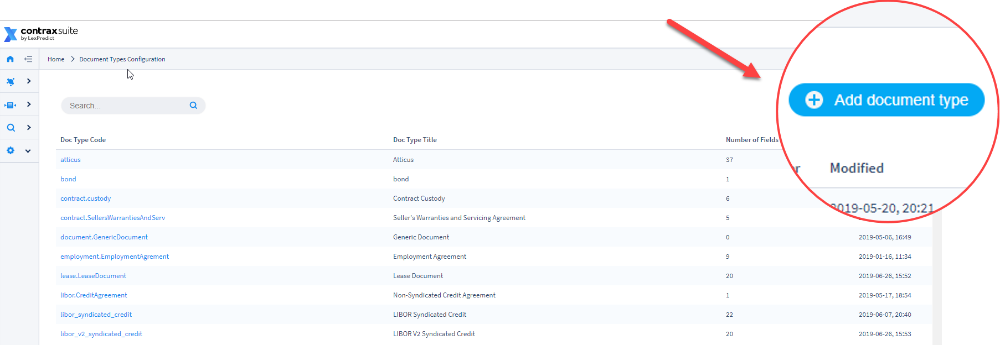
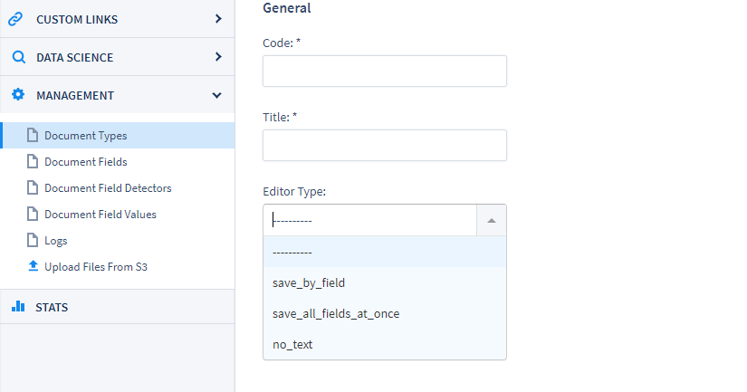
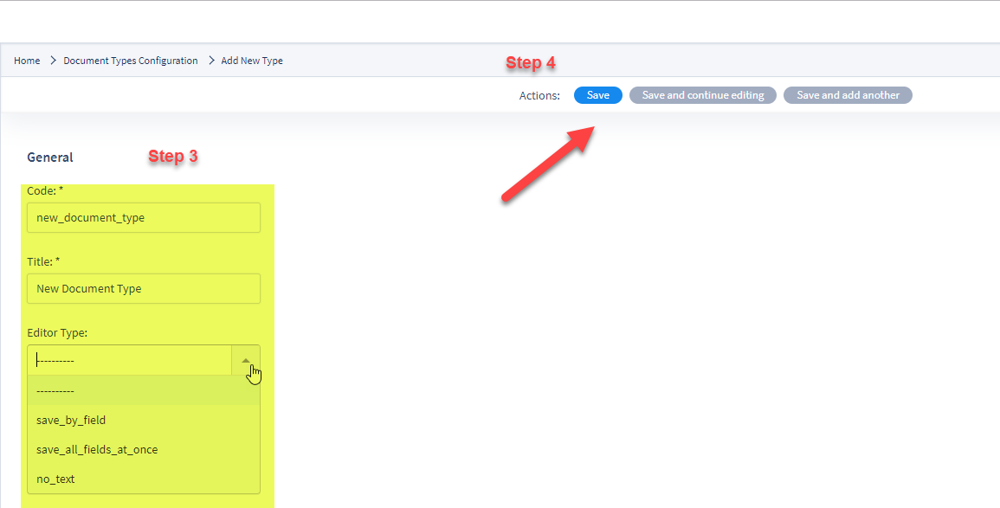

## Creating Document Types

---

Creating a Document Type in ContraxSuite allows an administrator to choose and configure a specific set of data fields that they want to work with.

ContraxSuite automatically finds sentences or sections within a specific Document Type and then extracts an appropriate value for any given Document Field assigned to that Document Type. Through the creation of unique Document Types, ContraxSuite answers the exact questions that users want answered about any document assigned to a project (*Each project in ContraxSuite has only one Document Type*).

An administrator can create a new Document Type in order to find specific Document Fields for their project. A Document Field can be any data type,from a simple calendar date, to complex clauses that require machine learning and model building. Each Document Field has a *field type*, which guides the system when searching for the right value. (Examples of field types include: ADDRESS, AMOUNT, CHOICE, COMPANY, DATE, DURATION, PERCENTAGE, GEOGRAPHY, *etc*.) 

Next, from the admin pages the user can then write Document Field Detectors for each Field. Field Detectors direct the system toward the sentence,paragraph, or section of the document in which the value being sought is located.

Document Field Detectors find the correct values for each Document Field via the following techniques:

* Defined words, terms, and phrases that LexNLP - the legal-specific dictionary - can identify based on format and context. Examples of these terms or words include words in quotations, words in parentheticals, and/or words that are near grammatical markers such as “means”.
* Field types such as percents, durations, currencies, and geo-entities all follow recognizable patterns, as do other simpler data types such as warranty clauses (a warranty clause nearly always contains the word "warranty"). ContraxSuite uses *regular expressions* to detect these sequences of symbols and characters.

---

#### How To Create a Document Type

To begin a custom project, a user must create a Document Type. Once created, a user can add corresponding Document Fields and Field Detectors for the project's different data types. Follow the steps below to create a new Document Type in ContraxSuite.

**1.** Go to __Management__ in left pane and click on link labeled “Document Types”

  

**2.** Click on “Add document type” in the upper right hand corner

  

**3.** A form will appear with three fields:

**Code**: Enter a short reference code for the Document Type. This code will be utilized in the system backend, and in the system admin section. The purpose of unique codes is to allow users to change a *title* later, without affecting how the field functions on the backend. *Note: Reviewers will not see this code reference*

The code for a Document Type should:
  * Start with a lowercase Latin letter
  * Be 50 characters or less
  * Contain only Latin letters, digits, and/or underscores. **You cannot have spaces in codes.** Use an underscore "_" instead of spaces to separate words in a code. Alternatively, you can capitalize each word in the code phrase (*e.g.*, "documentCodeNumberOne")

**Title**: This is how the name of the Document Type will be displayed in the frontend of the admin pages and in ContraxSuite projects. This title is what reviewers and other frontend users will see.

**Editor Type**: This dictates how the fields within this Document Type will be saved.
  The three choices for editor type are:
  * `save_by_field`: This selection means that reviewers will be required to individually save each field value they enter. This is the best solution for an administrator who wishes to require users to add annotations to every field.
  * `save_all_at_once`: This selection allows reviewers to save field values all at once, using one button on the page. This is the best solution for administrators who do not want reviewers to correct, edit, or add annotations, but simply want reviewers to update values.
  * `no_text`: **Reviewers will not be able to see the text of documents; only the data fields.**

  

**4.**	Click the “Save” option that best suits your workflow.

Creating a Document Type is only the first step. Once you've created a Document Type, to start using it in a meaningful way you will need to create and add unique Document Fields to be included in the Document Type. Document Fields represent the data points you want extracted from any document labeled as that Document Type. [Click here to read more about creating Document Fields](../power_users/create_document_field).