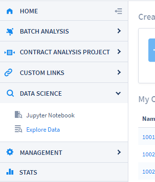
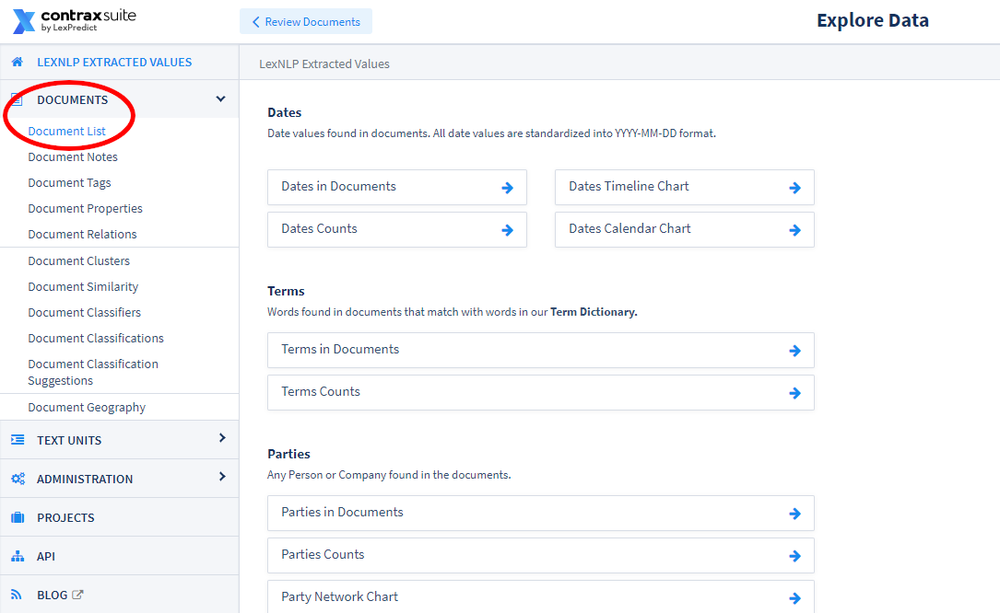
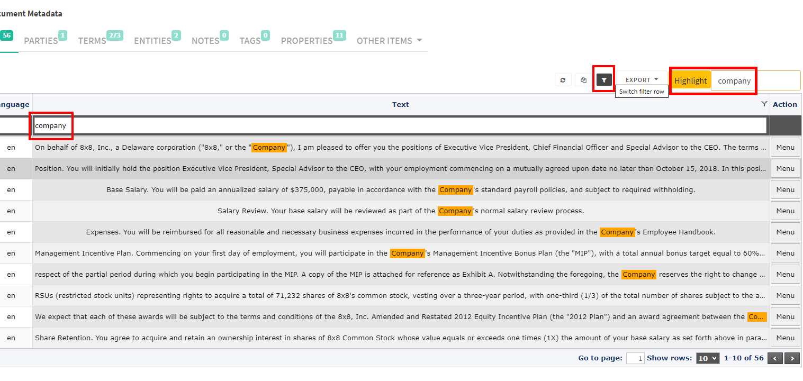
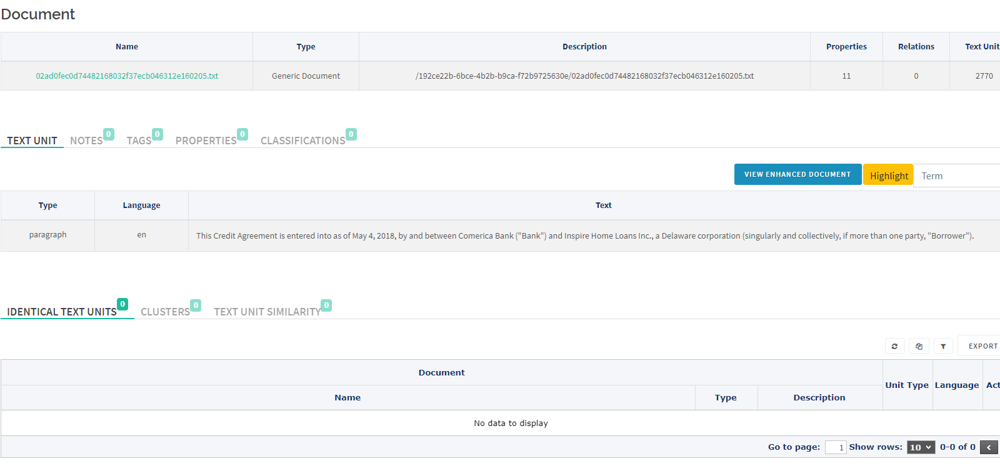

## Field Detection Examples

When creating a Document Field, you choose a Text Unit Type (Sentence, Paragraph, or Section), and the Field Detectors work on the sentence, paragraph, or section level. Field Detectors use their set criteria to search for a Text Unit Type that matches the criteria specified in the Field Detector. Below are some examples of Field Detectors, and what kinds of values they will return.

**Document Field**:
* _Name_: “Rogue Found”, 
* _Type_: Related Info, 
* _Text Unit Type_: Sentence
* _Document Field Detector_: Include Regexps: "rogue"

This Field Detector would find any *sentence* in which the word “rogue” was written, and return a highlight/annotation to the Related Info Field labeled "Rogue Found".

We could easily modify this Document Field's Text Unit Type to "Paragraph":

**Document Field:**
* _Name_: “Rogue Found”, 
* _Type_: Related Info, 
* _Text Unit Type_: **Paragraph**
* _Document Field Detector_: Include Regexps: "rogue"

This change would result in the Field Detector highlighting/annotating the whole paragraph - instead of just the one sentence - in which the word "rogue" occurred.

This is an important distinction to consider when you are extracting something like a date. For example:

**Document Field:**
* _Name_: "Rogue Found"
* _Type_: **Date** 
* _Text Unit Type_: Sentence
* _Document Field Detector_: Include Regexps: “rogue”

This Document Field Detector will find the *sentence* that contains ***both*** a date found by LexNLP, ***and*** the word "rogue". However, this Field Detector will not find one without the other, so if we know that sometimes the date we need is *not* in the same sentence as the word "rogue", but only in the same *paragraph,* we may instead want the Field Detector written in the following way:

**Document Field:**
* _Name_: "Rogue Found"
* _Type_: Date 
* _Text Unit Type_: **Paragraph**
* _Document Field Detector_: Include Regexps: "rogue"

As a general rule, a sentence ends with a period, and a paragraph ends with a line break. In reality, analysis is not always this straightforward, and complexities and variance will arise due to different document types and different formats (*e.g.*, PDF vs. DOCX vs. TXT files) and different text formatting (*e.g.*, line breaks, spaces, tabs).

Any given text in a document is stored both as a sentence and a paragraph. Sometimes a paragraph may be exactly equal to a sentence,but of course a sentence will often be just one sentence in a larger paragraph. The best way to be sure that ContraxSuite will correctly parse a "sentence" versus a "paragraph" is to check the actual text units after processing a given document.

There are two ways to check how ContraxSuite has parsed the text units in a document.

* **Document Annotation Page LexNLP Sentence Review:** If your sentence happens to have a LexNLP value in it (a date, definition, duration, currency, *etc.*), you can go to the Quick Data tab from the Annotator page to see the values LexNLP returned. The LexNLP locators are run by default, and displayed at the sentence level, which means the whole sentence will be highlighted.

* **"Explore Data" Review:** If the Quick Data tab does not show highlights on the sentence in question - or if your concern is with paragraphs, not sentences - you can go to the Explore Data view of the document and find the text units to see where they start and end.

#### Finding Data With "Explore Data"

If LexNLP locators did not show the data you hoped to have automatically extracted in the Quick Data tab of the Annotator, it's time to navigate to the Explore Data section of ContraxSuite. This is one of the major differences between ContraxSuite and similar products on the market. If the software hasn't found what you wanted, there are other tools you can bring to bear.

**1.** Start by navigating to "Data Science" in the main menu (left pane), clicking "Explore Data"

  

**2.** Next, Click on "Documents" and click on "Document List".

  

**3.** You should now see a list of all the documents that have been uploaded to your ContraxSuite project. Click on any document to open it up in the data explorer. Then click on the Filter icon to open up the Filter bar. With the filter bar, you can easily view only the Text Units in the document that contain the term you search for. You can also type the word in the "Highlight" bar to more easily see where the word is in each sentence in the Grid View.

  

**4.** Once you have found the Text Unit in question, either the sentence or paragraph, you can see the full text of the sentence or paragraph via hover-over, or by selecting **Menu > View Text Unit**.

  

**It is recommended you search at the sentence level, only up to paragraphs, if you find there is no way to identify the exact sentences you need. Contact support for assistance if you believe you need to detect "section" Text Unit Types.**