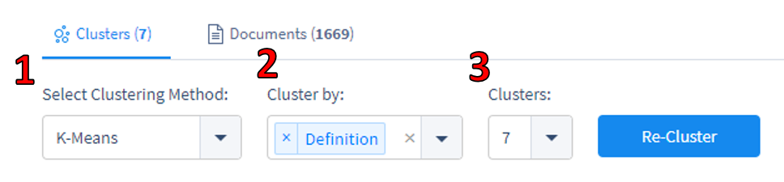
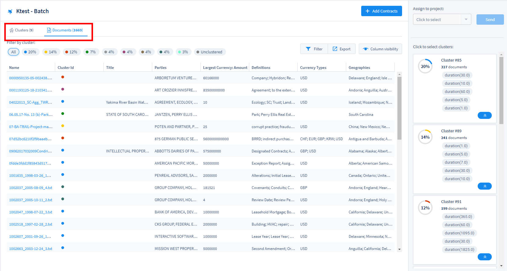
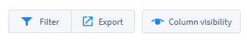
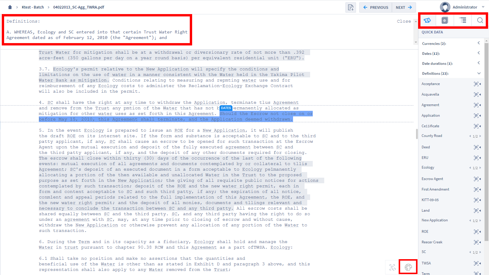
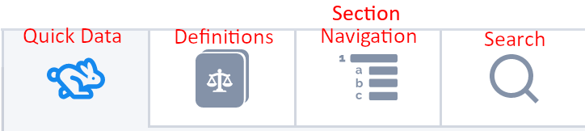
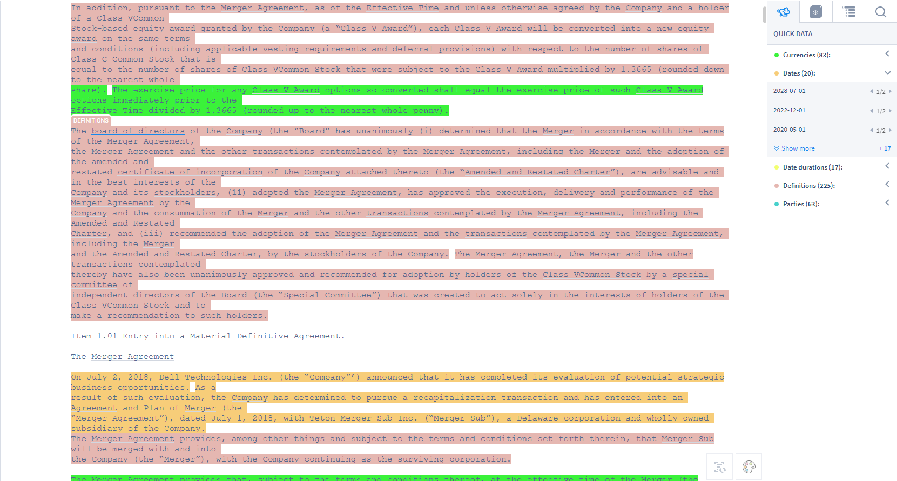
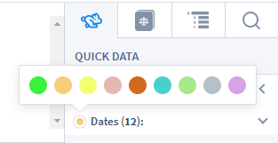

## Batch Analysis

Batch Analysis projects are great for anytime a user is not sure what types of documents they have, and need to perform identification and triage of documents before organizing them and continuing on to Contract Analysis.

---

#### Clustering

Any Batch Analysis project comes with the ability to view the documents in that project arrayed as a series of clusters.

Clustering provides a visual aid for reviewers who don't yet know exactly what kinds of documents are in their project, and who want to know more about the types of documents in that project, and the terms, clauses, and provisions in those documents.

Opening any Batch Analysis project will take you to the Clustering screen first. On the Clustering screen are a few different ways to manage your Batch Analysis project.

  

In this image we see a cluster map of the documents in a project. The clusters are mapped and color-coded based on the parameters that a user chooses from the controls in the top left of the Clustering screen.

  

**1. Select Clustering Method:** There are three different clustering methods a user can implement. Each method provides a slightly different picture of the data. The outbound links listed here provide more information on these three clustering methods.
  * [K-means Clustering](https://en.wikipedia.org/wiki/K-means_clustering)
  * [Minibatch K-means Clustering](https://www.geeksforgeeks.org/ml-mini-batch-k-means-clustering-algorithm/)
  * [Birch Clustering](https://en.wikipedia.org/wiki/BIRCH)

**2. Cluster by:** You can choose which "Quick Data" elements your chosen clustering method will use to produce the clusters. **Note: You can select more than one in order to produce more specific clustering.**
  * Term
  * Currency name
  * Currency value
  * Date
  * Definition
  * Duration
  * Party
  * Geoentity

**3. Clusters** Finally, you can choose how many clusters you wish to see. Each cluster will be assigned a different color. This can be especially useful if you know, for example, that you have documents from four separate countries, or three different types of documents, or eight different clients. This is also important when choosing how and where to send clusters to Contract Analysis projects.

---

#### Sending Clusters to Contract Analysis Projects

To send a cluster to an already existing Contract Analysis project, simply find the cluster you want to move in the right pane, and click on it. A blue highlight should appear around that cluster's information.

  

Next, use the drop-down menu at the top right of the screen (top center, above) that says, "Assign to project". All Contract Analysis projects that you have access to will be listed in the drop-down. Clicking "Send" will send those documents out of the Batch Analysis and into the chosen Contract Analysis project for more in-depth review and training.

Once your Contract Analysis project has all the documents you want to send to it from the Batch Analysis, you can [start reviewing those documents](./document_review).

---

#### Batch Document View

Clicking the "Documents" tab in the top left of a Batch Analysis Project will take you to the Document Grid View.

  

In the Document Grid View, documents are listed in a grid with Field Types organized by column. In the top left of the Document Grid View, there is a color code for each cluster, and each document will have a colored circle that matches the cluster it is in.

In the top right of the Document Grid View, there are several options for changing the view.

  

* **Filter:** This option allows you to filter the Document Grid View using individual searches for any of the visible columns. For example, typing "<5000000" in a Currency Field will show only those documents that have extracted currency values of under 5,000,000. Use in combination with **Column Visibility** to conduct targeted searches within an entire project of documents.
* **Export:** You can export a spreadsheet of all the data contained in the Document Grid View.
* **Column Visibility:** Change which Fields are visible in the Document Grid View. Use in combination with **Filter** to conduct targeted searches within an entire project of documents.

Clicking a document's name in the Document Grid View (left-most column) will open that document in the **Annotator**. Once you've opened a document in the Annotator, you will see that document's text displayed in plain text, with Fields and Field values displayed in the index on the right pane of the main viewing window. The Annotator displays the highlighted text from which ContraxSuite has automatically extracted data. The highlights in the main pane show where the data was found in the document, while the index on the right pane shows which Fields extracted the data.

  

There are several key components of the Batch Analysis Annotator screen. In the screenshot above, we see the following:

**1.** In the top left there is a collapsible "Definitions" tab, which shows definitions of specific words and phrases in the document, based on algorithms that extract information from a document's internal list of definitions.

**2.** The Annotator screen in a Batch Analysis project will default to showing "Quick Data" in the right pane. This is an index of various Terms (such as Currencies, Dates, Date Durations, Definitions, Parties, *etc.*)

There are four main viewing tabs in the Batch Analysis screen:
  

* **Quick Data**: This is an index of various Terms (such as Currencies, Dates, Date Durations, Definitions, Parties, *etc.*) in the document.
* **Definitions**: This tab will display a list of important definitions in a document, including any internal lists of definitions contained within the document itself.
* **Section Navigation**: A document's internal sections and sub-sections will be displayed in this tab so that users can quickly navigate to different sections in the document.
* **Search**: Conduct a simple search within the document for specific words or phrases.

**3.** In the bottom right of the main viewing pane, there is a palette icon.

  

This palette icon toggles between displaying different Quick Data elements in different colors. Each color is assigned to one of the default Quick Data types:

  

When colors are enabled, you can change the color associated with a Quick Data type by hovering over the color circle next to the data field in the right pane.

  