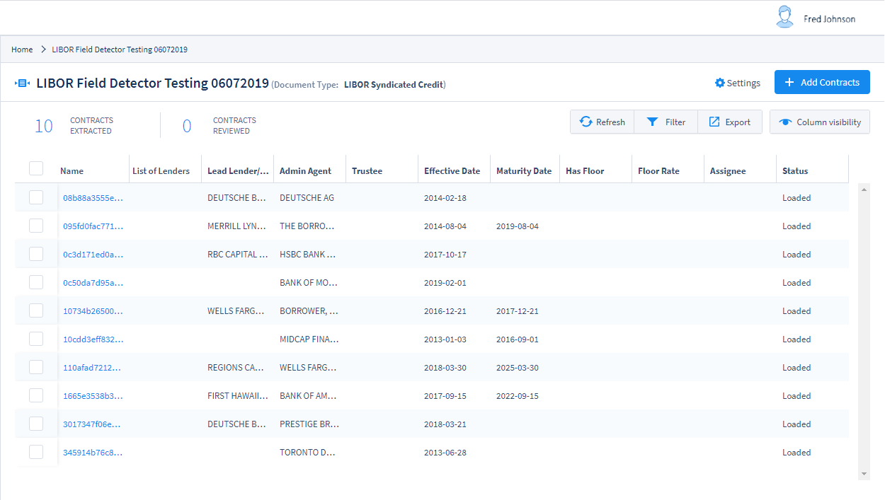
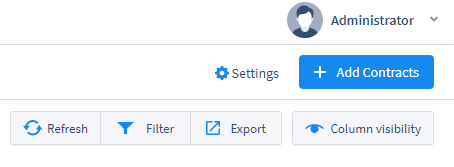
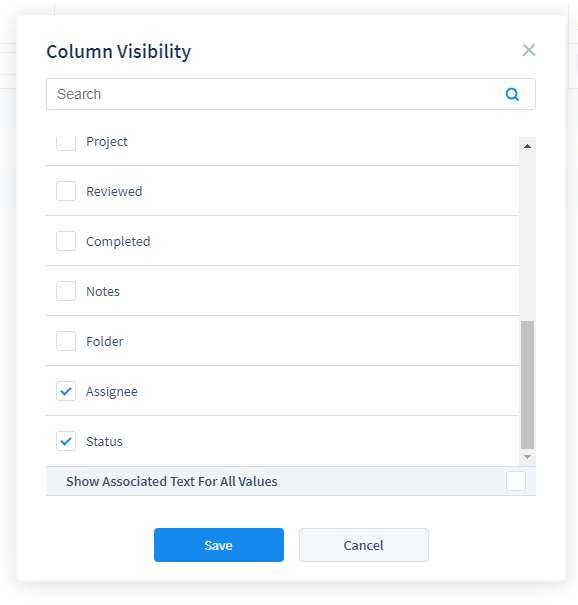
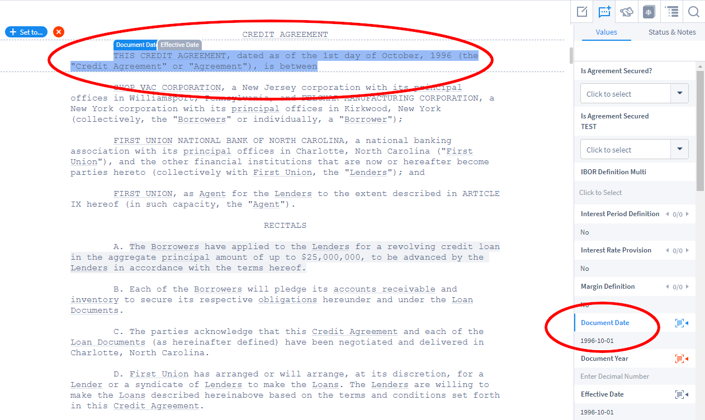

## Reviewing Documents

Document reviewers in ContraxSuite typically upload documents to Batch Analysis for quick triage before sending documents to Contract Analysis projects. Reviewers can either upload documents to a Batch Analysis, or upload them straight into a Contract Analysis project if they wish to skip the triage of Batch Analysis.

---

#### Document Grid View

Reviewers primarily use the Contract Analysis interface when they interact with documents. To get started, open up a Contract Analysis project from the main menu (left pane). You'll be taken to the Document Grid View, which looks something like this:

  

Several Field Types will be displayed automatically, such as:
* **Name:** The filename of a document
* **Assignee:** The user who has been assigned to review that particular document. Typically an admin or power user will assign reviewers to a project, but permission can be given to reviewers to self-assign documents as well.
* **Status:** There are five statuses that can be given to a document, depending on what stage it's at in a project's workflow. Statuses are manually assigned.
    * *Loaded*: A document that has been successfully uploaded to a Contract Analysis project will have this as its default status.
    * *Not Started*: A reviewer has been assigned to a document, but wishes to indicate that they have not started reviewing that document yet.
    * *In Review*: The reviewer is currently reviewing the document
    * *Completed*: The reviewer has completed reviewing the document
    * *Excluded*: The reviewer has determined that the document cannot be reviewed, or should not be reviewed. Often, this status is used when a document is not scanned and parsed correctly, or it does not belong in the project in the first place and was included by mistake.

Reviewers have several tools at their disposal for modifying the look of the Document Grid View.

  

* **Refresh:** If you've uploaded new documents, or changed other settings, but do not see the changes to the Document Grid View, click "Refresh" before troubleshooting in other ways.
* **Filter:** This option allows you to filter the Document Grid View using individual searches for any of the visible columns. For example, typing "<5000000" in a Currency Field will show only those documents that have extracted currency values of under 5,000,000. Use in combination with **Column Visibility** to conduct targeted searches within an entire project of documents.
* **Export:** You can export a spreadsheet of all the data contained in the Document Grid View.
* **Column Visibility:** Change which Fields are visible in the Document Grid View. Use in combination with **Filter** to conduct targeted searches within an entire project of documents.

  

---

#### Annotator Screen

Clicking on any document Name in the Document Grid View will open that document in the **Annotator**. Once you've opened a document in the Annotator, you will see the document displayed in plain text, with Fields and Field values displayed in the index on the right pane of the main viewing window.

The Annotator displays the highlighted text from which ContraxSuite has extracted data. The highlights in the main pane show where the data was found in the document, while the table on the right shows the extracted data in its associated Field. Relevant data is extracted and placed inside [Document Fields](../power_users/create_document_field) based on the [Field Detectors](../power_users/create_field_detectors) written by admins and power users. For example, in the picture below the phrase, **"the 1st day of October, 1996,"** was extracted as the "Document Date".

  

Field Detectors used to extract date values are assigned "Date" as their Field Type. What this means, is that ContraxSuite will search for patterns within a document's text that look like dates, in this case translating "the 1st day of October, 1996" into a standardized date format of "1996-10-01".

This is just a simple example of how Field Detectors can be trained to find and extract virtually any kind of data that might be contained in a document.

###### Manual Extraction

*unfinished*

In the event that a Field Detector *does not* correctly extract the data a reviewer is looking for in a particular field, that reviewer can use the Annotator to find the correct passage of text and highlight it. You can highlight any text in a document and assign it to a Field. This is how ContraxSuite's machine learning algorithms work:

**1.** The machine learning algorithms automatically extract data based on [Document Fields](../power_users/create_document_field) and their [Field Detectors](../power_users/create_field_detectors).

**2.** Reviewers can modify any highlighted Fields, and annotate new highlights, by dragging their cursor over the text they wish to assign to a Field. If ContraxSuite missed data, or incorrectly highlighted data, on its first automatic pass, the reviewer's correction will be used to the train and improve the system going forward.
