## User Roles

This page can help administrators and project managers determine what roles each of their team members should have.

#### Reviewers

Legal or contract review resource, able to follow links and respond to questions and prompts inside of ContraxSuite.
* Has subject matter expertise for relevant document types
* Requires minimal user interface training (experienced with other document review-type platforms)

The interface is designed to be intuitive, but there may be complications with some of the more technical aspects of ContraxSuite that are not comparable to other web-based forms and tools

---

#### Power Users and Admins

A power user of ContraxSuite is likely a subject matter expert, and possibly the project manager who directly supervises reviewers. A power user or admin likely does all of the following:
* Determine what Document Types and Document Fields are needed for a project
* Write descriptions for Fields, and configures Document Types and Document Fields
* Determine which Fields are shown or hidden, based on project needs
* Able to be trained on how to modify Fields and Field Detectors, though this may be covered by IT (see below)
* May have some IT or developer knowledge, but is not the implementation lead on the project

A business analyst or innovation resource acting as a power user or admin may have more advanced training, though not necessarily as much as a developer. Configuring additional aspects of the ContraxSuite interface may mean that a power user or admin has been trained to perform some or all of the following:
* Modify Document Fields and their descriptions
* Change the order in which Fields appear on the page, as well as their Categories
* Add automatic extraction for Fields that meet certain simple criteria, with degree of complexity dependent on sophistication of reviewers (see above)
* Add Fields with data that is not automatically extracted, [using formulas](./power_users/writing_formulas)
* Manage and update app notifications
* Add or hide Fields, and change labels, in a data visualization. May require working with IT or LexPredict resources on server-side storage of relevant data
* Connect other data visualization tools, such as PowerBI. May require working with IT or LexPredict resources to connect to database
* Build new data models, including customizable data visualization options, which may require working with IT or LexPredict resources

---

#### IT

Specialist in server maintenance, data storage, and upgrades. An IT resource will likely be responsible for all of the following:
* Responsible for server maintenance, and moving or renaming servers
* Able to implement system upgrades by taking instruction from LexPredict staff and copy-pasting code into command line
* Responsible for server size and troubleshooting for space needs on virtual machines (VMs)
* Responsible for off-server database backups

IT specialists are not mandatory on a project, as LexPredict staff can assist in these functions. An IT specialist on a ContraxSuite implementation will be given documentation, including how to upgrade their instance via a `dev` server.

---

#### Developers

Whether you use the Enterprise Edition or the Community Edition of ContraxSuite, there are many ways a developer can add their own custom code. We deploy [Jupyter](https://jupyter.org/) notebooks so that a developer can use the platform to analyze their own documents, all without setting up a complete development environment. Developers can thus:
* Use LexNLP to load a document set and retrieve all of one data type (*e.g.*, every **date** in a document set). This data can be exported to a spreadsheet or a third-party application
* Work with LexPredict resources to ensure that changes they make using Jupyter notebooks are not overwritten during system upgrades

LexPredict has various law firm clients and non-law firm clients with their own data science teams, and they choose our platform because of the many versatile developer tools we offer. For LexNLP Jupyter notebooks, [visit the LexNLP GitHub page](https://github.com/LexPredict/lexpredict-lexnlp/tree/master/lexnlp/extract/en).

---

#### How to Add New Users and Assign User Roles in ContraxSuite

In order to add users to ContraxSuite, you must have permissions set up as a "Technical Admin" with "Staff" (*i.e.*, access to the admin site).

**1.** Go to "Data Science" in the main menu and select "Document Explorer".

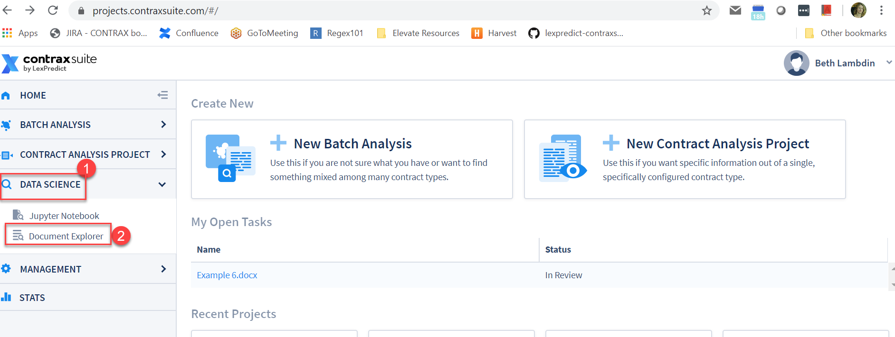

**2.** Go to Administration in the main menu on the left and select "Admin Site" from the submenu.

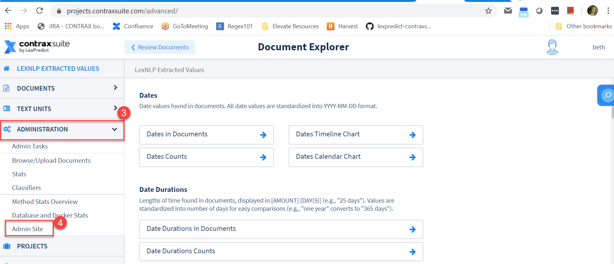

**3.** Choose "Users" from left hand column and then "Users" again from the submenu.

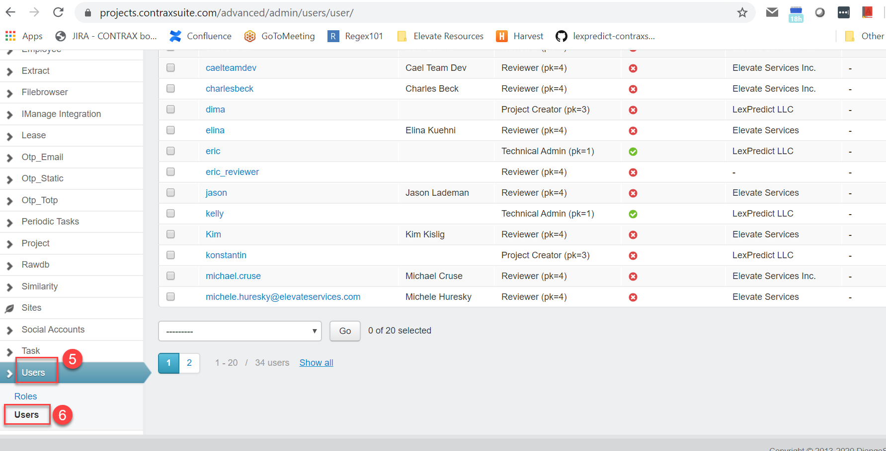

**4.** Select "Add User" from upper right hand corner

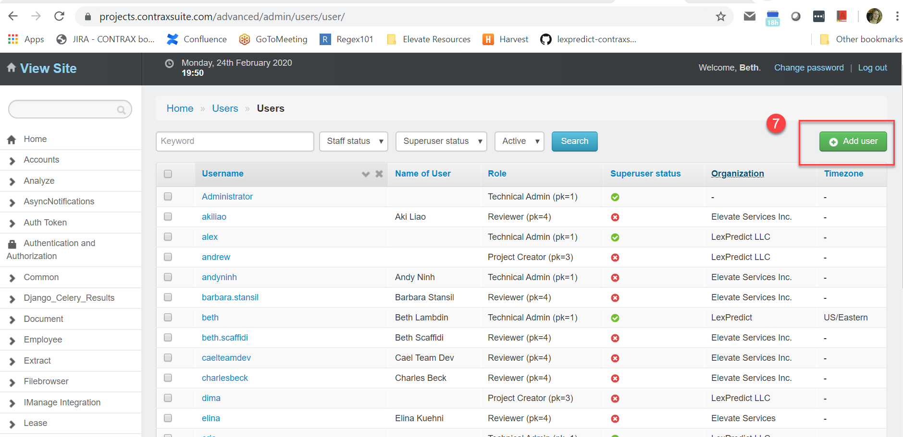

**5.** Input a Username (we recommend you make this username the same as the user's email address), and the same password twice. Click "Save".

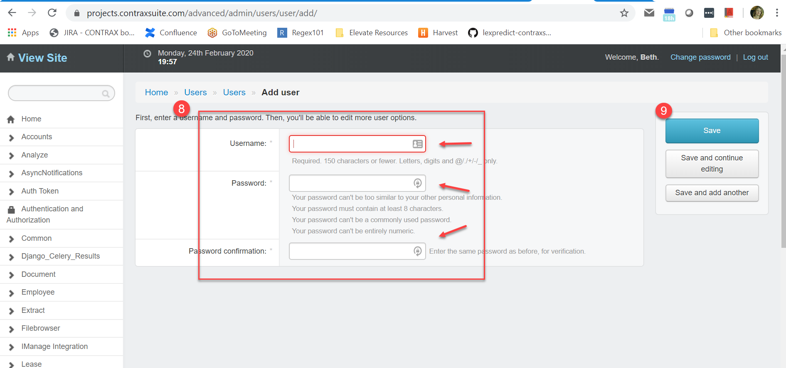

**6.** Next you will be taken to a page to fill in more information about the user, including:
  * **Role**: See User Roles/Permissions below for more information
  * **Email address**: Use the email that the user will use to login through the main UI
  * **Name**: First name and last name for the user, which will appear in the UI
  * **Active**: Should always be checked when adding a new user. This should only be unchecked when deactivating an account
  * **Staff Status**: Should be checked if a user needs to create contract types, or upload documents through the ```/advanced``` interface
  * **Superuser Status**: Only use for administrators. Should be redundant of the Technical Admin role

If you are unsure of what permission settings to use, check that an existing user has the correct permissions.

**IMPORTANT NOTE**: Users added as "Reviewers" need to be given explicit permission to work on each project through Project Settings.

#### ContraxSuite User Permissions

There are both System-level permissions, and Project-level permissions, in ContraxSuite.
**System Level Permissions**: All Users of the system are set with one of the following roles:
  * **Technical Admin (Developer/IT)**: Permission to access the Django Admin Interface, and all projects. Permission to run complete delete of items under "Soft Delete Projects" and "Soft Delete Documents".
  * **Project Creator (Cross-Over Technologist)**: Permission to create new Batch Analysis or new Contract Analysis Project, and permission to "soft delete" projects they are Project Owner of. **Note:** Does *not* have access to Django Admin interface
  * **Reviewer - Project Team Member (Attorney, Paralegal)**: Login access, with read/write data access assigned through Project-level permissions. IF YOU ASSIGN A USER TO THIS ROLE- You will need to take the additional step of adding them to Projects for them to have access.

__Project Level Permissions__: Once users are assigned a system role, they will also need to be added to any individual Projects they'll need access to. To do this the Project Admin will need to:

**1.** Open the Project and click on Settings:

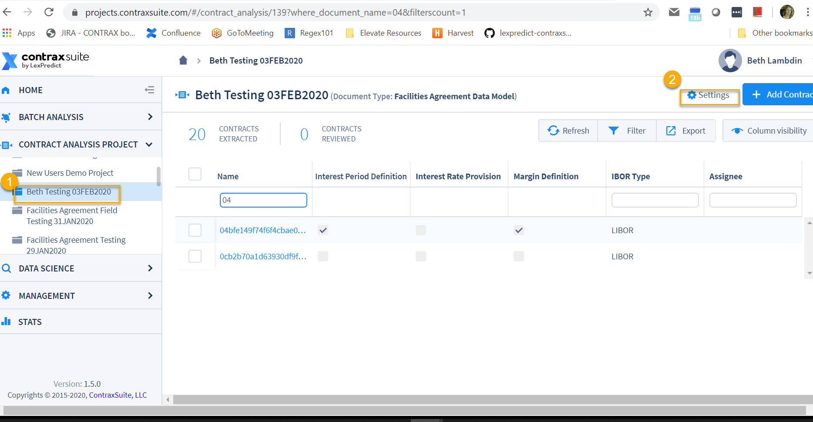

**2.** Start to type the name of the user then choose the correct name from the drop down and click the "+ Add" button

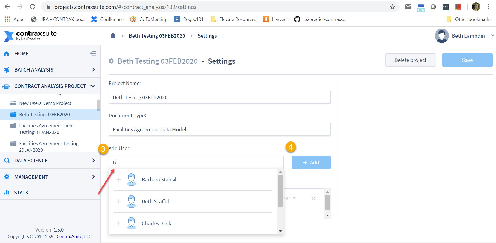

**3.** Choose the appropriate Project Role for that user within the Project

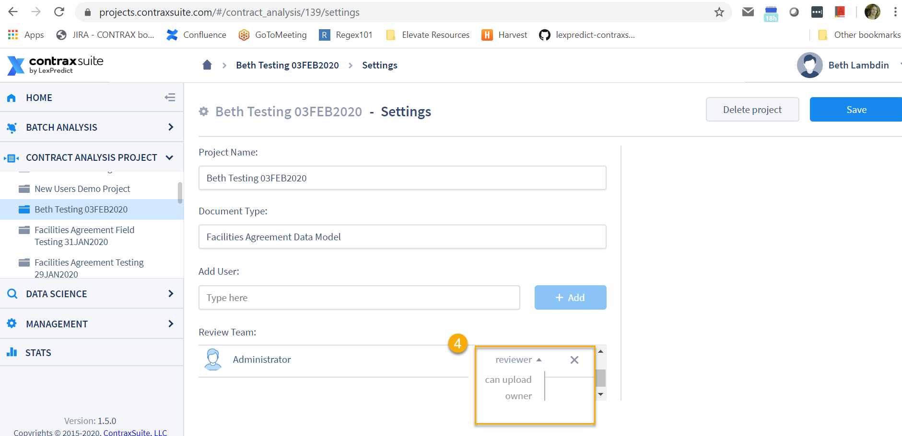

  * Reviewer: Can see documents, and write or modify Document Fields and extracted values.
  * Can Upload: All Reviewer permissions, as well as the ability to upload documents to that Project. Can also soft delete documents (**Note:** "soft delete" means a user can no longer see the document, but Project Admin still has access unless and until the Project Admin completely deletes the document).
  * Project Owner: All "Can Upload" permissions, as well as the ability to edit project settings on that Project, including adding users to the Project.

Once a user is set up, you should send them their credentials to sign in to confirm access, and then prompt them to follow instructions below to change their password.

To change your password:

**1.** Go to "Forgot Password"

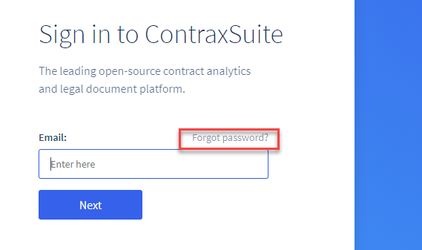

**2.** You will be prompted to input your email address and select "Request reset link" 

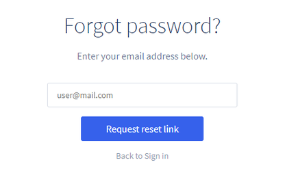

**3.** You will be sent an email with a link that will allow you to reset your password

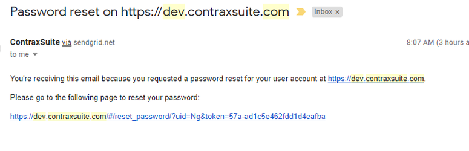

Click the link and follow the instructions to reset your password. 