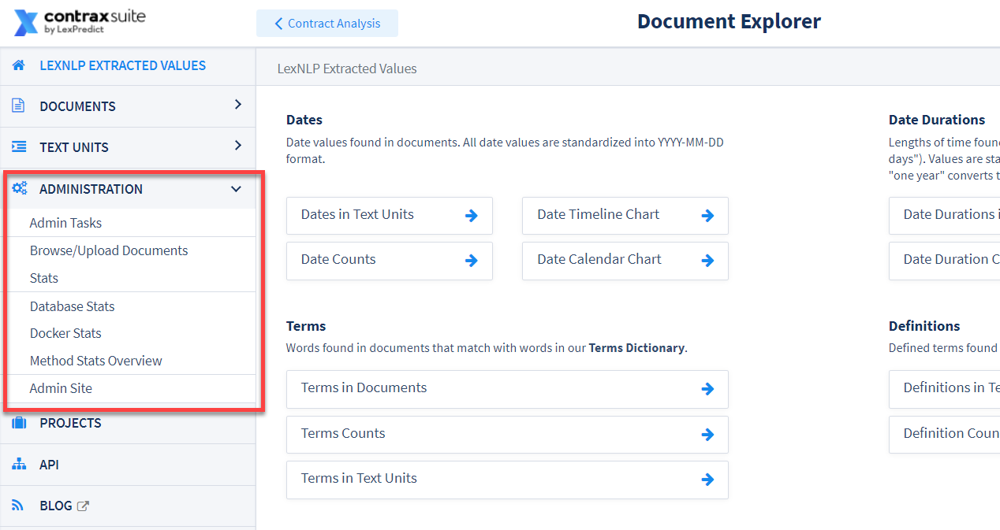
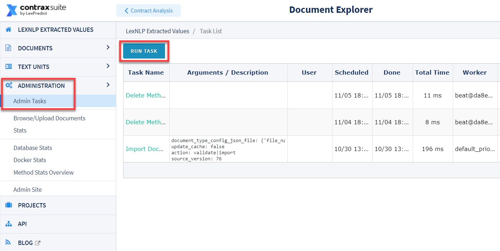
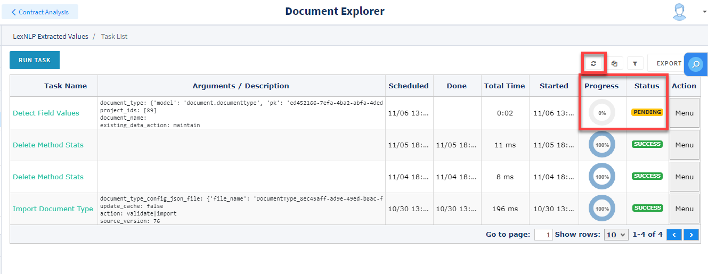

## Administration

The Document Explorer UI is the primary user interface for open source users of ContraxSuite, but it is also a powerful tool for administrators of the fully-featured, licensed version of ContraxSuite.

Many of the most powerful tools in ContraxSuite are available in the **Administration** tab of the Document Explorer.

  

---

#### "Admin Tasks" List

Administrators and Project Managers can see any currently running tasks, as well as past tasks and their statuses, in the Admin Tasks Grid. From the Admin Tasks Grid, you can also use the "Run Task" button to perform various analysis tasks.

  

Specific instructions for various Admin Tasks are below. For importing or exporting Document Types, [jump to the Importing/Exporting Document Types page](./doc_type_migration.md).

---

#### Testing and Applying New Field Detectors

You can run a "Detect Field Values" task from a Contract Analysis project, but admins can also run the "Detect Field Values" task from within the Document Explorer. To do so, enter the Document Explorer (**Data Science** > **Document Explorer** from the main interface) and select **Administration** > **Admin Tasks** to open the Admin Tasks Grid View. Follow these steps to run "Detect Field Values" for any project on your ContraxSuite instance:

**1.** Navigate to **Data Science** in the ContraxSuite main menu (left pane), and click on **Document Explorer**

**2.** In the Document Explorer, click **Administration** in the main menu and click **Admin Tasks** to open up the Admin Tasks Grid. Click the "Run Task" button in the top left of the Grid:

  

**3.** Clicking the "Run Task" button opens up a drop-down menu. Select "Application Tasks" and then "Documents:Detect Field Values":

  

**4.** A pop-up window will appear.

  

Choose a Document Type from the **Document Type** drop-down, and a project from the **Projects** drop-down on which you want to re-run all Field Detectors. You can also choose one specific document, if you know its file name (*this is not required*). In the "Existing Field Data" box, you can choose "Maintain Reviewed Data" to have the system retain data currently in the database, or you can choose "Delete all field data from the project and run fresh extraction". Finally, the "Do not write detected values to DB (only log)" checkbox lets you choose whether to write data to the database at all, or simply run this task and log the results.

**IMPORTANT NOTE**: *Be sure to select one single project, or even just one document*. If you accidentally run all Field Detectors on all projects, it will slow the system down and take a significantly longer time for the task to complete. This could even lead to a system crash.

**5.** Once you have selected your Document Type and project or specific document, click the "Process" button in the lower right of the pop-up. Refresh the Admin Task List screen using the "Refresh" button near the top-right. Task status will reach 100% when the task is complete.
    
  

**6.** Depending on how many documents are in the project you chose, this task may take a while. Refresh the page until the Task Progress is "100%" and its status is marked "Success" in green.

Developers, admins, and power users may wish to see details of the task, especially if the task fails. To see a log (and a [stack trace](https://en.wikipedia.org/wiki/Stack_trace) if the task failed), click the "Menu" button on the far right of the Grid, and then click "View Details".

  

**7.** The Task Details page will look something like this:

  

**8.** Finally, return to the project where you ran the "Documents:Detect Field Values" task and click the "Refresh" button above the Document Grid View.

  

Once you refresh the Document Grid View, you will see the new values that the new/updated Field Detectors have extracted. Click into a document in the Annotator to view any new annotations.

---

#### Text Unit Similarity

The Document Explorer provides many opportunities to review and analyze Entities at the text-unit level. One particularly powerful tool within the Document Explorer is the ability to search and compare text units to each other.

To see a similarity analysis of the text units in a project, and build a list of text units that you can compare within ContraxSuite (or output into a format like `.xslx` or `.csv`), you first need to run a Text Unit Similarity task. Follow the steps below to run Text Unit Similarity tasks.

**1.** In the Document Explorer, go to the **Admin Tasks** Grid, then select **Run Task** > **Application Tasks** > **Similarity: Identify Similar Documents/Text Units Based on Text**

   

**2.** In the pop-up window, you'll be asked to take the following actions:
   
* Check "**Identify similar Text Units**" (you can also run Document-level similarity with "**Identify similar Documents**")
* Choose a Similarity Threshold between 50 and 100. For the best results, we recommend using a threshold of 75, which is also the default value here. If you find that the results are too dissimilar, you can increase the Similarity Threshold and run the task again. If you prefer to cast a wider net after reviewing initial results, lower the threshold and run the task again.
* Check "**Use TF-IDF**" to normalize data, and increase the speed of the task.
* If you want to start an analysis from scratch, check “Delete existing Similarity objects”. Uncheck this box to retain previous Similarity objects.
* Choose a project in "Restrict to project." **It is critical that you select a project, otherwise, the task will be run on your entire server and will take significant time to complete and may result in a crash**.

  

**3.** Make sure that the task successfully completed by checking the status bar at the far right:

  

**4.** Return to the Text Unit List view, and turn on filters using the icon at the top right of the Grid. You can click the various column headings to filter in different ways.
  
  

**5.** When you have identified the target text unit for which you want to see similar text units, click the Menu button to the far right of it and select "View Details".

  

**6.** The "Text Unit Detail" page displays various data points and information about the specific text unit. Most prominently, once the Text Unit Similarity task has completed, a Text Unit Detail page will show a list of identical text units at the bottom of the page.

  

*Below, a close-up view of a list of similar text units.*

  

**7.** Another way to view the Similarity object created by the Similarity Task is by going to "Text Units" in the main menu and clicking "Text Unit Similarity".

  

**8.** The Grid on the Text Unit Similarity page will display columns for "Text Unit A" and "Text Unit B", with a corresponding Similarity score comparing the two.

  

---

For information on setting and changing passwords, or setting up notifications and subscriptions, [jump to the "Passwords and Notifications" page](./pass_notif).
