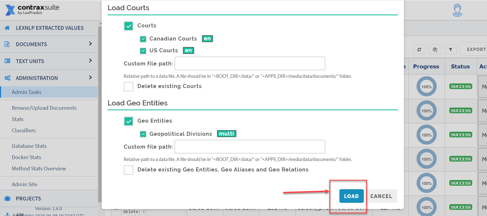

## Custom Term Sets 

ContraxSuite utilizes the Terms Dictionary of LexNLP to automatically extract thousands of relevant Terms from your contracts. ContraxSuite comes pre-loaded with these default Term Sets, which include terms related to [Generally Accepted Accounting Principles (GAAP)](https://en.wikipedia.org/wiki/Generally_Accepted_Accounting_Principles_(United_States)), the [Financial Accounting Standards Board (FASB)](https://www.fasb.org/home), and [Black's Law Dictionary](https://thelawdictionary.org/), to name just a few.

Some ContraxSuite admins may want more freedom with the platform. To that end, ContraxSuite allows admins to upload custom Term Sets. Have a LIBOR- or GDPR-related project that requires more precise extraction of related Terms? Do you have some contracts that are written in another language? You can customize your instance of ContraxSuite to be able to extract all the Terms you need, by creating and uploading custom Term Sets.

**Note:** Users with "Reviewer" System-Level permission cannot upload Term Sets.

Below is a step-by-step guide for creating new Term Sets, and for editing previously uploaded Term Sets.

---

#### Creating and Uploading a Custom Term Set

Default legal terms are all always extracted at document upload, and these terms are used by LexNLP extractors to find and annotate default Data Entities. ContraxSuite allows admins and power users to upload their own Term Sets, which can be selected as part of the [document upload process](../reviewers/create_manage.html#contract-analysis) so that the system extracts those custom terms in addition to, or instead of, terms in the default Term Set. (*Note: This affects clustering by Terms, and may also have an effect on machine learning down the line.*)

Below are instructions for creating and uploading a custom Term Set.

**1.** Create a `.csv` file and save it to your hard drive. This `.csv` file should contain all of your desired custom terms. Format the `.csv` file using the following template:

  

Name four columns of your CSV in the following way, and fill them with the following information:
  * **Term Locale**: Use "en-US" for standard American English terms. [Click here for more information on Language codes](https://en.wikipedia.org/wiki/Language_localisation#Language_tags_and_codes).
  * **Term Category**: Name the Term Category, which will appear in the Grid Views in ContraxSuite.
  * **Term**: The Term itself
  * **Case Sensitive**: Specify whether the Term is case sensitive, using either "TRUE" or "FALSE" as the value in this column.

**2.** From the Document Explorer, navigate to **Administration** > **Browse/Upload Documents**. Upload the saved `.csv` file here and note the name of the file.

  

**3.** Next, navigate to **Admin Tasks** > **Run Task** > **Load Data** > **Load Dictionary Data**.

  

**4.** Uncheck all the boxes that are currently checked in the "Loaded Terms" pop-up. Doing so will ensure that default Term Sets are not re-uploaded and create errors. **Note:** If you only wish to upload Term Sets that are already included with ContraxSuite, uncheck the default terms, and then check the boxes for the Term Sets you wish to upload, and then skip to Step #6.

  

**5.** Enter the file name noted in Step #2 into the "Custom file path" text box near the bottom of the pop-up.

  

**6.** Click "Load" in the lower right corner.

  

Task will begin. You can monitor the status of this upload on the Admin Tasks screen, using the refresh button in the top right to track the upload progress.

---

#### Using Uploaded Term Sets

After the Upload Task for the new Term Set completes, the Term Set can be utilized either at project creation, or in a pre-existing Project's "Settings" page.

When creating a new project: Term Sets can be adjusted in the **Advanced** panel on the project creation pop-up. Uncheck the "Use Default Term Set" checkbox to see a full list of available Term Sets.

  

When changing Term Sets in a pre-existing project: Go to the project's "Settings" page and click on the "Customize LexNLP" tab. On this tab you can uncheck the "Use Default Term Set" checkbox to change or add Term Sets to the project.

  

After adding or changing the Term Sets to use on the documents uploaded to this project, you may click the blue "Locate Terms" button in the upper right to run the new Term Set configuration on documents already in the project. (If you don't select "Locate Terms", the new Term Set configuration will only be run on documents uploaded to the project after saving these changes.)

---

#### Adding and Editing Terms to Specific Projects

**1.** Once the Upload Task has run successfully, go to the Admin Site at **Administration** > **Admin Site** in the main menu. Once in the Admin Site, select **Project** from the main menu on the left.

  

**2.** Select **Project Term Configurations** from the **Project** submenu.

  

**3.** Click "Add project term configuration".

  

**4.** Choose the Project from the drop-down. Then, choose terms from the list that you want to include in this project. **Note:** You can filter on Source and click "Choose All" below the drop-down to include all the terms from one source group (In the example image below, the user could have typed "Accounting" to filter out all non-Accounting terms). Click "Save".

  
