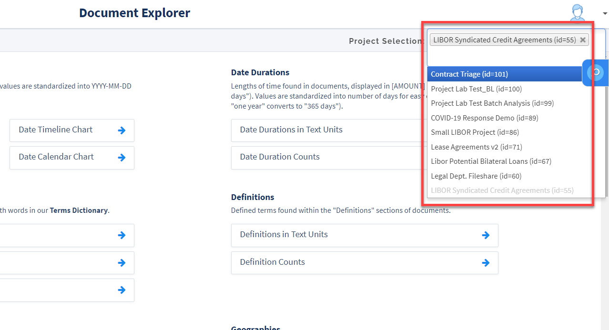
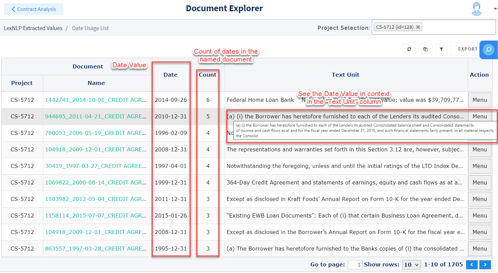
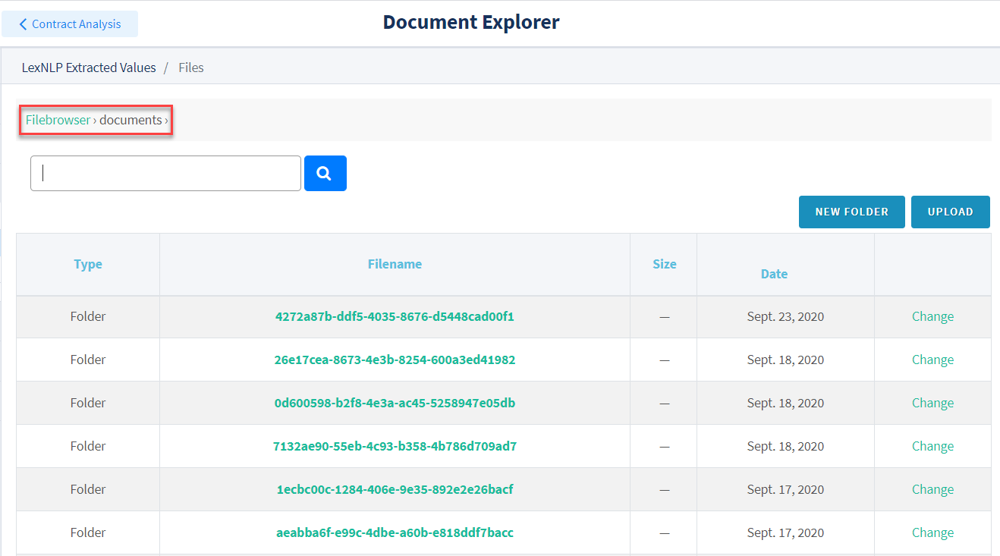
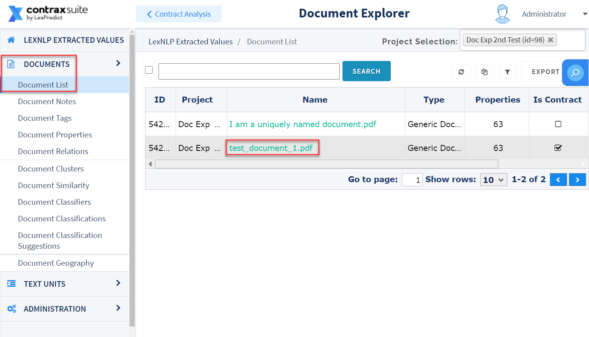

## Introduction to Document Explorer

The Document Explorer extracts many different types of data from your contracts that you can use in a variety of ways. The following types of Entities are all extracted by the Document Explorer:

* Dates
* Date Durations
* Terms
* Definitions
* Parties
* Geographies
* Amounts
* Currencies
* Citations to laws (*e.g.*, "CCPA" or "GDPR")
* Regulations (*e.g.*, Titles of the U.S. Code)
* Percents
* Ratios
* Trademarks
* URLs
* Courts
* Copyrights
* Distances

When you first enter the Document Explorer, you will see a home page ("LexNLP Extracted Values") displaying each type of data Entity. Each Entity has between 2 and 4 different buttons associated with it. Clicking these buttons will navigate you to various "Entity Usage Lists".

  

 These Entity Usage Lists can be viewed for a single project, or any number of projects. To select which projects to view Entity Usages for, use the "Project Selection" drop-down form at the top right of the screen.

  

Clicking on an Entity Usage List will navigate you to a Data Grid for that Entity. (In the image below, this is the "Date Usage List").

  

---

#### Loading Documents in Document Explorer

*ContraxSuite customers can upload documents directly into [Batch Analysis](./../reviewers/batch_analysis) or [Contract Analysis](./../reviewers/contract_analysis) projects. Open source users of the ContraxSuite Document Explorer will need to follow the instructions below to upload documents to their ContraxSuite instance.*

**1.** In the Document Explorer, click on "Projects" in the main menu, and then click "Create" to create a new project. *You can skip this step if you wish to upload documents to a pre-existing project*.

  

**2.** Enter a project name. There is also a box for an optional description of the project. (*The "Task Queues" box can be ignored, however*). Click "Create".

  

**3.** Go to **Administration** > **Browse/Upload Documents** and click the "documents" folder. The contents of the **documents** folder should be displayed on the screen, with relevant breadcrumbs in the top left.

  

  

**4.** Click **Upload** to add more documents to the folder. You'll be redirected to an Upload screen. Click "Upload A File" to browse documents on your computer and upload them to the folder.

  

**5.** Next, document upload progress bars will appear on the page. Click the "Return to uploads" button to return to the "Folders" page.

  

**6.** After the upload completes, go to **Document List** and select your project in the "Project Selection" bar in the top right to show the documents in your project.

  

You can now analyze the documents in your project. For more on the different tasks available to you once documents are finished uploading, go to [Document-Level Analysis](./documents) or [Text Unit-Level Analysis](./text_units).

---

#### Projects Page

Clicking **Projects** in the Main Menu opens up an alphabetical list of all the projects on your ContraxSuite instance. Clicking "Menu" (at right) for any project will open a small pop-up with the option to "Update Project". Clicking a project in the Projects list will also take you to the "Update Project" page. On this page, you can change the name and description of a project.

  

On the main Projects page, use the Filter icon to engage filters on the list of projects in the Grid. You can also export Grid data into a `.csv`, `.xslx`, or `.pdf` using the "Export" button.

  

Navigate to other pages addressing Document Explorer functionality:
* ["Documents"](./documents) tab (link to separate page)
* ["Text Units"](./text_units) tab (link to separate page)
* ["Administration"](./admin) tab (link to separate page)