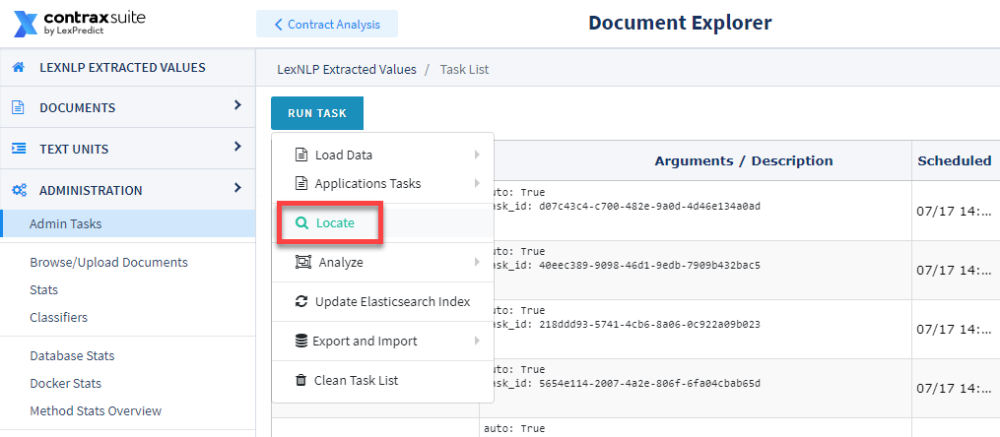
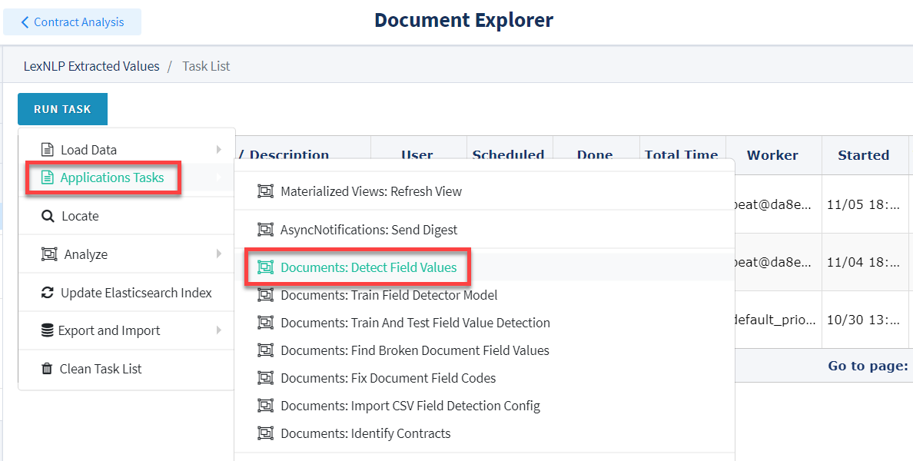
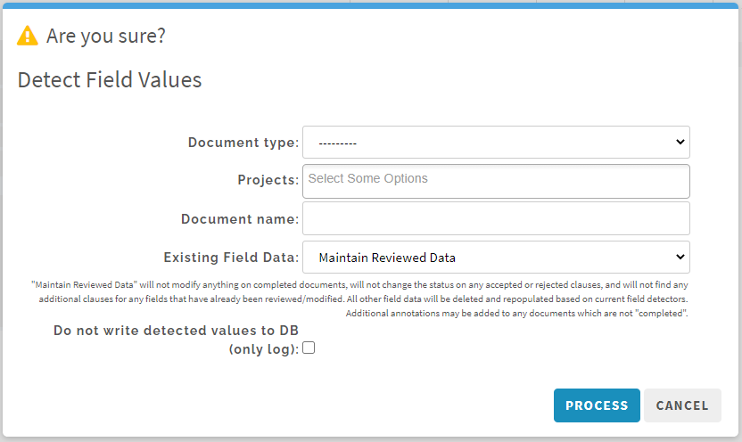

## Running Locators

ContraxSuite Power Users and Administrators often create custom Document Types, Fields, and Field Detectors for their projects. By default, ContraxSuite runs what are called "Locators", scripts within LexNLP that automatically extract data Entities like Company names, Dates, Percents, and so forth. The following list of Data Entities can be extracted by Locators:

Not all of these Entities are extracted *by default*. This is because the amount of computing resources necessary to do so can cause a ContraxSuite instance to operate too slowly. In the list below, only the data Entities highlighted in **bold** are automatically extracted: Citations, Currencies, Dates, Date Durations, Definitions, Geo-Entities, Parties, Percents, Ratios, and Terms.

* **Dates**
* **Date Durations**
* **Terms**
* **Definitions**
* **Parties**
* **Geographies**
* Amounts
* **Currencies**
* **Citations to laws (*e.g.*, "CCPA" or "GDPR")**
* Regulations (*e.g.*, Titles of the U.S. Code)
* **Percents**
* **Ratios**
* Trademarks
* URLs
* Courts
* Copyrights
* Distances

All of the un-bolded Entities listed here can be extracted in your ContraxSuite instance, and Field Detectors can be run. But you will need to initiate a separate task in the Document Explorer in order to accomplish this.

---

#### Running Locators

The Locators not highlighted in bold above are not run by default in ContraxSuite, in order to conserve server resources and process documents faster. Follow the procedure below to run one of the un-highlighted Locators, or to re-run Locators on Entities after modifying a project or a project's documents.

**1.** In the Document Explorer, navigate to **Administration** > **Admin Tasks** > **Run Task** and then find the **Locate** task.

  

**2.** A pop-up window will appear.

  

You can select "LOCATE ALL ITEMS/REVERSE CHOICE" to make bulk selections, or select each individual Entity you want to run the Locator for. **Note:** The "Delete existing data" option will automatically trigger when you make a selection. This is to avoid duplicate data that may adversely affect your results. You can also choose to only delete data, and/or not re-run Locators, for any Entities you wish.

Once you've selected which Entities types to run Locators for, select "Find in sentences" and/or "Find in paragraphs". It's recommended that you select both options for inclusive results. Finally, select from the drop-down which project to run the Locator task for, and then click "Locate".

**3.** After running the Locate task, you will need to run a "Detect Field Values" task. This will ensure that all the data extracted by the Locate task is populated in the ContraxSuite ReactUI. To run Detect Field Values, return to the **Admin Tasks** page and click **Run Task** > **Application Tasks** > **Documents: Detect Field Values**.

  

**4.** A pop-up window will appear.

  

Choose a Document Type from the **Document Type** drop-down, and a project from the **Projects** drop-down on which you want to re-run all Field Detectors. You can also choose one specific document, if you know its file name (*this is not required*). In the "Existing Field Data" box, you can choose "Maintain Reviewed Data" to have the system retain data currently in the database, or you can choose "Delete all field data from the project and run fresh extraction". Finally, the "Do not write detected values to DB (only log)" checkbox lets you choose whether to write data to the database at all, or simply run this task and log the results.

**IMPORTANT NOTE**: *Be sure to select one single project, or even just one document*. If you accidentally run all Field Detectors on all projects, it will slow the system down and take a significantly longer time for the task to complete. This could even lead to a system crash.