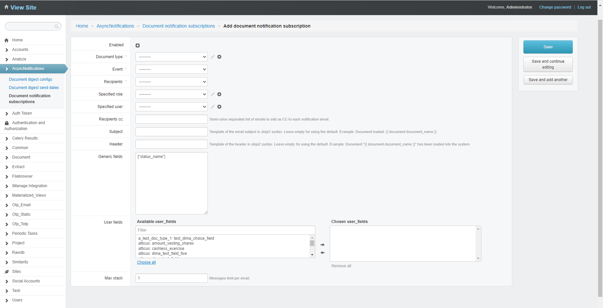
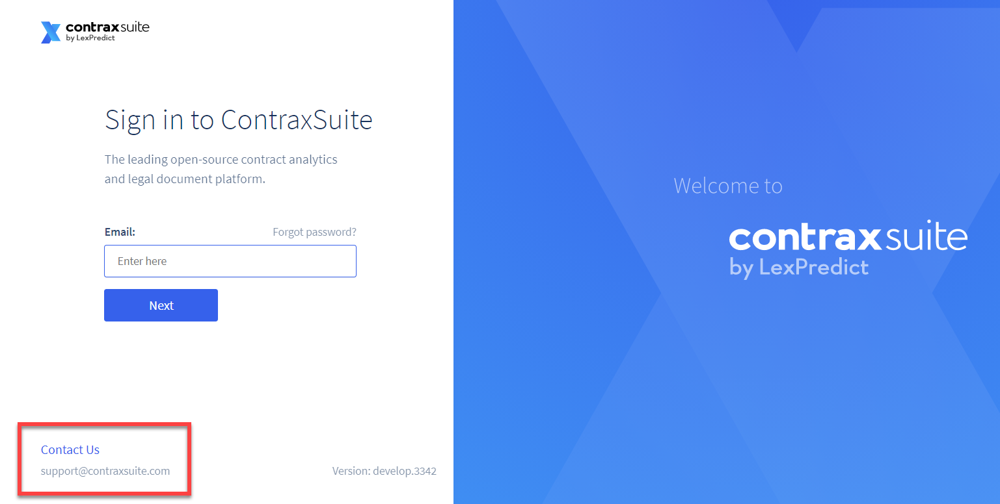
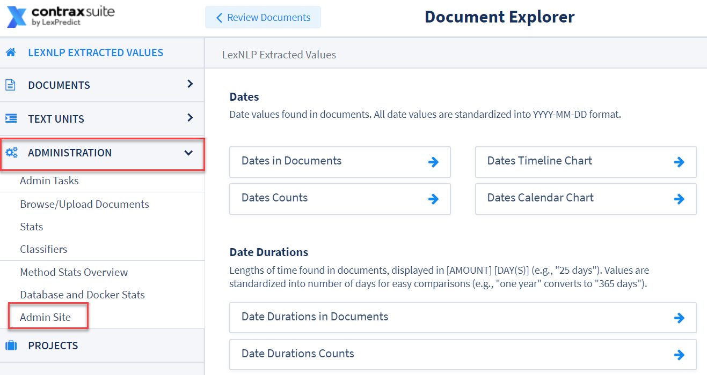

## Passwords and Notifications

This page details how to reset passwords and set up email notifications in ContraxSuite.

---

#### Reset Passwords

For information regarding user roles and permissions, refer back to [the **User Roles** page](../power_users/user_roles).

For initial password setup, refer to [the "ContraxSuite User Permissions" section of the **User Roles** page](../power_users/user_roles.html#contraxsuite-user-permissions)).

---

#### Notifications and Subscriptions

ContraxSuite can be configured to send email notifications to users. These email notifications come in two forms:
1. **Event-based notifications** notify an assignee when a document is assigned to that user.
2. **Digest notifications** notify users weekly if and only if they have any outstanding documents to review.

###### Event-Based Notifications

**1.** For an event-based notification, first navigate from the Document Explorer to the Admin Site by selecting **Administration** from the main menu and clicking **Admin Site**. This will take you to the Django Administrative interface.

  

**2.** In the Admin Site main menu, go to **AsyncNotifications** > **Document notification subscriptions**.

  

**3.** A grid of notifications will appear. Click on an existing notification, or click the green "Add document notification subscription" button in the top right to create a new notification.

  

**4.** You will be taken to the "Add document notification subscription" page.

  

Fill out the following forms to create a new notification.

* **Enabled:** Turn this notification on or off.
* **Document Type:** Select a Document Type from the drop-down. Notifications will be sent to users assigned to any documents of this Document Type.
* **Event:** Select one of the following from the drop-down:
    * Document loaded - Send this notification when documents are uploaded into ContraxSuite
    * Document Changed - Send this notification anytime a document is changed
    * Document assigned - Send this notification anytime a document is assigned to a user
* **Recipients:** Choose who will receive this notification from the drop-down:
    * Current assignee - The user (you) creating this notification will receive it
    * Specified role - Select a role from the drop-down. This notification will send to all users with this role
    * Specified user - Select a user from the drop-down. This notification will only send to the specified user
* **Specified role:** Select a role, if you chose "Specified role" for "Recipients"
* **Specified user:** Select a user, if you chose "Specified user" for "Recipients"
* **Recipient cc:** Set up a "cc" for this notification (recommended for monitoring the database). This allows a specific resource to monitor assignments.
* **Subject:** Subject line for the notification email. You can also insert the document name by entering the code `{{document.document_name}}`
* **Header:** Top line of the email. You can also insert the document name by entering the code `{{document.document_name}}`
* **Generic Fields:** The specific Fields (not particular to the Document Type) that you would like inserted into the email. For example:
    * `["assignee_name"]`
    * `["status_name"]`
* **User Fields:** Choose specific Fields of the selected Document Type that you want to include in the email. Type in the Filter bar to narrow the drop-down list to just the Document Type in question. You can only select Fields from the matching Document Type you entered in **Document Type**.
* **Max stack:** Message limit per email, with a default of 1. It is recommended that this value not be changed.

Click "Save" when you are finished. You will be returned to the AsyncNotifications Grid. Your Event-Based Notification will now appear in the Grid.

###### Digest Notifications

**1.** For digest notifications, from the Admin Site go to **AsyncNotifications** > **Document Digest Configs**. A grid of notifications will appear. Click on an existing notification, or click the green "Add document digest config" button in the top right to create a new digest notification.

  

* **Enabled:** Turn this notification on or off.
* **Document type:** Select a Document Type from the drop-down. Notifications will be sent to users assigned to any documents of this Document Type.
* **Documents filter:** Choose from a drop-down which kinds of documents to be included in this digest.
    1. Documents assigned to the destination user during the period
    2. Documents loaded into the projects the user has access to
    3. Non-reviewed documents of the destination user
    4. Uncompleted documents of the destination user
* **Still send if no docs:** Check this checkbox if you wish to send a digest email, even if there are no updates for the user.
* **Message if no docs:** *If "Still send if no docs" is checked*. Write an email message for when there are no document updates being reported.
* **Period:** Enter a period, if you selected the first option for **Documents filter**.
* **For role:** Narrow the digest to a particular permission level.
* **For user:** Narrow the digest to a specific user.
* **Subject:** Subject line for the notification email. You can also insert the document name by entering the code `{{document.document_name}}`
* **Header:** Top line of the email. You can also insert the document name by entering the code `{{document.document_name}}`
* **Generic Fields:** The specific Fields (not particular to the Document Type) that you would like inserted into the email. For example:
    * `["assignee_name"]`
    * `["status_name"]`
* **User Fields:** Choose specific Fields of the selected Document Type that you want to include in the email. Type in the Filter bar to narrow the drop-down list to just the Document Type in question. You can only select Fields from the matching Document Type you entered in **Document Type**.
* **Run at month:** Choose a month in which to run this digest. Use the numeral that corresponds to the month (*e.g.,* 1 for January, 2 for February, and so on). Separate multiple numbers with commas. Leave this form empty to run the digest every month.
* **Run at day of month:** Choose a particular day of the month to send a monthly digest. Use the numeral that corresponds to the day. Separate multiple numbers with commas. Leave this form empty to run the digest every day.
* **Run at day of week:** *Optional.* Choose the day of the week to send this digest. Use the numeral that corresponds to the day, beginning with Monday = 1, Tuesday = 2 ... Sunday = 7. Separate multiple numbers with commas.
* **Run at hour:** Choose an hour of the day to send the digest, 0 through 23. The hour you choose is in [Universal Coordinated Time (UTC)](https://en.wikipedia.org/wiki/Coordinated_Universal_Time). Leave this form empty to run the digest every hour.
* **Run at minute:** Choose a minute of the hour to send the digest, 0 through 59. This is a useful parameter for shuffling server load so that emails send on time.

**2.** Click "Save" when you are finished. You will be returned to the "Document digest config" Grid. Your new Digest Notification will now appear in the Grid.

---

#### Support Email Configuration

ContraxSuite's frontend user interface can be customized to display any email address you wish. Below is a screenshot of the default support email address (support@contraxsuite.com):

  

 

**1.** To change the support email address, enter the Document Explorer and go to **Administration** > **Admin Site**.

  

**2.** From the Django Admin Site, go to **Common** > **App vars**.

  

**3.** The "App Vars" page has a Grid that contains several application variables that can be changed and saved to customize your ContraxSuite instance. To change a support email address, find "Common" > `support_email`

  

**4.** In the form, write out the email address with double quotes (*e.g.,* "admin@yoursite.com") that you would like to display on the Login page for your ContraxSuite instance.

**5.** When you are finished typing in the email address (and finished editing any other App Vars), click the "Save" button at the bottom right of the Grid.

  