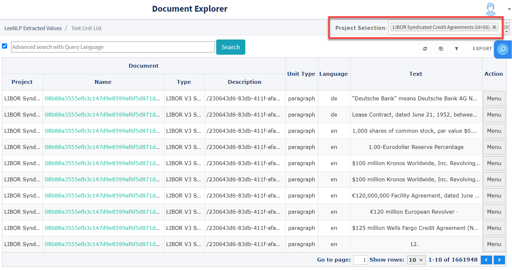
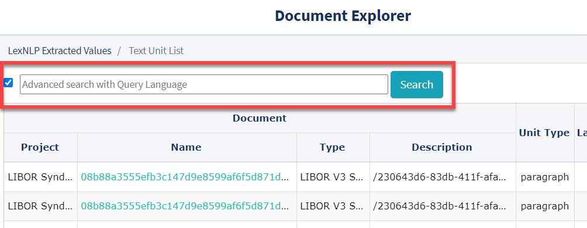

## Text Unit-Level Analysis

To view Text Unit-Level analysis, in the Document Explorer go to **Text Units** > **Text Unit List**.

---

#### Advanced Search with DjangoQL

There are many ways to use ContraxSuite to find items of interest that are already contained in the database. Sometimes, you might only need to engage Filters on one of the Documents List or the Text Unit List Grids. For a more targeted search, the ContraxSuite Document Explorer supports [DjangoQL searches](https://www.lexpredict.com/2020/10/query-language-advanced-search-contraxsuite-1-7-0/).

If you want to search for all salaries within a set of employment agreements, you might search for text units that contain any currency amount above "1,000", and that also contain the word "salary".

DjangoQL is useable both on the Documents List and the Text Unit List:
  * **Documents** > **Document List** > click the checkbox next to the search bar on the top left
  * **Text Units** > **Text Unit List** > click the checkbox next to the search bar on the top left

**1.** From the Document List or Text Unit List Grid, select a specific project in the Project Selection drop-down in the top right.

  

**2.** Select the checkbox to the left of the search bar to engage DjangoQL ("Advanced") search.

  

**3.** Start typing. A drop-down with auto-complete options will prompt you with options for values to query. (**Note:** Not all ContraxSuite tables are automatically populated when documents are loaded. Copyrights, Courts, and other data types are not automatically extracted when documents are uploaded. See the [Running Locators](../doc_exp/locators.md) page for more.

You can also click into documents or text units via the "Menu" button, or export the whole grid to `.xslx`, `.csv`, or `.pdf`.

Here are a few tips for writing queries in Advanced Search DjangoQL:
* Model Fields: These are defined in Python code within ContraxSuite. Access nested properties by typing `.`, For example:
    * `currencyusage.amount` - Currency amounts
    * `termusage.term.term` - Terms found in ContraxSuite's "Terms Dictionary"
    * `definitionusage.definition` - Terms defined in a document as definitions ("Definitions")
    * `partyusage.party.name` - Party names
     
* Strings must use regular 'double' quotation marks. Single, or 'scare' quotes, are not supported. To escape a double quote, use "\\\"
* Boolean and null values: Type `True`, `False`, or `None`. These three terms can all *only* be combined with equality operators, *e.g.,* `published = False` or `date_published = None`
    * However, `published > False` will cause an error
     
* Logical operators: `and`, `or` (**Note:** these operators will only work when typed lowercase)
* Comparison operators: 
    * `=` - is equal to
    * `!=` - is not equal to
    * `~` - contains a substring
    * `!~` - does not contain a substring
    * `<` - less than
    * `<=` - less than or equal to
    * `>` - greater than
    * `>=` - greater than or equal to
    * `in` - value is in the referenced list
    * `not in` - value is not in the referenced list

For more information on using DjangoQL to run Advanced Searches in the Document Explorer, click the "Syntax Help" link that appears in the drop-down autocomplete list in the Advanced Search bar. You can also visit the [DjangoQL page from python.org](https://pypi.org/project/djangoql/0.6.4/)

**Examples of Query Language**
* `definitionusage.definition in ("EMPLOYEE", "EXECUTIVE") and partyusage.party.name ~ "ENERGY"`
    * Finds all text units/documents that contain defined terms of either "Employee" or "Executive", and that also contain at least one party that has the word "energy" in its name

* `currencyusage.amount >=1000 and dateusage.date != None`
    * Finds all text units/documents that contain at least one currency value over "1,000", and that also contain at least one date value.

* `currencyusage != None and (dateusage != None or datedurationusage != None)`
    * Finds all text units/documents that contain some kind of currency, and that also contain either a date or a date duration value.

* `currencyusage.amount > 45000 or currencyusage.currency = "EUR"`
    * Finds all text units/documents that contain a currency amount above "45,000", or finds all text units/documents that contain currency values denominated in euros.

* `termusage.term.term in ("term") and datedurationusage.amount != None`
    * Finds all text units/documents that contain the term "term", and that also contain a numeric duration value.

**Additional Formatting Help**

DjangoQL searches are case-sensitive (our database standardizes many objects to certain capitalizations). Definitions, Companies, and Parties must be written in UPPERCASE. Dates must be written in "YYYY-MM-DD" format (*e.g.,* "January 15th, 2020" must be written as "2020-01-15")