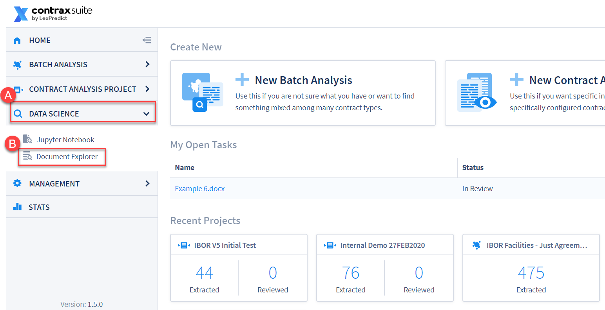
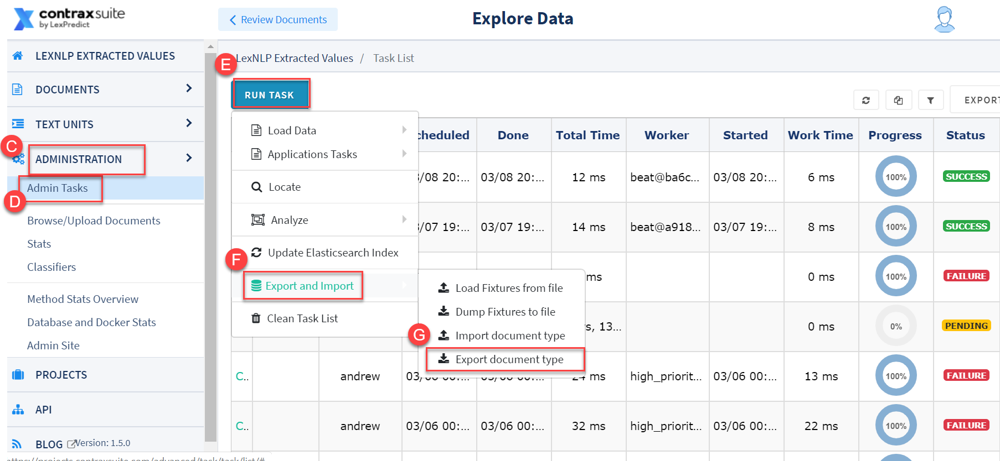
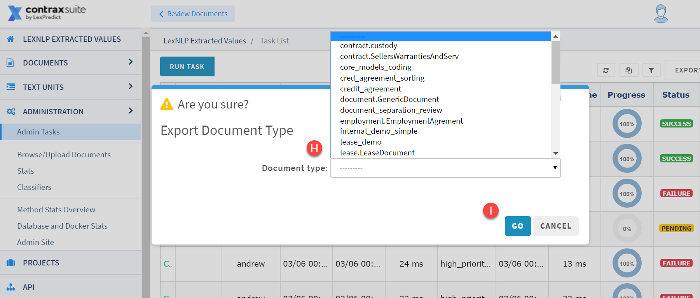
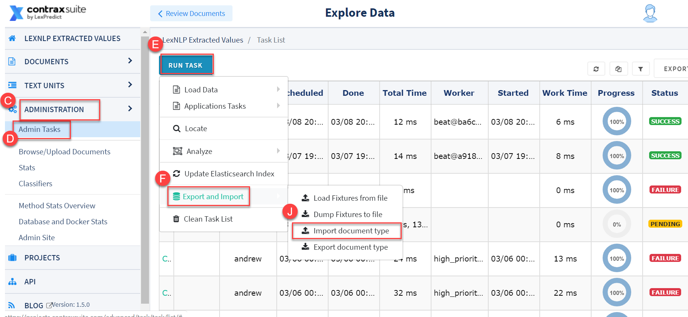
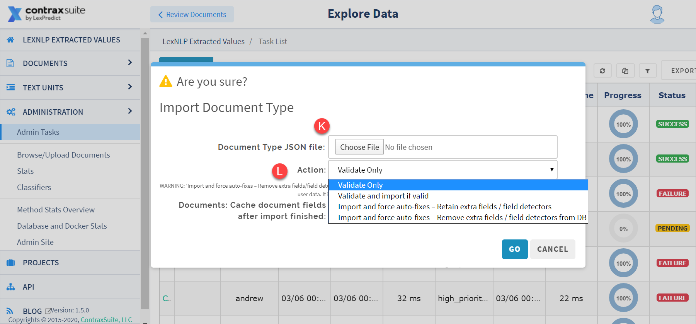
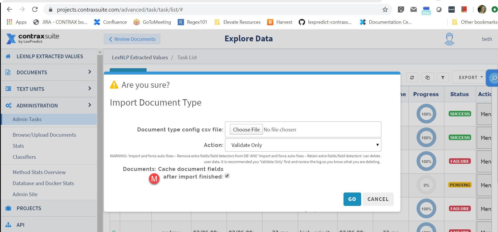

## Importing/Exporting Document Types

A Document Type incorporates the Document Fields, Document Field Detectors, and Categories assigned to it. Document Types - along with all of their Fields and Field Detectors - can be migrated to other instances of ContraxSuite to which an Admin has access. Admins can bring a new Document Type into the instance, or update an existing Document Type, using this import/export function.

---

#### Steps for Document Type Migration

*Note: Depending on the number of Fields and Field detectors associated with the Document Type, the migration process may take between 1 and 3 hours to complete*

**1.** Go to the instance that contains the version of the Document Type you wish to migrate. Go to "Data Science" in the Main Menu and navigate to the "Document Explorer" tab.

   

**2.** In the Document Explorer, choose "Administration" from the left column and then choose "Admin Tasks" from the submenu. From the "Admin Tasks" page, click on the "Run Task" button in the top left, and select "Export and Import" from the dropdown. Finally, select "Export document type."
   
   

**3.** Select the Document Type you want to export and click "Go". Find the file in your Downloads folder, and save it somewhere you can find it easily again on your local drive.

   

**4.** Go to the ContraxSuite environment where you want to transfer the Document Type that you just exported. Repeat Step #2, but this time choose "Import document type" from the menu.

   

**5.** Choose the file you wish to import, the one you saved in Step #3.

   

**6.** Once you have selected your Document Type to import, you have one of four options. This is an important decision, depending on what you need your Document Type import for.

   

**Option 1: Validate Only**. Choose this option if you want to first ascertain whether the data in a Document Type can validly be imported into your chosen environment. This option is useful if you are uncertain whether Fields and Field Detectors might accidentally be deleted during an import.

**Option 2: Validate and import if valid**. *Recommended Approach for New Document Types.* Choosing this option will allow the system to automatically resolve any conflicts. The chance of having conflicts is low with new Document Types, but this option will resolve any conflicts that may occur.

**Option 3: Import and force auto-fixes - Retain extra fields / field detectors**. *WARNING: May delete data*. For new Document Types, there is a very low risk of losing data, but if this is *not* a new Document Type, choosing to retain extra fields and field detectors will help avoid accidentally deleting data. However, if you are replacing an older Document Type with a new Document Type, this option may delete some Fields and Field Detectors.

**Option 4: Import and force auto-fixes - Remove extra fields / field detectors**. *WARNING: May delete data*. For new Document Types, there is a very low risk of losing data, so you may want to take a shortcut by choosing "Import and force auto-fixes - Remove extra fields / field detectors from DB". This will make the configuration of the Document Type in its new instance exactly like its configuration in the instance from which it was exported, even if it has to delete some Fields and Field Detectors to do so.

#### Recommended Approach For Preserving User-Entered Data

**We recommend that the following procedure be completed during maintenance hours**

**1.** Select "Validate Only" and uncheck "Cache document fields after import finished". This will not change anything in your production data or configurations; instead, you will just have a report of issues to resolve. If this Document Type has many fields, and you've been careful about only making changes on a ```dev``` instance, then you may skip to #5 below.

**2.** When this task completes, the Task list will display either "SUCCESS" or "FAILURE" on the right. Select the **Menu** button on the right, and click **View Details** to scan the log. You may have to skim the entire length of the log to find the word "ERROR". If "ERROR" does not appear in the log, then there were no issues found and you can skip to #5 below.

**3.** Potential conflicts will lead to the message "VALIDATION ERRORS HAS OCCURRED DURING VALIDATION". The validation errors will be numbered and will say something like:  
```
   "VALIDATION ERROR 1. Unable to update field #[UUID HERE] field_code_name_here.
   Field type has changed, old field type is "Amount", new field type
   is "Floating Point Number." Existing document field values become
   invalid and will be removed. User entered X values, automatically
   detected Y values. You need to set auto-fixes option to continue.
```
  
**4.** It is recommended you manually resolve all of the found issues rather than choosing any of the options that force changes (Options 3 and 4, above). Manually resolving found issues will better inform you of what you may be deleting, and is the safest method for making sure you have not deleted anything inadvertently. This could involve choosing to delete empty Document Fields, deleting extra Field Detectors that you had already deleted from the source instance, *etc*. You can see which Field is being referred to by copying the UUID onto the end of `/advanced/admin/document/documentfield/[UUIDHERE]`.

**5.** Once you have resolved all of the issues documented in the log, return to Step #6 from above. Choose "Validate and import only if valid" and leave "Cache document fields after import finished" checked.

**6.**	If you have in fact resolved all issues, the task will succeed. If you have not resolved all issues, you will have to go through the logs to determine what issues still remain. 

#### Potential Problem Scenarios in Export/Import

**WARNING: There is a lot of potential for conflicts when a Document Type exists on 2 or more servers and you wish to update one server with the configurations from another. It is STRONGLY recommended that you only ever make changes in one "development" instance, and then migrate all new configurations to your main project environment. Failing to do so will likely create extraneous Fields and Field Detectors that cannot be synchronized, and lead to downstream problems like accidental deletion of data, malfunctioning Fields, or other errors.**

Below are some examples of potential problem scenarios that can occur as a result of improper Document Type migration.

* **Conflict in Field Types:** Imagine you have a String Field that you later decide to convert to a Number Field. If you change the Field Type on the source server, the data will be deleted when you import the Field to the destination server, because a string value cannot be converted to a number. This issue will lead to downstream deletion of string data from the Field, because the system could not convert the string data in that Field to numbers.

* **Duplicate Fields:** Imagine you've created a Field with the code "rent_amount" on one server. On another server, you create another Field, using the same code "rent_amount". There is no inherent conflict when using the same Field code on two different servers, but if you try to migrate one Field to a server that already has a Field with the same code, the system will not be able to resolve the conflict and will either create a duplicate Field, or delete one of the Fields, or error out (depending on which of the four options you chose in the import step). Document Fields and Document Field Detectors are migrated and tracked based on their UUID, and not just their code, because users may change Field codes. Be sure to monitor both Field codes and Field UUIDs.

* **Extra Field Detector:** The system will always try to synchronize Field Detectors. Imagine that you did not choose an import option that forces auto-fixes, and you have 3 Field Detectors for one Field. You decide that only 1 Field Detector is worth keeping, so you delete the other 2 Field Detectors from the source instance. However, your destination instance still contains a version of the Field that has 3 Field Detectors. When you then attempt to migrate/synchronize your Field from the source to the destination instance, the system will throw a validation error. We recommend that in situations like this, you manually review and delete any extra Field Detectors from both your source server and your destination server, so that you are positive of what has been deleted. Otherwise, if/when you force auto-fixes, the system may delete Field Detectors you did not intend it to.