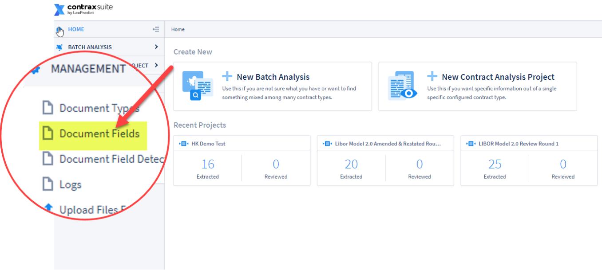
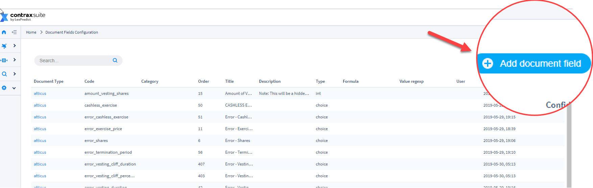
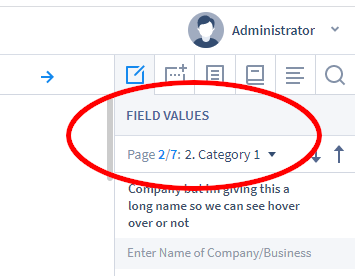

## Creating Document Fields

ContraxSuite automatically finds sentences or sections within a specific Document Type and then extracts an appropriate value for any given Document Field assigned to that Document Type. Through the creation of unique Document Fields, ContraxSuite answers the exact questions that users want answered about the data in their documents. This data gathering is what enables administrators, power users, and document reviewers to determine whether they have the data they need, and whether it's in the right place. (*A Document Type in ContraxSuite can have any number of Document Fields*).

A Document Field can be any data type, from a simple calendar date, to complex clauses that require machine learning and model building. Each Document Field has a *field type*, which guides the system when searching for the right value. (Examples of field types include: ADDRESS, CHOICE, COMPANY, DATE, DURATION, PERCENTAGE, GEOGRAPHY, *etc*. See the "Type" section below for more.)

After setting up a Document Field, an admin or power user can then write Document Field Detectors for each Field. Field Detectors direct the system toward the sentence, paragraph, or section of the document in which the value being sought is located.

Document Field Detectors find the correct values for each Document Field via the following techniques:

* Defined words, terms, and phrases that LexNLP - the legal-specific dictionary - can identify based on format and context. Examples of these terms or words include words in quotations, words in parentheticals, and/or words that are near grammatical markers such as “means”.
* Field types such as percents, durations, currencies, and geographies all follow recognizable patterns, as do other simple text-based data types such as warranty clauses (because a warranty clause nearly always contains the word "warranty"). ContraxSuite uses *regular expressions* to detect these sequences of symbols and characters.

---

#### How to Create a Document Field

**1.** Go to __Management__ in the main menu (left pane) and click on the link labeled "Document Fields"
  

**2.** Click on “Add document field” in the upper right hand corner
   
  

**3.** Use the Guide below to complete the new field based on the specific field Type that you would like to create.

---

#### General

The Document Field creation page will display a number of forms to be filled out. The first two are general information, and are **required** for any Document Field.

**Title**: This is how the name of the Document Field will be displayed in the frontend of the admin pages and in ContraxSuite projects. This title is what reviewers and all other users will see. For ideal visibility, the shorter the name, the better. Longer names will only be fully visible as a hover-over.

**Code**: As with Document Types, enter a short reference code for this Document Field. This code will be utilized in the system backend, and in the system admin section. The purpose of unique codes is to allow admins and power users to change a *title* later, without affecting how the field functions on the backend. *Note: Reviewers will not see this code reference*

The code for a Document Field should:
  * Start with a lowercase Latin letter
  * Be 50 characters or less
  * Contain only Latin letters, digits, and/or underscores. **You cannot have spaces in codes.** Use an underscore "_" instead of spaces to separate words in a code. Alternatively, you can capitalize each word in the code phrase (*e.g.*, "documentCodeNumberOne")

---

###### Type

Choose from the drop-down menu. The **Type** specifies the type of object to be extracted from the document and entered as the value for the Field. Different Document Field Types require different settings to function.

**Note:** a Field Type cannot be edited once the Field has been created (though other aspects can be - see below). Changing a Type after creation could potentially corrupt or delete existing data assigned to the Field by its Type. To change the Type after creation, you will need to create a new Field and migrate the data.

The following list describes each Type:
* **Address:** Extracts a street address from text, *e.g.*, extracting the addresses from leases.
* **Amount:** Extracts amounts. **Note:** This field *should not be used*. It was used in prior versions of ContraxSuite. **Floating Point Number**, **Integer**, or **Money** should be used, where applicable, for these kinds of values.
* **Boolean:** A field that determines whether or not the right data is in the document ("True") or not ("False").
* **Choice:** A user, or the system, chooses from a set of pre-written options (*e.g.*, a **color** field might have the options **red**, **yellow**, **blue**, and **green**). Field Detectors are set up for Choice fields in order to search for specific attributes of the data and then return one of the listed values (*e.g.*, a Field Detector has regexp to detect the words "red," or "yellow," or "blue," or "green").
* **Company:** Extracts a company name. Often used to extract the parties to an agreement (*e.g.*, a Company field for landlords, another Company field for tenants).
* **Date: Non-Recurring Events:** Extracts a date. This type is best for most date scenarios, such as start date, effective date, *etc*.
* **Date: Recurring Events:** Extracts a recurring date. For example, the sentence "Rent is due on the fifteenth of every month," would be captured as a recurring field, and typed so that the value can be placed in a calendar. Useful for due dates, such as rent payments in leases.
* **DateTime: Non-Recurring Events:** *Pending*
* **Duration:** Extracts a time duration. This value will be converted and stored as a number of days, for easier data manipulation and proper numeric comparisons (*i.e.*, "3 months" is converted to "90"; "5 years" becomes "1825"). Useful for term lengths of contracts.
* **Floating Point Number:** Extracts any number (*e.g.*, "The loan will be made with an interest of 3.25%" will result in an extracted value of "3.25").
* **Geography:** Extracts a country, state, city, *etc*. Useful for finding "governing law" clauses, for example.
* **Integer Number:** Extracts integers (*i.e.*, whole numbers, numbers without decimals). **Floating Point Number** will also extract integers, but it is recommended that users choose the most narrow Document Field possible. If you know the value will always be an integer (*e.g.*, number of children), then you should use Integer Number.
* **Linked Documents:** *Pending*
* **Money:** Extracts amounts in all forms of currency (not just USD).
* **Multi Choice:** Similar to the "Choice" Type, a Multi Choice field allows reviewers to choose multiple options. For example, a lease might have "retail," "farming," "storage," and "residential" as options, and a specific lease document specifies both farming- and storage-related attributes. Specific Field Detectors would then need to be set up to search for particulars to be returned both for a "retail" list and a "farming" list. *See [Creating Field Detectors](./create_field_detectors) for more*.
* **Percent:** Extracts percent values, including values expressed as basis points. Values are stored up to two decimal places.
* **Person:** Extracts a person's name from a document. Often used to extract employee names from an employment agreement, for example.
* **Ratio:** Extracts ratios, displays as "amount 1 / amount 2".
* **Related Info:** This field allows for unlimited selection of multiple clauses and provisions. Related Info fields are often used in place of "Yes/No" fields where the answer is "Yes" if any applicable data is found, and "No" if no applicable data is found. This field is also employed for finding large sections of text, particularly multiple separate but related sections within long documents. An example of this would be a field for "Intellectual Property Rights," which may encompass multiple passages and clauses from different sections of a document that are not necessarily adjacent, all speaking at great length, and with no well-defined extractable values *per se*.
* **String (vectorizer uses words as tokens):** If, for example, you need to extract a land PIN, and you know it will be after the exact text "HRM Land Registry Pin:" - you could write regexp in the "Value Regexp" field further down that would look for "HRM Land Registry Pin:" and take the next Y characters after it, but not the text "HRM Land Registry Pin:" itself. This Field Type can also be used when admins and power users don't necessarily want to extract any data, and just want reviewers to type in a text value themselves. For more on this, see "Field Detection: Regexp-Based" below.
* **String (vectorizer uses whole value as a token):** *Pending. Mikhail et al. are confused about the distinction between these values. **what do we say here?***
* **Long Text:** This Type of field is only used if **nothing** is being extracted, but admins or power users want reviewers to type in multiple lines of additional explanatory text. This Type is often used when admins and power users wish to write brief summaries of contracts.

After you have selected a **Type**, you will have to select a "Document Type" for this Field to be associated with.

###### Document Type

Choose which [Document Type](./create_document_type) this field will be associated with from the drop-down.

**Note:** a Document Type cannot be changed after creation of the Document Field. Doing so could potentially corrupt or delete existing data. If you need a Document Field to be assigned to a different Document Type after it's already been created, you will need to create a new Document Field.

---

Descriptions of the remaining Document Field forms are below. Depending on what type of Field you create, you will not need to fill out every form listed here. These other attributes will require additional configuration via some of the following forms:

###### Category

This sets the page that the field will be on in the Field Values tab of the Annotator screen. Choose the corresponding category from the drop-down menu, and the field will appear on that category's page of the Field Values tab. Categories allow users to organize fields into more distinct buckets, to avoid having to scroll through one long column of fields on the Annotator screen.



*View of Categories within a project in the Annotator screen*

###### Description

Include a description of the nature of the Field. This will be useful to other users for understanding a Field's purpose and parameters. This will display as a hover-over on the field name in the Annotator screen.

An example of how to write a description: You have a Field called "Start Date," and you write a description that reads "Please enter the date the term of lease is to start, not the date of the agreement."

###### Confidence

**Optional**. To be used to indicate the level of confidence necessary for the success rate of the Field Detectors when they identify values for the Field. This attribute is somewhat subjective, but can be useful for those times when admins and power users want to communicate a certain confidence level to reviewers.
* *High*: Reviewers can be confident that the correct value will be identified, extracted, and populated into the Field.
* *Medium*: Moderate confidence. The correct value is expected to be identified, extracted, and populated into the Field about half of the time.
* *Low*: Minimal confidence. Reviewers should not rely on the system to identify, extract, and populate the correct data into this Field.

###### Requires Text Annotations

Check this box if the Field should always have an annotation highlight around the sentence in which the Field's value was found.

###### Read Only

Check this box if you don't want reviewers to have the ability to modify value choices populated in this Field.

###### Default Value

If you would like this Field to be populated with a specific value by default, enter it here.

---

#### For "Choice" and "Multi-Choice" Fields Only

###### Choices

Type the value of each option that should be listed with this Field. Each option should be on a separate line inside the form. For example:

    Red
    Yellow
    Green
    Blue

###### Allow Values Not Specified in Choices

Check this box if you would like reviewers to be able to type in custom values for the Field. Taking the color example, if a reviewer found "purple" or "orange", they could write that into the Field themselves.

---

#### Frontend Options

###### Hidden Always

Check this box if you do **not** want this Field to ever be displayed to a reviewer.

Typically, this box is checked if admins and power users are creating this Field to be utilized in a formula, in which case the data in this specific Field does not necessarily need to be displayed, only calculated and left hidden until the formula from another Field is calculated and displayed.

This is also useful when an admin or power user wishes to archive a Field where data is contained, but does not need to be displayed going forward in the project.

###### Hide Until Python

Enter a ```python```-based command that indicates the conditions/dependencies (*e.g.*, "if field_a_code is not none and field_b_code is true") under which this Field should be displayed.

###### Hide Until JS

**Not configurable**. This form displays the python code from "Hide Until Python" converted into Javascript. If there is no value in "Hide Until Python" this display will be blank.

###### Display Yes/No

**For Related Info Fields only**. If this box is checked, the word "No" will be displayed for the Field if no corresponding relevant phrases have been highlighted in the document. Where phrases have been highlighted in a document, the word "Yes" will appear.

---

#### Field Detection: General

###### Value Detection Strategy

Choose from the drop-down a method for detecting values that will be populated into the Document Field. The following is a list of all available value detection strategies. The first three are by far the most commonly used:

* **Field Detection Disabled:** This creates a stop and indicates that no further searching will be done for a value. This should not be used for "Read Only" Fields, as they will be difficult to populate with data, or edit later.
* **No ML. Use Formula Only:** The system uses a manually specified formula written in `python` syntax, rather than regexp, to calculate the sought-after value for this Field. The formula can be written directly in this form, and will not require writing separate Field Detectors. As the name implies, there is no training for Fields that use this detection strategy. More information on calculated fields and formulas is below.
* **No ML. Use Regexp Field Detectors:** This is the default option. When this choice is selected, you will need to write separate instructions called [Field Detectors](./create_field_detectors), using either definition words or regexp to identify and extract the desired values into this Field. If there is no regexp written for this Field, then the extraction function will find values for this Field based on the Field Type (*e.g.*, Companies, Dates, Persons) using LexNLP extractors.
  * You can specify which value to be prioritized using Field Detectors.
  * As the name implies, there is no training for Fields that use this detection strategy.
  <br>

* **Use pre-trained text-based ML only:** Detection works similar to "No ML. Use regexp field detectors" except machine learning is used to find the sentences/paragraphs related to the Field. The machine learning model needs to be pre-trained manually via Admin Tasks in `/advanced`. The model is trained on the Field values entered by users, or detected by the machine and then confirmed by users.
* **Start with regexps. Switch to text-based ML when possible:** Use regexp Field Detectors (see "No ML. Use regexp field detectors") until there is enough data to train the machine learning model. Next, users can train the model and then switch to using it for finding sentences/paragraphs related to this Field.
* **Apply regexp field detectors to depends-on field values:** Works similar to "No ML. Use regexp field detectors" except Field Detectors are applied to the values of the other "depends-on" Fields, converted into strings (instead of applying them to sentences/paragraphs).
  * When a Field value matches the regexp, the extraction function is used on the matching Field value to find the value of the resulting Field.
* **Start with formula. Switch to field-based ML when possible:** Functions similar to "No ML. Use formula only." Until there are enough user-entered or confirmed Field values to train an ML model. Once there are enough values, the goal is to train and then switch this Field to "Use pre-trained field-based ML only".
* **Use pre-trained field-based ML only:** Works best for Choice Fields. A classifier model is trained to select one of the possible choice variants based on the values of other Fields of the document. These associations are mapped onto a *feature vector,* which is translated differently depending on the Field Type. The classifier is trained to select a choice value based on this feature vector.
  * For strings, word frequencies are used to build this vector. For Floating Point Numbers, the normalized value between the minimum and maximum values is used.
* **Use python class for value detection:** Use the `python` class specified in the "Python coded field" attribute of the "Document Field" model in the Django Admin. The `python`-coded field classes may implement the training method as well as the detection. See apps/document/python_coded_fields.py


###### Text Unit Type

This is what defines the text unit that will be searched and highlighted when a Field Detector finds the target value in a document. From least inclusive to most inclusive:
* Sentence
* Paragraph
* Section

Select the Text Unit Type that best fits this particular Field. The default Text Unit Type is "Sentence".

###### Detect Limit Unit

Choose to add an upward limit to the amount of document text ContraxSuite will search for this Document Field. For example, you can choose to only search the first 10 paragraphs of text for the value required (this often works best for values like "Company," "Execution Date," or "Parties," all of which typically appear in the first few paragraphs of a contract).

This value must be equal to or smaller than the Text Unit Type selected (*i.e.*, you cannot select a Text Unit Type of "paragraphs" and a Detect Limit Unit of "sentences"). Selecting "Limit to N document units" will use the Text Unit Type as the Detect Limit Unit.

**Note:** Cannot be used with Value Detection Strategy of "Apply regexp field detectors to depends-on field values.

###### Detect Limit Count

Set the number of "Detect Limit Units" to search from the top of the document (*e.g.*, "10")

###### Depends On Fields

**Required if the field uses calculation rather than a regexp field detector.** This will identify which of the other fields of this Document Type must be utilized in this Field's formula. Select other available Fields from the left side of the "Available" box in order to move them to the right side ("Chosen").

---

#### Field Detection: Regexp-based

###### Stop Words

Stop any detected values from being assigned to the Field via field detection (ML or regexp-based) from being returned, if a certain admin- or power user-defined "stop word" is found *anywhere* in the document. Note that this field is rarely used.

###### Value Regexep

**Required if Field Type is "String".** Value regexp is run on the sentence found - via the Field Detectors created by admin or power user - to extract a specific string value out of the sentence/paragraph/section. The following is an example to demonstrate what this might look like if a user is trying to locate PIN numbers:
1. You know that all PIN numbers have the following format: the phrase "Location PIN:" followed by 9 dights and 3 letters, no spaces
2. All PIN numbers are preceded by the following phrase: "Location PIN: 123456789PLX"
3. Your Field Detector should be written with the following regexp (*Note: The code "\s{1,5}" accounts for variable spacing between words*):
    
        "Location\s{1,5}PIN"

4. The Value regexp needed in order to extract the 9-digit, 3-letter PIN and leave out the "Location PIN:" text would be:

        (?:Location\s{1,5}PIN:)\s{1,5}(\d{9}\w{3})

For more on regular expressions, including how to write basic commands, visited [RegExr](https://regexr.com/).

#### Field Detection: Calculated Fields

**Formulas are required for all Fields that use calculation rather than regexp Field Detectors.**

###### Formulas

Type a formula, using `python` commands, to be applied when populating this Field. ContraxSuite will alert user is the formula's code contains any errors.

---

For more on how to create Document Fields the way you want them, continue to the [Creating Field Detectors](./create_field_detectors) page.