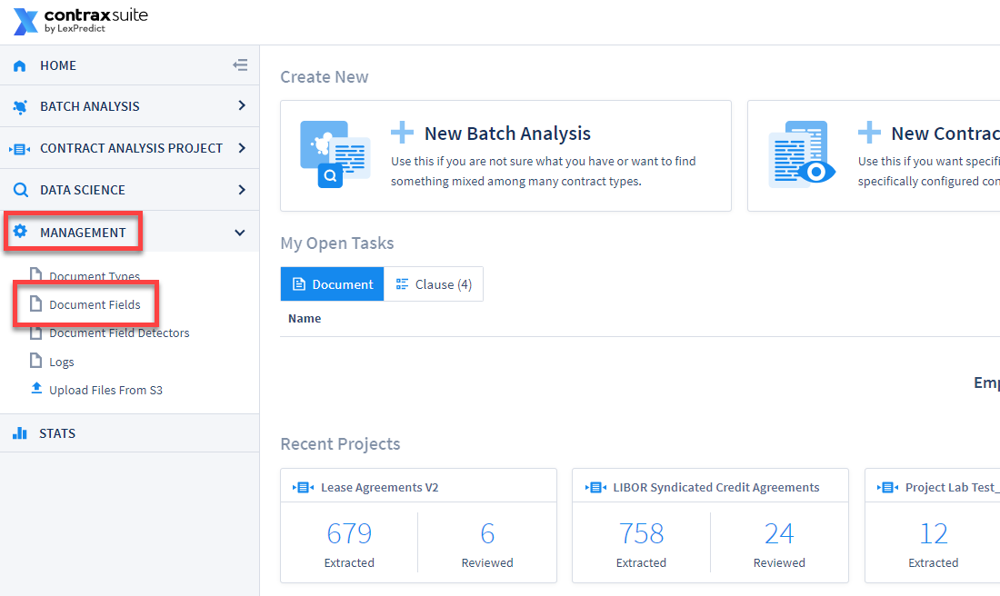
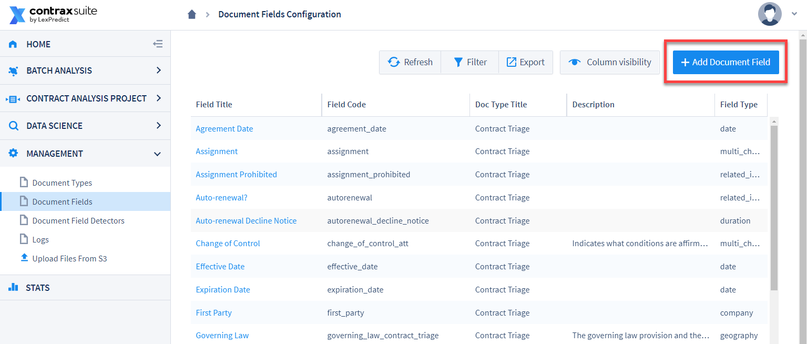
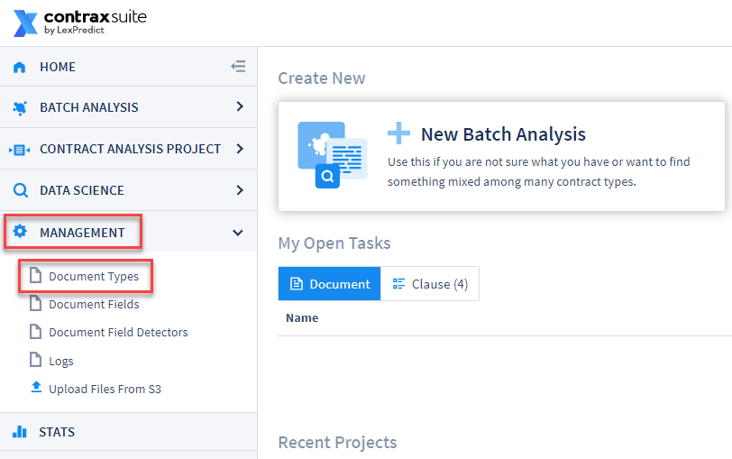
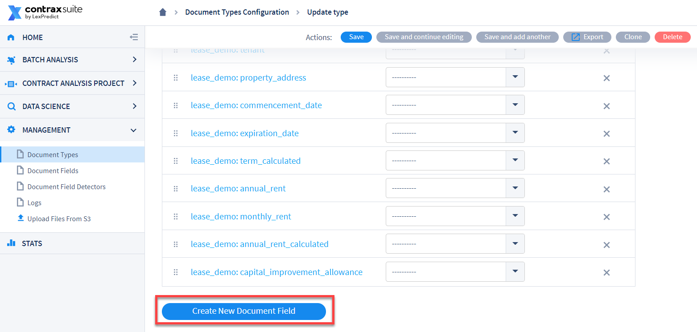
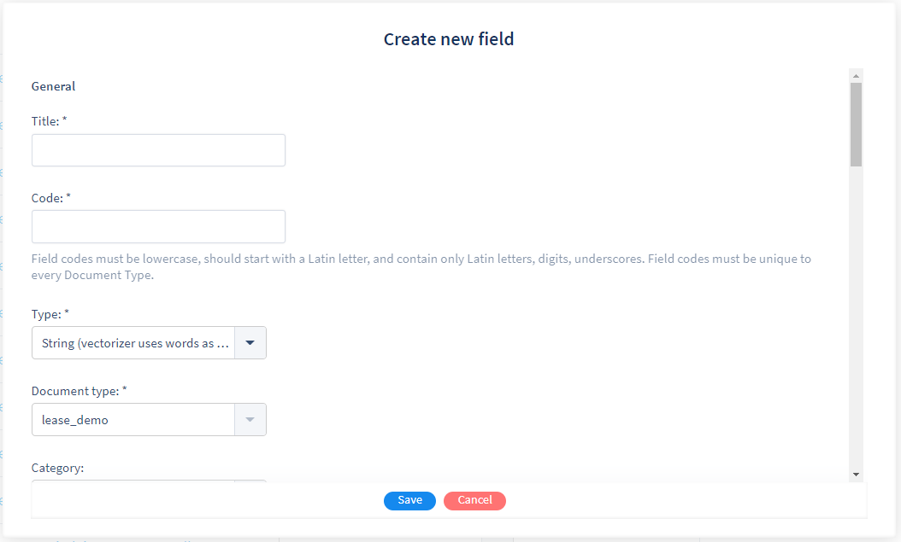
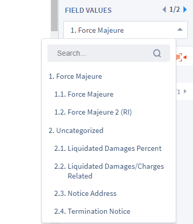
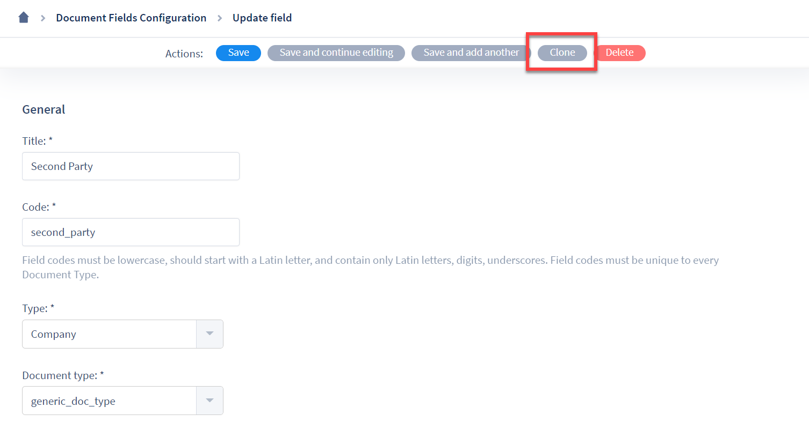
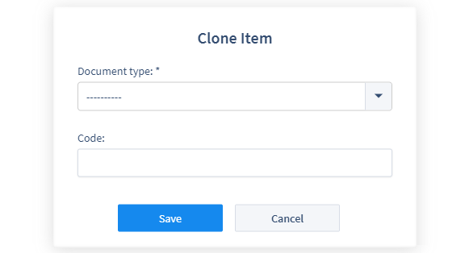

## Document Fields

ContraxSuite automatically finds sentences or sections within a specific Document Type and then extracts an appropriate value for any given Document Field assigned to that Document Type. Through the creation of unique Document Fields, ContraxSuite answers the exact questions that users want answered about the data in their documents. This data gathering is what enables administrators, power users, and document reviewers to determine whether they have the data they need, and whether it's in the right place.
* ***Note: A Document Type cannot exceed 400 Document Fields***

A Document Field can be any data type, from a simple calendar date, to complex clauses that require machine learning and model building. Each Document Field has a **Type**, which guides the system when searching for the right value. (Examples of field Types include: ADDRESS, CHOICE, COMPANY, DATE, DURATION, PERCENTAGE, GEOGRAPHY, *etc*. See the "Type" section below for more.)

After setting up a Document Field, an admin or power user can then write Document Field Detectors for each Field. Field Detectors direct the system toward the sentence, paragraph, or section of the document in which the value being sought is located.

Document Field Detectors find the correct values for each Document Field via the following techniques:
* Defined words, terms, and phrases that LexNLP - the legal-specific dictionary - can identify based on format and context. Examples of these terms or words include words in quotations, words in parentheticals, and/or words that are near grammatical markers such as “means”.
* Field Types such as percents, durations, currencies, and geographies all follow recognizable patterns, as do other simple text-based data types such as warranty clauses (because a warranty clause nearly always contains the word "warranty"). ContraxSuite uses *regular expressions* to detect these sequences of symbols and characters.

---

#### How to Create a Document Field

There are two ways to create a new Document Field in ContraxSuite. The first method:

**1.** Go to **Management** in the main menu (left pane) and click on **Document Fields**
  
  

**2.** On the Document Fields Configuration grid, click on **Add Document Field** in the upper right corner.
  
  

**3.** Use the guide in ["General"](./create_document_field.html#general) below to complete the new Field based on the specific Field Type that you would like to create.

 

The second method for creating a new Document Field:

**1.** Go to  **Management** in the main menu (left pane) and click on **Document Types**

  

**2.** in the Document Types Configuration Grid, click the Document Type you'd like to add a Field to. The screen will navigate to the Document Type's edit page. Scroll to the bottom of this page, and click **Create New Document Field**.

  

**3.** A pop-up modal window will appear on your screen. Use the guide in the ["General"](./create_document_field.html#general) section below to complete the new Field based on the specific Field Type that you would like to create.

  

---

#### General

The Document Field creation page/pop-up modal will display a number of forms to be filled out. The first four are general information, and are **required** for any new Document Field.

**Title**: This is the Document Field's display name. This Title is what reviewers and other users will see in the UI. For ideal visibility, the shorter the name, the better. Longer names will only be fully visible in grids by mousing over.

**Code**: Enter a short reference Code for this Document Field. This Field Code will be utilized in the system backend, and in the system Admin Site. Unlike Field Titles, Field Codes must be *unique*. Unique Codes allow admins and power users to create formulas and calculated Fields using the Code. Field Codes are not only unique, but they also cannot be changed once a Field is saved. This allows users to change a Field's Title later without affecting any formulas that use the Field's Code.

A Document Field Code must meet the following criteria:
  * Start with a lowercase Latin letter
  * Be 50 characters or less
  * Contain only Latin letters, digits, and underscores. **You cannot have spaces in codes.** Use an underscore "_" instead of spaces to separate words in a Code. Alternatively, you can capitalize each word after the first in order to create a phrase (*e.g.*, "documentCodeNumberOne")

Deleting a Field will delete that Field Code. You can [clone a Field](./create_document_field.html#cloning) in order to choose a new Code.

**Type**: Choose the new Field's Type from the drop-down menu. The Field Type specifies the type of data object the system will look to extract for the Field. Different Document Field Types require different settings to function. As with Field Code, Field Type cannot be edited once the Field has been saved. To change the Field Type after creation, you will need to clone the Field, or create a new Field and migrate the parameters.

The following list describes each Type:
* **Address:** Extracts a street address.<!--* **Amount:** Extracts amounts. **Note:** This field *should not be used*. It was used in prior versions of ContraxSuite. **Floating Point Number**, **Integer**, or **Money** should be used, where applicable, for these kinds of values.-->
* **Boolean:** Extracts the required data if it is present ("True"). If required data is not present, the Field will return "False".
* **Choice:** Extracts data that contains one from a set of pre-written options (*e.g.*, a *color* Field might have the options *red*, *yellow*, *blue*, and *green*). [Field Detectors](./create_field_detectors) should be set up for Choice Fields in order to search for specific attributes of the data and then return one of the listed values (*e.g.*, a Field with a Field Detector that has regular expressions for detecting the words "red," or "yellow," or "blue," or "green").
  * **Note:** Entries for Choice options cannot contain commas, or spaces that are not between words.
* **Company:** Extracts a company name. Can also be used to extract the parties to an agreement (*e.g.*, a Company Field for landlords, a separate Company Field for tenants).
* **Date: Non-Recurring Events:** Extracts a date. This Field Type is best for most date scenarios, such as start date, effective date, *etc*.
* **Date: Recurring Events:** Extracts a recurring date. For example, the sentence "Rent is due on the fifteenth of every month," would be extracted for a recurring Field, and typed so that the value can be placed in a calendar. Useful for due dates, such as rent payments in leases.<!-- * **DateTime: Non-Recurring Events:** *Pending*-->
* **Duration:** Extracts a duration, which will be converted and stored as a number of days, for easier data manipulation and proper numeric comparisons (*i.e.*, "3 months" is converted to "90"; "5 years" becomes "1825"). Useful for term lengths of contracts.
* **Floating Point Number:** Extracts any number (*e.g.*, "The loan will be made with an interest of 3.25%" will result in an extracted value of "3.25").
* **Geography:** Extracts a country, state, city, *etc*. Useful for finding, *e.g.*, "governing law" clauses.
* **Integer Number:** Extracts integers (*i.e.*, whole numbers, numbers without decimals). **Floating Point Number** will also extract integers, but it is recommended that users choose the most narrow Document Field possible. If you know the value will always be an integer (*e.g.*, number of children), then you should use Integer Number.<!--* **Linked Documents:** *Pending*-->
* **Money:** Extracts amounts of money in the following forms of currency: US Dollars (USD), Canadian Dollars (CAD), Australian Dollars (AUD), Euros (EUR), British Pounds (GBP), Japanese Yen (JPY), and Chinese Yuan/Renminbi (CNY).
* **Multi Choice:** Similar to the **Choice** Type, a Multi Choice Field allows users to choose multiple options. For example, a lease might have "retail," "farming," "storage," and "residential" as options, and a specific lease document specifies both farming- and storage-related attributes. Specific Field Detectors would then need to be set up to search for particular criteria for extracting data for both "retail" and for "farming". *See [the Field Detectors page](./create_field_detectors) for more*.
    * **Note:** Entries for Multi Choice options cannot contain commas, or spaces that are not between words.
* **Percent:** Extracts percent values, including values expressed as basis points (bps). Values are stored up to two decimal places.
* **Person:** Extracts a person's name. Often used to extract, *e.g.*, employee names from an employment agreement.
* **Ratio:** Extracts ratios, and displays them as "amount 1" / "amount 2".
* **Related Info:** This Field Type allows for unlimited selection of multiple clauses and provisions. Related Info fields are often used in place of Boolean "Yes/No" Fields where the answer is "Yes" if any applicable data is found, and "No" if no applicable data is found. This Field Type is also employed for finding large sections of text, particularly multiple separate but related sections within long documents. An example of this would be a Field for "Intellectual Property Rights," which may encompass multiple passages and clauses from different sections of a document that are not necessarily adjacent, but that all speak to IP rights, and may have no well-defined extractable values *per se*. [Field Detectors](./create_field_detectors) for a Related Info Field will be used to specify what passages of text qualify.
* **String (vectorizer uses words as tokens):** You might need to extract a land PIN, for example. You know it will be after the exact text "HRM Land Registry Pin:", so to capture the PIN itself you would write regexp in the "Value Regexp" form for the Field that will look for "HRM Land Registry Pin:" and take the next Y characters after it, though *not* the text "HRM Land Registry Pin:" itself. This Field Type can also be used when admins and power users don't necessarily want to extract any data, and just want reviewers to type in a text value themselves. For more on this, see ["Field Detection: Regexp-Based"](./create_document_field.html#field-detection-regexp-based) below.<!--* **String (vectorizer uses whole value as a token):** *Pending.-->
* **Long Text:** This Type of field is only used if **nothing** is being extracted, but admins or power users want reviewers to type in multiple lines of additional explanatory text. This Type is often used when admins and power users wish to write brief summaries of contracts.

After you have selected a **Type**, you will have to select a "Document Type" for this Field to be associated with.

**Document Type**: The last form that requires a value before the user can save the Document Field is the Document Type. Select from the drop-down which [Document Type](./create_document_type) this Field will be included in. If you need a Document Field to be assigned to a different Document Type after it's already been created, you will need to create a new Document Field, or [clone an existing Field](./create_document_field.html#cloning).

---

#### Additional Forms

Descriptions of the remaining Document Field forms are below. Depending on what type of Field you are creating, you may not need to fill out every form described in this section and sub-sections.

**Category**: A Field's Category allows a user to organize Fields into separate pages in the Field Values tab of the Annotator screen. Choose a category for a Field from the drop-down menu. This Field will then appear on that Category's page in the Field Values tab. *Note*: Categories exist at the Document Type level. To add Categories to a Document Type, *see [Managing Document Types](./create_document_type.html#managing-document-types)*.

  

**Description**: Include a description of the nature of the Field, and how users should expect to interact with the Field. Mousing over the Field in the Field Values tab of the Annotator will display this description as a tooltip.

**Requires Text Annotations**: Check this box if the Field should always have an annotation highlight for the text unit (sentence or paragraph) in which the Field's value was found. *Checking this box is recommended*.

 

###### "Choice" and "Multi-Choice" Fields Only

The following options will only appear if the Field Type is Choice or Multi Choice.

**Choices**: Type the value of each option that should be listed with this Choice/Multi Choice Field. Each option should be on a separate line inside the form. For example:

    Blue
    Red
    Green
    Yellow

These values will appear alphabeticaly in the interface, regardless of what order they are written in this form.

**Allow Values Not Specified in Choices**: Check this box if you would like users to be able to type in custom values for the Field. Taking the color example from above, checking this box would allow a reviewer who finds "purple" or "orange" in a document to manually type that value into the Choice/Multi Choice Field.

 

###### Field Detection Rules

**Value Detection Strategy**: From the drop-down menu, choose a method for detecting values and extracting data objects. The following is a list of all available value detection strategies. The first three are the most commonly used:

* **Field Detection Disabled:** This indicates that no automated searching will be done for a data object. This is useful for testing, or for projects that are mainly centered around manual review. This strategy should not be used for "Read Only" Fields, as they will be difficult to populate with data or edit later.
* **No ML. Use Regexp Field Detectors:** *This is the default option*. When this choice is selected, you will need to write separate instructions called [Field Detectors](./create_field_detectors), using either definition words or regexp to identify and extract the desired values into this Field. If there is no regexp written for this Field, then the extraction function will find values for this Field based on the Field Type (*e.g.*, Company, Date, Person) using LexNLP extractors.
*Note: Field Detectors can be used to specify multiple desired values for extraction. As the name implies, there is no machine learning for Fields that use this detection strategy.*
* **No ML. Use Formula Only:** The system uses a manually specified formula written in `python` syntax, rather than regexp, to calculate the sought-after value for this Field. The formula can be written directly in this form, and will not require writing separate Field Detectors. As the name implies, there is no machine learning for Fields that use this detection strategy. More information on calculated fields can be found below in the [Field Detection: Calculated Fields](./create_document_field.html#field-detection-calculated-fields) section, or on the [Writing Formulas](./writing_formulas.md) page.

 

* **Use Multi-Line Field Detectors:** *Formerly "Use regexp pattern: value collection"*. Choose this option if you are creating a Choice or Multi Choice Field with a large list of potential options that are stored in a separate file. See the relevant [section of the Field Detectors page](./create_field_detectors.html#field-detection-for-use-multi-line-field-detectors-strategy) for a detailed breakdown of how to set up this Value Detection Strategy.
* **Start with regexps. Switch to text-based ML when possible:** Use regexp Field Detectors (see "No ML. Use regexp field detectors" above) until there is enough data to train a machine learning model. Users can train the model and then switch to using it for finding sentences/paragraphs related to this Field.
* **Use pre-trained text-based ML only:** Detection works similar to "No ML. Use regexp field detectors" except machine learning is used to find the sentences/paragraphs related to the Field. The machine learning model needs to be pre-trained manually via [Admin Tasks](../doc_exp/admin). The model is trained on the Field values entered by users, and by the data detected by machine learning and then confirmed by users.
* **Start with formula, switch to fields-based ML when possible:** Functions similar to "No ML. Use formula only" until there are enough user-entered or confirmed Field values to train an ML model. Once there are enough values, the goal is to train and then switch this Field to "Use pre-trained field-based ML only".
* **Apply regexp field detectors to depends-on field values:** ***Note: This option may no longer be available after Version 1.9.*** Works similar to "No ML. Use regexp field detectors" except Field Detectors are applied to the values of the other "depends-on" Fields (*see below*), converted into strings. Field Detectors are run on values of the specified "depends-on" Fields, rather than on a document's text units (sentences, paragraphs, and sections). When a Field value matches the regexp, the extraction function is used on the matching Field value to find the value of the resulting Field.

<!--* **Use python class for value detection:** Use the `python` class specified in the "Python coded field" attribute of the "Document Field" model in the Django Admin Site. The `python`-coded field classes may implement the training method as well as the detection. *See the [python_coded_fields.py file](https://github.com/LexPredict/lexpredict-contraxsuite/blob/master/contraxsuite_services/apps/document/python_coded_fields.py) in the GitHub repository for more*.-->

<!--* **Use pre-trained field-based ML only:** Works best for Choice Fields. A classifier model is trained to select one of the possible choice variants based on the values of other Fields of the document. These associations are mapped onto a *feature vector,* which is translated differently depending on the Field Type. The classifier is trained to select a Choice Field value based on this feature vector. For String Fields, word frequencies are used to build this vector. For Floating Point Numbers, the normalized value between the minimum and maximum values is used.-->

<!--* **Use pre-trained MLflow model to find matching text units:** MAY NOT NEED THIS. REFER TO CS-6362-->

**Text Unit Type**: Select the size of text unit the Field will extract and annotate when its Field Detector finds the target value in a document. Users can select "Sentence" or "Paragraph". Select the Text Unit Type that best fits the needs of this particular Field. The default Text Unit Type is "Sentence".

**Depends On Fields**: *Only for formula-based Value Detection Strategies*. Use this two-column form to select Fields that this Field requires in order for formula calculations to work. The list of Available Fields will align with the chosen Document Type for this Field. Move Fields from the left side of the "Available" box into the box on the right side ("Chosen").

**Detect Limit Unit**: Choose an upward limit to the amount of document text this Field will search. For example, you may wish to have a Field only search the first 10 paragraphs of text for the value required (this often works best for values like "Company" or "Execution Date" which typically appear in the first few paragraphs of a contract). "No Limit" is the default. Selecting "Limit to N "text unit type" units" will use the chosen Text Unit Type as the Detect Limit Unit. *Note: Cannot be used with Value Detection Strategy of "Apply regexp field detectors to depends-on field values.*

**Detect Limit Count**: If you chose "Limit to N "text unit type" units" for Detect Limit Unit, use this form to enter the number of text units. If you selected "No Limit" for Detect Limit Unit, this form will not appear.

**Dependent Regexp**: *Only appears for String or Long Text Fields*. The regular expression entered in this form will be run on the sentence found by the Field Detector(s), in order to extract a specific string value from the Text Unit. If the regular expression returns multiple matching strings, then the *first* matching string will populate the Field. The following is an example to demonstrate this functionality:

  * **1.** You know that all PIN numbers in your contracts use the following format: the phrase "Location PIN:" followed by 9 dights and 3 letters, with no spaces

  * **2.** You know that all PIN numbers are preceded by the phrase "Location PIN:", such that they appear like the following: "Location PIN: 123456789PLX"
  
  * **3.** Your Field Detector should have the following in its ["Include regexps" section](./create_field_detectors) (*Note: The code "\s{1,5}" accounts for variable spacing between words*):
    
        Location\s{1,5}PIN

  * **4.** The Dependent Regexp you need in order to extract the 9-digit, 3-letter PIN number while leaving out the phrase "Location PIN:" would be the following:

        (?:Location\s{1,5}PIN:)\s{1,5}(\d{9}\w{3})

For more on regular expressions, including how to write basic commands, visit [RegExr](https://regexr.com/).

 

###### Field Detection: Calculated Fields

*This section of configuration options will only appear if you have selectd a formula-based Value Detection Strategy.*

**Formula**: Enter the formula for this Field. All Fields used as part of a formula must be in the same Document Type as this Field. Here is an example scenario:

  * You have a Duration Field for the length of a contract: `contract_length`
  * You have another Duration Field for the length of a contract extension: `extension_length`
  * You create a third Field, an Integer Field, to calculate the full length of the contract after extensions: `total_length`

You will want to write a formula like the following:

    total_length if total_length \
    else (contract_length + extension_length) if contract_length and extension_length \
    else None

The first line checks whether there is already a value in `total_length`. If so, the calculation resolves, and that value displays.

The second line performs a calculation, adding the values of `contract_length` and `extension_length` if both of those Fields contain values. The third line resolves the formula and populates no value if `contract_length` or `extension_length` don't have a value (failure on Line 2), and `total_length` doesn't already have a value (failure on Line 1).

For more on writing formulas, go to the [Writing Formulas](./writing_formulas.md) page.

**Convert Decimal arguments to float in formulas**: Check this box to use extra decimal places for formula calculations, for more accurate results. Floating Point Field values are represented in Python Decimal type to avoid rounding problems. This leads to calculations sometimes that result with a lot more decimal places. Check this box to use these extra decimal places in calculations.

 

###### Advanced

The forms and options that appear in the collapsible **Advanced** panel on the Document Field page are optional, and can be used to additionally configure Fields in various ways.

**Confidence**: Indicates the user's level of confidence in the success rate of the Field Detectors (or machine learning, if it is an ML-based Field) when they identify values for the Field. This attribute is somewhat subjective, but can be useful for when admins and power users want to communicate a certain confidence level to reviewers.
* **High**: Reviewers can be confident that the correct value will be identified, extracted, and populated into the Field.
* **Medium**: Moderate confidence. The correct value is expected to be identified, extracted, and populated into the Field about half of the time.
* **Low**: Minimal confidence. Reviewers should not rely on the system to identify, extract, and populate the correct data into this Field.

**Read Only**: Check this box to make it so this Field's value cannot be modified in the Annotator.

**Default Value**: If you would like a Choice, Multi-Choice, or String Field to be populated with a specific value by default, enter it here. This value will appear if the Field's Detectors extracted nothing from a document after it was uploaded and parsed.

**Hidden Always**: Check this box if you do **not** want this Field to be displayed in the Annotator. Typically, admins and power users will check this box when creating a Field for use in a formula. In such a case, the data in this specific Field does not necessarily need to be displayed, only included in a calculation and kept hidden until the formula from another Field is calculated and displayed. This is also useful when an admin or power user wishes to archive a Field that contains useful data for the project, but no longer needs to be displayed.

**Hide Until Python**: Enter a `python`-based command that indicates the conditions/dependencies under which this Field should be displayed. For example:

    if field_a_code is not None and field_a_code == "5" and field_b_code is True

In this example, if the Field that has the code `field_a_code` contains a value of 5, *and* the Field with the code `field_b_code` is "True", then display this Field and any values it contains.

For more on writing Python code and creating Field formulas, go to the [Writing Formulas](./writing_formulas.md) page.

The way to write these "Hide until python" conditionals depends heavily on what type of Field is used. In the example discussed above, `auto_renew` is a Related Info Field. For Related Info Fields, values should be expressed as "is True" or "is False". If `auto_renew` was a Choice or Multi-Choice Field with "Yes" or "No" values, the code would need to be written like "`auto_renew is not None and auto_renew=='Yes'`".

Writing **Hide Until Python** Formulas:

* All Field Codes used in the "Hide Until Python" form must be part of the same Document Type.
* The output of the "Hide Until Python" must be a True or False value.
* You must type the exact Document Field code.
* "Hide Until Python" can interfere with page loading if it does not account for null/None/empty values properly. You must always check that a value "is not None" before you can perform other operations on that Field. It is recommended you test the document page regularly while writing "Hide Until Python" code.
* Use `is` to check whether a Field has a value: `is None`, `is not None`, `is True`, `is False`
* Use `==` to check a Field for a specific value: *e.g.,* `duration_field == '45'`

For more on writing formulas, jump to the [Writing Formulas](writing_formulas) page.

<!--Once successfully saved, the “Hide Until Python” in the `auto_renew` Field would generate the equivalent expression in JavaScript. Code written in the "Hide Until Python" form will be automatically translated into JavaScript and appear in the "Hide Until JS" form below (users cannot modify code in the "Hide Until JS" form).

This JavaScript form is relevant because what ContraxSuite can accommodate in the "Hide Until Python" Field depends on what expressions have been accommodated for conversion into javascript. Some Python code may be written correctly, but not be translatable to work within ContraxSuite. It is recommended you work off of sample expressions provided and reach out to support if you need to do something outside of those examples. (Jump to [Writing Formulas](./writing_formulas.md)).-->

---

**Display Yes/No**: *For Related Info Fields only*. If this box is checked, the word "No" will be displayed for the Field if the Field extracts nothing. If phrases are extracted by this Field, The word "Yes" will appear, along with a numbered indicator that can be used to navigate between all the extracted clauses.

If this box is **not** checked, Field will only list data it extracted from the document, if any.

---

#### Cloning

Cloning is useful for creating a Field that is identical to, or similar to, a Field that already exists. You may also want a Field from one Document Type to be a part of another Document Type. To clone a Field, follow these steps:

**1.** Go to **Management** > **Document Fields** to open the Document Fields Configuration Grid.

  

**2.** Find the Field you want to clone, and open its edit page by clicking on it. At the top of the Field's edit page, click the "Clone" button.

  

**3.** A pop-up window will appear, with a drop-down menu for you to select which Document Type this Field clone will belong to, as well as a form where you can enter a unique Field Code for this new Field clone.

  

**4.** Click "Save". You will be returned to the Document Fields Configuration Grid. From there, you can use the Grid's filters to find your new Field, and edit is as usual.

---

After creating Document Fields, visit the [Field Detectors](./create_field_detectors) page to learn about writing Field Detectors and utilizing regular expressions (regexp).