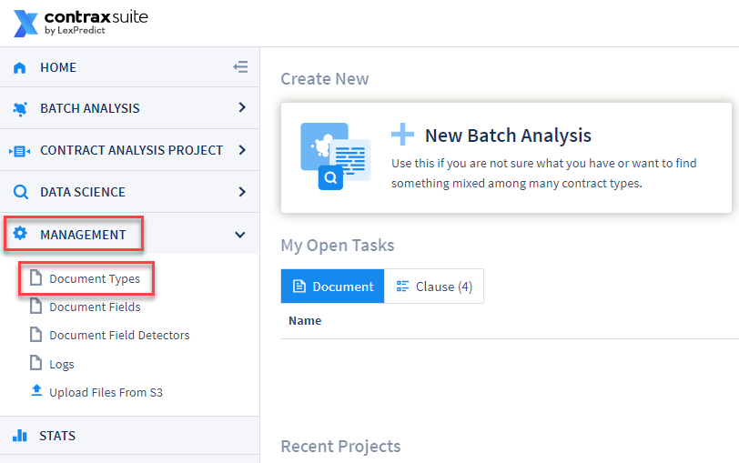

## Document Types

Creating a Document Type in ContraxSuite allows an administrator to choose and configure a specific set of data fields that they want to work with.

ContraxSuite automatically finds sentences or sections within a specific Document Type and then extracts an appropriate value for any given Document Field assigned to that Document Type. Through the creation of unique Document Types, ContraxSuite answers the exact questions that users want answered about any document assigned to a project (*Each project in ContraxSuite has only one Document Type*).

An administrator can create a new Document Type in order to find specific Document Fields for their project. A Document Field can be any data type, from a simple calendar date to complex clauses that require machine learning and model building. Each Document Field has a **Field Type**, which guides the system when searching for the right value. (Examples of Field Types include: ADDRESS, AMOUNT, CHOICE, COMPANY, DATE, DURATION, PERCENTAGE, GEOGRAPHY, *etc*.) 

Next, write Document Field Detectors to extract text for each Field. Field Detectors direct the system toward the sentence,paragraph, or section of the document in which the value being sought is located.

Document Field Detectors find the correct values for each Document Field via the following techniques:

* Defined words, terms, and phrases that LexNLP - the legal-specific dictionary - can identify based on format and context. Examples of these terms or words include words in quotations, words in parentheticals, and/or words that are near grammatical markers such as "means"
* Field Types such as percents, durations, currencies, and geo-entities all follow recognizable patterns. ContraxSuite uses **regular expressions** to detect these sequences of symbols and characters.

---

#### How To Create a Document Type

To begin a custom Contract Analysis project, you must first create a Document Type. Once created, a user can add corresponding Document Fields and Field Detectors for the project's different data types. Follow the steps below to create a new Document Type in ContraxSuite.

**1.** Go to **Management** in the Main Menu and select **Document Types**

  

**2.** Click on **Add Document Type** in the upper right-hand corner

  

**3.** A form will appear that has three fields to define and name your new Document Type.

  

**Title**: This is how the name of the Document Type will be displayed in ContraxSuite projects. This Title is what reviewers and other frontend users will see.

**Code**: Enter a short reference code for the Document Type. This Field Code will be utilized in the system backend, and in the [system admin interface](../doc_exp/intro). The purpose of unique Field Codes is to allow users to change a Field's Title later, without affecting how the Field functions. *Note: Reviewers will not see this Field Code reference*. The Field Code for a Document Type should:
  * Start with a lowercase Latin letter
  * Be 50 characters or less
  * Contain only Latin letters, digits, and/or underscores. **You cannot have spaces in codes.** Use an underscore "_" instead of spaces to separate words in a code. Alternatively, you can capitalize each word in the code phrase (*e.g.*, "documentCodeNumberOne")

**Editor Type**: The Editor Type dictates how the Fields in a Document Type are saved.

  

The three choices for Editor Type are:
  * `save_by_field`: This selection means that reviewers will be required to individually save each Field value they enter. This is the best solution for an administrator who wishes to require users to add annotations to every Field.
  * `save_all_at_once`: This selection allows reviewers to save Field values all at once, using one button on the page. This is the best solution for administrators who do not want reviewers to correct, edit, or add annotations, but simply want reviewers to update values.
  * `no_text`: **Reviewers will not be able to see the text of documents; only the Fields.**

**4.**	Click "Save" at the top of the window once you have entered all this data.

Creating a Document Type is only the first step. Once you've created a Document Type, to start using it in a meaningful way you will need to create and add unique Document Fields to be included in the Document Type. Document Fields represent the data points you want extracted from any document labeled as that Document Type. [Click here to read more about creating Document Fields](../power_users/create_document_field).

---

#### Managing Document Types

Once you have created a Document Type, you can click on that Document Type in the Document Type Configuration grid to make additional changes.

**Categories**: Creating Categories in a Document Type allows you to organize Fields within the user interface.

  

You can choose which Fields belong to which Category from a Document Field's creation/edit page. (*see [Additional Forms](./create_document_field.html#additional-forms) on the "Document Fields" page for more*)

You can also set a Field's Category on the Document Type's edit page, or delete a Field from the system with the grey "X" button.

  

---

#### Exporting and Importing Document Types

A Document Type incorporates the Document Fields, Document Field Detectors, and Categories assigned to it. Document Types - along with all of their Fields and Field Detectors - can be migrated to other instances of ContraxSuite. Migrating a Document Type into a different instance, or updating an existing Document Type in the same instance, can be accomplished using the import/export function.

**1.** Go to **Management** and select **Document Types**. On the Document Types Configuration Grid, select the Document Type you wish to export. ***Note: The "Export" button on this page will only export the Grid.***

**2.** On the Document Type's edit page, click **Export** at the top

  

**3.** The Document Type should have been exported to your computer's "Downloads" folder as a `.json` file. Next, log in to the ContraxSuite server you wish to import this Document Type into. Go to the Document Types page, and click "Import".

  

**4.** In the pop-up window, click "Choose File" and find and upload the `.json` file you exported.

  

Once the file is selected, you must choose one of four "Actions" from the "Action:" drop-down.

**Option 1: Validate Only**. *Recommended first step for already in-use Document Types.* Choose this option if you want to first ascertain whether the data in a Document Type can validly be imported into your chosen environment. This option is useful if you first want to figure out what is different between environments, and want to address any problematic discrepancies manually.

**Option 2: Validate and import if valid**. *Recommended approach for new Document Types.* Choosing this option will allow the system to import the Document Type only if there are no conflicts. If there are conflicts, the import will be cancelled and the conflicts will be reported in the log.

**Option 3: Import and force auto-fixes - Retain extra fields / field detectors**. *WARNING: May delete data*. This should only be used for Document Types that are not in live usage and/or do not yet have live data. This will force resolution of conflicts, potentially deleting invalid choice options but maintaining all extra Fields and Field Detectors. If you choose this option, it's a good idea to follow up by reviewing Fields and Field Detectors for any extras that may have been created by the import.

**Option 4: Import and force auto-fixes - Remove extra fields / field detectors**. *WARNING: May delete data*. This should only be used for Document Types that are not in live usage and/or do not yet have live data. Choosing this option will force the configuration of the Document Type in the new instance to conform exactly to its configuration in the instance from which it was exported, deleting Fields, Field Detectors, Field Values, and/or Field Annotations in order to do so.

<br>

**5.** Next, select the "Source CS Version" if the server the imported `.json` file came from is of a different major version of ContraxSuite. This option is set to "current" by default. In most circumstances, the default "current" option will work.

Finally, check or uncheck the box marked "Documents: Cache document fields after import finished". Checking this box will ensure that all document fields are cached after importing.

---

#### Recommended Approach For Preserving User-Entered Data

**We recommend that the following procedure be completed during maintenance hours**

**1.** Select "Validate Only" and uncheck "Cache document fields after import finished". This will not change anything in your production data or configurations; instead, you will just have a report of issues to resolve. If the Document Type in question has many fields, and you've been careful about only making changes on a development ("`dev`") instance, then you may skip to #5 below.

**2.** When this task completes, the system will display either "SUCCESS" or "FAILURE". Click **View Logs** to scan the log. You may have to skim the entire length of the log to find the word `ERROR`. If `ERROR` does not appear in the log, then there were no issues found and you can skip to #5 below.

**3.** Potential conflicts will lead to the message "VALIDATION ERRORS OCCURRED DURING VALIDATION". The validation errors will be numbered and will say something like:  
```
   "VALIDATION ERROR 1. Unable to update field #[UUID HERE] field_code_name_here.
   Field type has changed, old field type is "Amount", new field type
   is "Floating Point Number." Existing document field values become
   invalid and will be removed. User entered X values, automatically
   detected Y values. You need to set auto-fixes option to continue.
```
  
**4.** It is recommended you manually resolve all of the found issues rather than choosing any of the options that force changes ("Option 3" and "Option 4" above). Manually resolving found issues will better inform you of what you may be deleting, and this is also the safest method for making sure you have not deleted anything inadvertently. This could involve choosing to delete empty Document Fields, deleting extra Field Detectors that you had already deleted from the source instance, *etc*. You can see which Field is being referred to by copying the UUID onto the end of `/advanced/admin/document/documentfield/[UUIDHERE]`.

**5.** Once you have resolved all of the issues documented in the log, return to Step #4 from above. Choose "Validate and import only if valid" and leave "Cache document fields after import finished" checked.

**6.**	If you have in fact resolved all issues, the task will succeed. If you have not resolved all issues, you will have to go through the logs to determine what issues still remain. 

---

#### Potential Problem Scenarios in Export/Import

**WARNING: There is a lot of potential for conflicts when a Document Type exists on 2 or more servers and you wish to update one server with the configurations from another. It is STRONGLY recommended that you only ever make changes in one "development" instance, and then migrate all new configurations to your main project environment. Failing to do so will likely create extraneous Fields and Field Detectors that cannot be synchronized, and lead to downstream problems like accidental deletion of data, malfunctioning Fields, or other errors.**

Below are some examples of potential problem scenarios that can occur as a result of improper Document Type migration.

* **Conflict in Field Types:** Imagine you have a String Field that you later decide to convert to a Number Field. If you change the Field Type on the source server, the data will be deleted when you import the Field to the destination server, because a string value cannot be converted to a number. This issue will lead to downstream deletion of string data from the Field, because the system could not convert the string data in that Field into data for the Number Field it was changed to.
<br>

* **Duplicate Fields:** Imagine you have a Field with the Field Code "rent_amount" on one server. On another server, you create another Field, using the same Field Code "rent_amount". There is no inherent conflict when using the same Field Code on two different servers, but if you try to migrate one of these Fields to a server that already has a Field with the same Field Code, the system will not be able to resolve the conflict and will either create a duplicate Field, or delete one of the Fields, or error out (depending on which of the four options you chose in the import step). Document Fields and Document Field Detectors are migrated and tracked based on their UUID, and not just their code, because users may change Field Codes. Be sure to monitor both Field Codes and Field UUIDs.
<br>

* **Extra Field Detector:** The system will always try to synchronize Field Detectors. Imagine that you did not choose an import option that forces auto-fixes, and you have 3 Field Detectors for one Field. You decide that only 1 Field Detector is worth keeping, so you delete the other 2 Field Detectors from the source instance. However, your destination instance still contains a version of the Field that has 3 Field Detectors. When you then attempt to migrate/synchronize your Field from the source to the destination instance, the system will throw a validation error. We recommend that in situations like this, you manually review and delete any extra Field Detectors from both your source server and your destination server, so that you are positive of what has been deleted. Otherwise, if/when you force auto-fixes, the system may delete Field Detectors you did not intend it to.