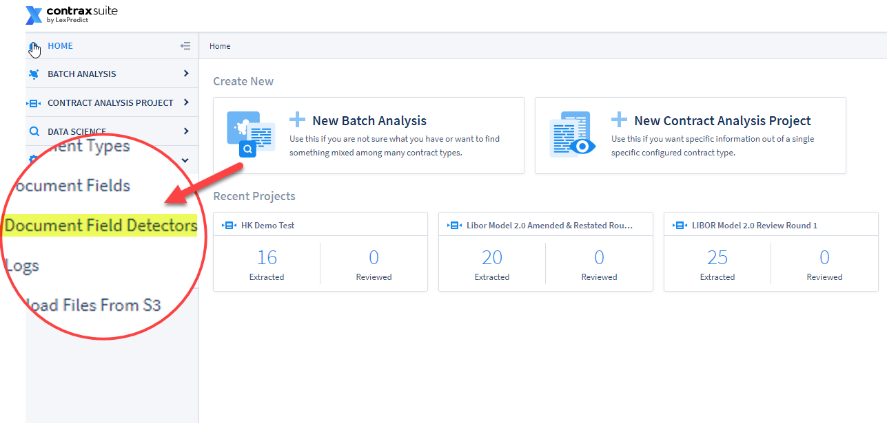
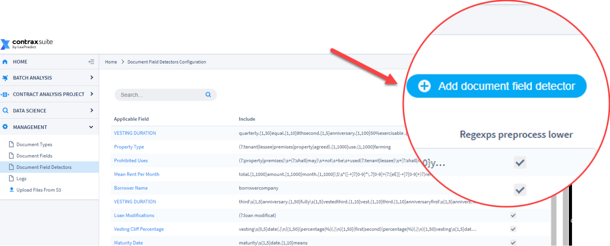
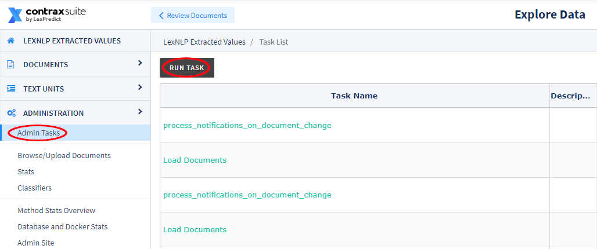
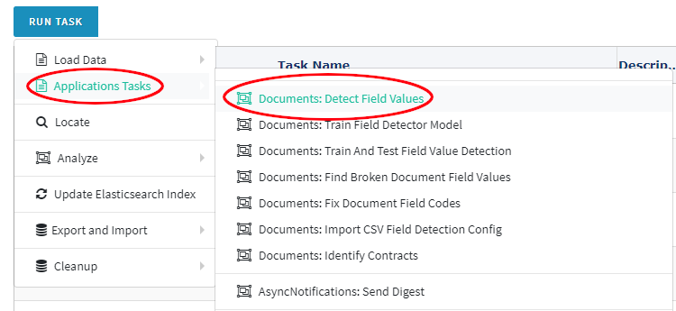
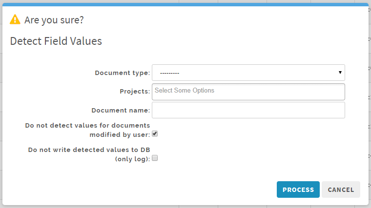
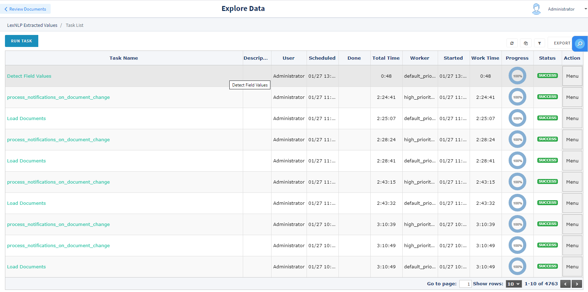
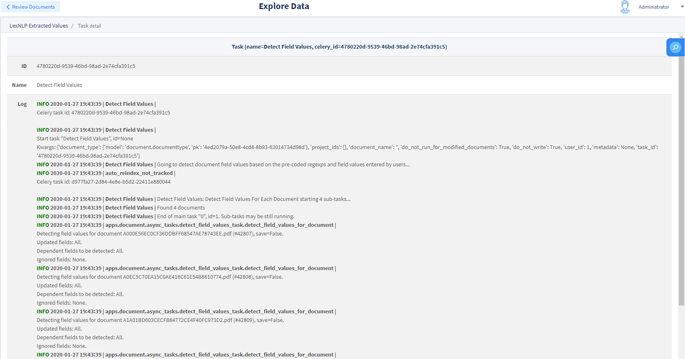
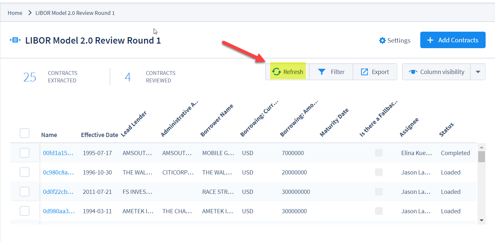
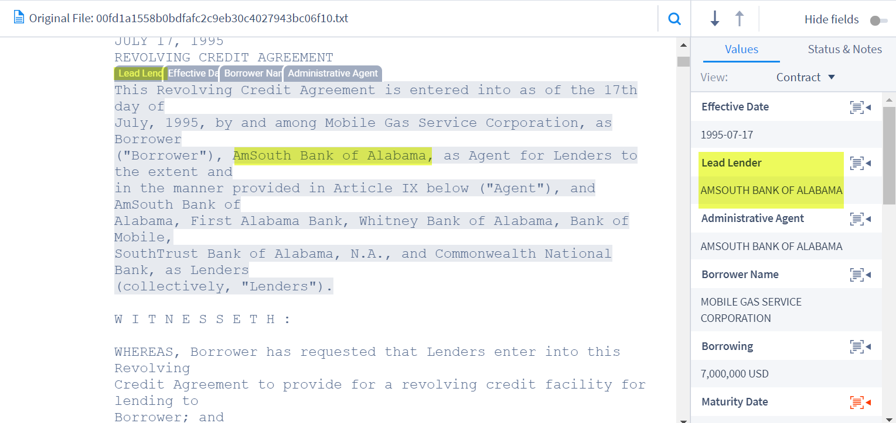

## Creating Field Detectors

Once you have created a Document Type, and begun to add Document Fields to that Document Type, the next step is to refine your Document Fields with Document Field Detectors.

Read on for more on how to set up Document Field Detectors and take full advantage of the machine learning and data analysis tools of ContraxSuite.

---

#### How to Create a New Field Detector

**1.** Go to **Management** in the main menu (left pane) and click on the link labeled "Document Field Detectors"
  

**2.** Click on “Add document field detector” in the upper right hand corner
  

**3.** Complete the following fields in the form:
  * **Field:** Choose the Document Field that this Field Detector will correspond to.
  * **Exclude regexps:** Enter any regexp you want to identify phrases which would _disqualify_ a text unit from being picked up in the search and highlighted for this Field. You can separate more than one exclusion pattern with a line break and they will be run separately. **Note:** A Field Detector will not work properly if it only has an Exclude regexps, without a Definition word and/or Include regexps.
  * **Definition words:** Any words entered here (in lowercase) will be checked after "Exclude regexps". Any matching text units found in the document will be highlighted for this Field, unless there is further refinement using "Include regexps" (see next). You can separate multiple defined terms with a line break and they will be run separately.
  * **Include regexps:** Enter regexp to identify phrases that should trigger the system to highlight the respective text unit in which the trigger is found, as well as to extract the appropriate value based on the Field Type. You can separate more than one defined term with a line break and they will be run separately.
  * **Regexps preprocess lower:** Check this box to make regexp case-insensitive. For most scenarios, it is helpful to have this box checked and to write all regexp in lowercase.
* **Detected value:** *Only appears for Choice and Multi Choice Fields.* User should indicate what value should be populated in the Field if the relevant phrase(s) or word(s) are found.
* **Extraction hint:** User can provide additional instruction on which specific values should be prioritized for extraction, when multiple values of the same Type (*e.g.*, Company, Person, Geography) are found within the relevant detected text unit.
  * TAKE_FIRST
  * TAKE_SECOND
  * TAKE_LAST
  * TAKE_MIN
  * TAKE_MAX
* **Text part:** The user indicates which part of the highlighted text unit the extraction hint should apply to:
  * Whole text
  * Before matching substring
  * After matching substring
  * Inside matching substring

**Field Detector Example #1:** For a Date Field, the string "2019-01-23 is the Start date and 2019-01-24 is the end date," with the Include regexp "is.{0,100}Start" and the text part "Before matching substring", the date "2019-01-23" will be parsed correctly as the Start Date.

**Field Detector Example #2:** For a Company Field, the clause "ABC Company as lender has provided $100 to XYZ Company, as borrower," with the Include regexp "as\s[1,5}borrower" and the extraction hint "TAKE_LAST" and the text part "Before matching substring", the string "XYZ Company" will be parsed correctly as the borrower.

---

#### How to Test and Apply New Field Detectors

When you write a new Field Detector, it is not automatically applied retroactively to documents already uploaded to a project. In order to see if your new Field Detector is working as expected on all documents in your project, you will need to either upload a new document to a project to see if your changes are working properly, or run the **Documents:Detect Field Values** task from the Admin Tasks.

Follow these steps to run "Documents:Detect Field Values" on your project:

**1.** Navigate to "Data Science" in the main menu (left pane), and click on "Document Explorer"

**2.** In the Document Explorer, click "Administration" in the main menu (left pane), then choose "Admin Tasks" and then click the "Run Task" button in the top-left of the main viewing screen:
    

**3.** From the "Run Task" menu, select "Application Tasks" and then "Documents:Detect Field Values"
  
  

**4.** From the pop-up, choose either the **Document Type** or choose the specific **Project(s)** on which you would like to re-run all Field Detectors. You can also choose one specific document, if you know its file name. You can also choose to have the system ignore documents that users have modified (useful if you don't want to reset values the machine has already learned), or have the system not write any detected values to the database (this is useful for quick system testing).

**Do not skip this step**. If you accidentally run all Field Detectors on all projects, it will slow the system down and take a significantly much longer time for the task to complete. This could even lead to a system crash.
  
  

**5.** Once you have seletect your Document Type and/or Project (or specific document), click the "Process" button in the lower right of the pop-up. Refresh the Admin Task List screen using the "Refresh" button near the top-right. Task status will reach 100% when the task is complete.
    
  

**6.** Depending on how many documents are in your chosen Document Type and/or Project, this task may take a while. Refresh the page until the Task Progress is "100%" and its status is marked "Success" in green.

Developers, admins, and power users may wish to see details of the task. To do so, click "Menu" on the far right of the main viewing pane, and then click "View Details". You will be taken to a screen that looks like this.
  
  

**7.** Finally, return to the project where you ran the "Documents:Detect Field Values" task and click the "Refresh" button above the Document Grid View.

  

**8.** Once you refresh the Document Grid View, you will see the new values that the new/updated Field Detectors have extracted. Or you can click into a document to view any new annotations.

  

---

#### Additional Information on Field Detection Strategies

The field detection system is implemented as a set of field detection strategies which can be assigned manually to any Field using the Django Admin interface (usually only available to project Administrators).

Field detection strategy is a Python class that implements two main methods: train models and detect field values.

Field detection is executed in an abstract manner regardless of other attributes of the Field. The assigned field detection strategy may decide if it is able to execute correctly or not depending on the Field's attributes, and may cancel itself if the Field's attributes do not conform with its parameters.

A field detection strategy may detect Field values based on the values of other Fields. To achieve the correct field values of the resulting fields the field detection is asynchronously triggered not only on the initial document loading but also on each field change.

Field detection is executed in Celery. To see changed Field values, a page refresh may be required.