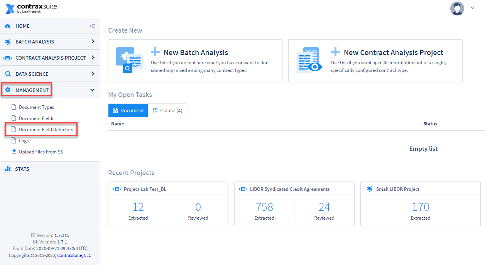
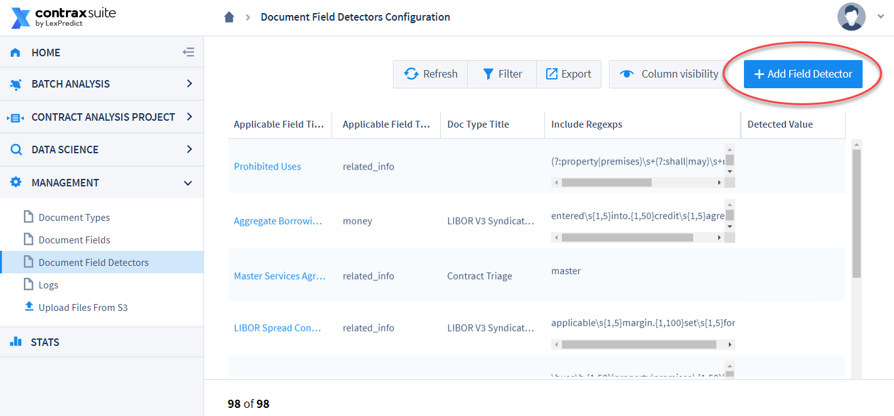
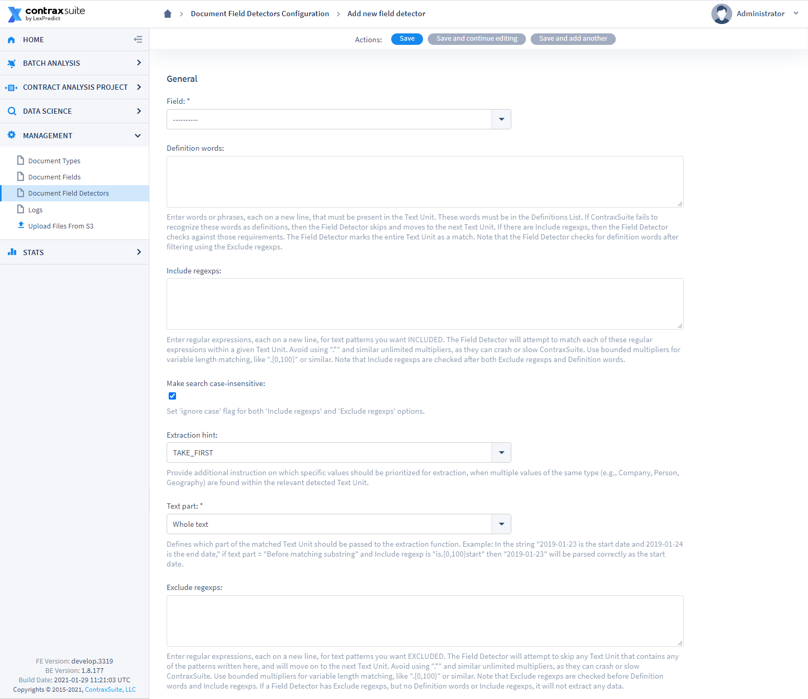
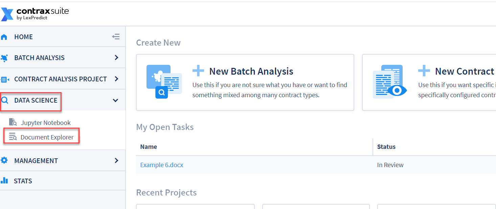
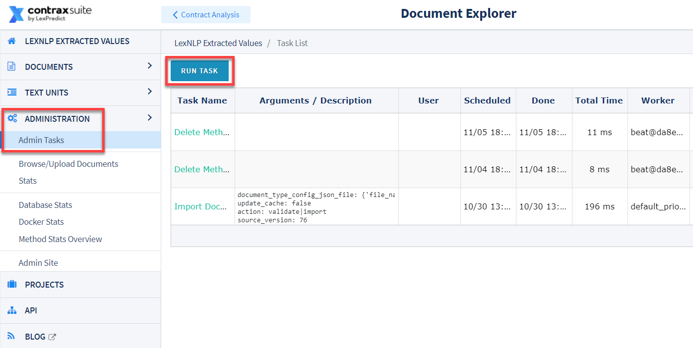
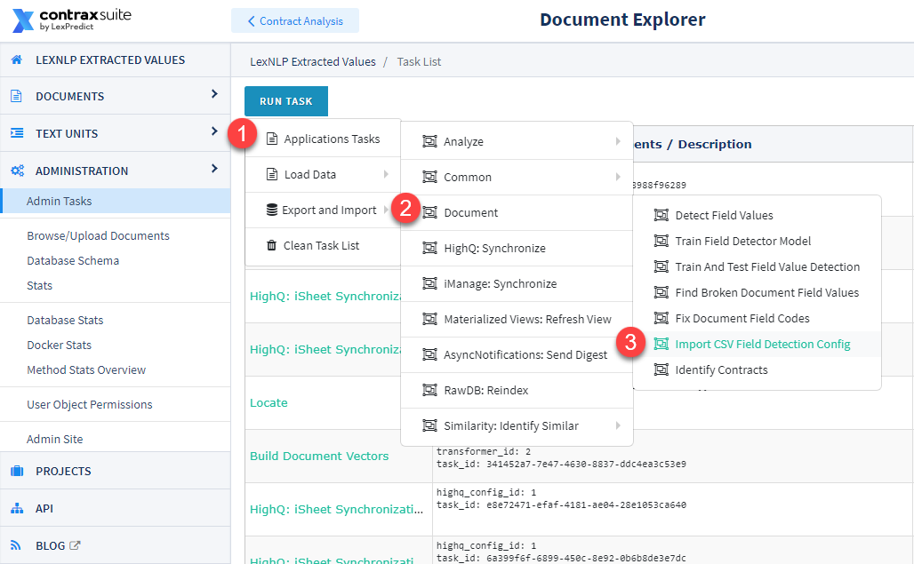
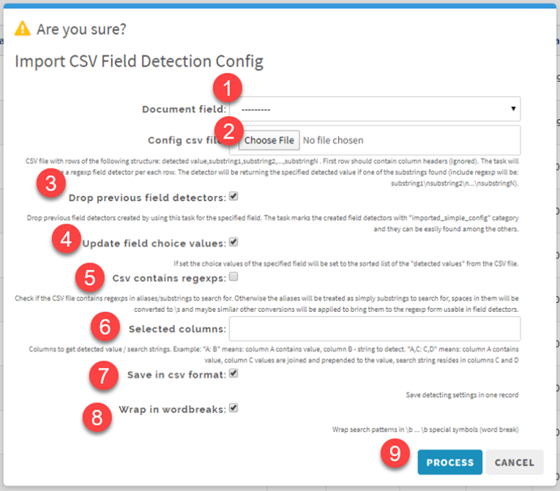
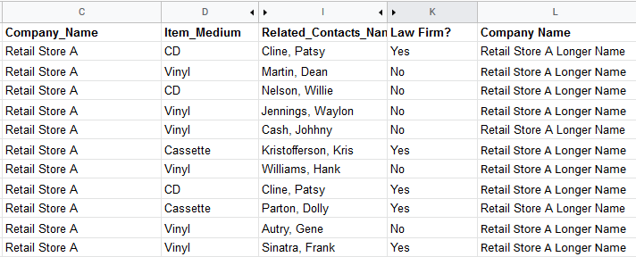

## Field Detectors

Once you have created a Document Type and begun to add Document Fields to that Document Type, the next step is to create the conditions under which Document Fields will extract specific values from documents. When creating a [Document Field](./create_document_field), you choose a Text Unit Type (Sentence or Paragraph), and the Field Detectors work on the sentence or paragraph level. Field Detectors search for and extract a text unit that matches the criteria specified in the Field Detector. Read on for more about writing Document Field Detectors for your Fields.

---

#### Creating New Field Detectors

**1.** Go to **Management** in the main menu (left pane) and click on **Document Field Detectors**
  
  

**2.** On the Document Field Detectors Configurion page, click **Add Field Detector** in the upper right hand corner
  
  

**3.** You will be navigated to a Field Detector creation page.

  

Fill out the following forms:
* **Field:** From the drop-down, choose the Document Field that this Field Detector will correspond to.
* **Definition words:** Enter any words or phrases (in lowercase) to be checked against terms that are defined within a document. Matching text units will be highlighted for this Field, unless there is further refinement using "Include regexps" (see next). You can separate multiple defined terms with a line break. ***Note:*** You do not need to write regular expressions for Definition words.
* **Include regexps:** Enter regular expressions to identify phrases that the system should highlight and extract a relevant value from. You can separate more than one Include regexps phrase with a line break and they will be run separately.
* **Make search case-insensitive:** Check this box to make regular expressions case-insensitive. For most scenarios, it is helpful to have this box checked and to write all regular expressions in lowercase. In general, checking this box is a good idea so that Field Detectors return false positive data, rather than return no data at all, in the event of irregularities in capitalization.
* **Detected value:** *Only appears for Choice and Multi-Choice Fields.* User can indicate what value should be populated in the Field if the relevant phrase(s) or word(s) are found.
* **Extraction hint:** Prioritize which specific values should be extracted from any given text unit, if multiple values of the same Type (*e.g.*, Company, Person, Geography) meet the criteria of the "Include regexps" expressions.
  * TAKE_FIRST
  * TAKE_SECOND
  * TAKE_LAST
  * TAKE_MIN
  * TAKE_MAX
* **Text part:** Choose which segment of a text unit the extraction hint should apply to, for the "Include regexps" regular expressions:
  * Whole text
  * Before matching substring
  * After matching substring
  * Inside matching substring
* **Exclude regexps:** Enter regular expressions to identify phrases that will _disqualify_ a text unit from being extracted and highlighted for this Field. Separate multiple exclusion patterns with line breaks. ***Note:*** A Field Detector will not work properly if it only has an Exclude regexps and no Definition word or Include regexps phrase(s).

**4.** Click "Save" or "Save and continue editing" at the top of the screen to save the Field Detector.

**Note:** When editing Field Detectors via a Document Field's edit page, open the Field Detectors modal, make changes, and save those changes before editing/saving the rest of the Document Field.

---

#### Writing Regular Expressions

Regular expressions are what power the pattern matching capabilities for Document Fields. Writing effective regular expressions can take some practice, which is why we recommend using tools like [regex101.com](https://regex101.com/) or [regexr](https://regexr.com/) to test regular expressions before implementing them in ContraxSuite.

Regular expressions identify a text unit and the value to extract from that text unit. When writing regular expressions in ContraxSuite, the most important rule to remember is **do not use `.*` or `.+`**. Using either of these overly inclusive codes may cause catastrophic system errors. Instead of overly inclusive codes, use something like `.{1,N}` when using the catchall `.` operator, so that N creates a maximum distance between two characters or words that you would reasonably expect to see in the same text unit.

However, be careful not to put code like `.{1,N}` at the beginning of a regular expression. This will break the Document Type because it will search for 1 to N of *nothing* if it is at the beginning of the regular expression. This is why you must make sure to test with one of the above regexp testers, to catch any overinclusion errors before implementing them in a ContraxSuite project.

###### Examples of Good Regular Expressions

**Example 1:** Say you're working on a lease project, and need regular expressions to extract rent payment amounts. The following two phrases might be good places to start:
  * `become\s{1,5}due` - Extracts a value when the system finds a sentence with the word "become", followed by 1 to 5 spaces before the word "due"
  * `be\s{1,5}due.{1,10}payable.{1,10}full` - Extracts a value when the system finds a sentence with the word "be", followed by 1 to 5 spaces before the word "due", followed by 1 to 10 characters before the word "payable", followed by 1 to 10 characters before the word "full"
    * a regular expression like this will flexibly return a phrase like "**be due** (and) **pay**(able in) **full**".

**Example 2:** Say you now also want to write a Date Field to find start dates within your lease documents. The following regular expression is a good place to start:
  * `is.{0,100}start` - Extracts a value when the system finds a sentence or paragraph with the word "is", followed by 0 to 100 characters before the word "start"
  
This regular expression, with a span of 100 characters allowed between "is" and "start", is flexible enough for any situation where you want a Date Field to find a date in or around this phrase. This is, however, an example where specifying a "Text part" becomes important. In this example:
  * Text part "Before matching substring" would return something like "January 31 **is** the **start** date". But,
  * Text part "After matching substring" might return "...th**is** agreement shall not **start** if outstanding rent is unpaid as of February 1".

In the second sentence here, additional changes to the regular expression, such as adding the `\b` operator before the word **is**, could resolve this probable false positive.

**Example 3:** Say you also need to extract values for a Party or Company Field. This would be a good situation for an "Include regexps" written like the following:
  * `as\s{1,5}borrower` - Extracts a value when the system finds a sentence with the word "as", followed by 1 to 5 spaces before the word "borrower"

Note that the Extraction hint "TAKE_LAST" and the Text part "Before matching substring" would probably be good choices for this Field Detector (This would return a phrase like "John Smith, as Borrower").

**Example 4:** Say you now want to find every lease in your project that contains the word "closing", but only if the text unit contains a date. Your Include regexps for this Date Field is pretty simple:
  * `closing` - Extracts a value when the system finds a sentence with the word "closing"

This Field Detector will find the *sentence* that contains ***both*** a date found by LexNLP, ***and*** the word "closing". The Field with this Field Detector will not extract and return a date from any sentence that doesn't have the word "closing", so if we know that sometimes the date we need is *not* in the same sentence as the word "closing", but only in the same *paragraph*, we can try to be more inclusive by editing the Document Field's Text Unit Type to be "Paragraph".

---

#### Testing and Applying New Field Detectors

When you write a new Field Detector or edit an existing Field Detector, its new parameters will not retroactively run on documents already uploaded to your project. In order to see if your new Field Detector is working as expected on all documents in your project, you will need to either upload a new document to that project to test your changes, or run the **Detect Field Values** task.

For instructions on how to run "Detect Field Values" inside a Contract Analysis project, [read the instructions on the "Creating and Managing Projects" page](../reviewers/create_manage.html#running-detect-field-values).

---

#### Field Detection for "Use Multi-Line Field Detectors" Strategy

The "Use Multi-Line Field Detectors" Value Detection Strategy requires additional configuration via the Django Admin interface. Follow the steps below to set up a Field with this Strategy.

This Value Detection Strategy is based on the following situation: a user has a large set of choices they need to incorporate into a Choice or Multi Choice Field, and this data is stored in a `csv` file (or can be converted into a `csv` file, from, *e.g.*, an `xsl` or `xslx` file).

The first step of this process is to upload the `csv` file containing the data you want included as options.

In the main menu, go to **Data Science** > **Document Explorer**.

  

In the Document Explorer's main menu, go to **Administration** > **Admin Tasks** > **Run Task**.

  

In the **Run Task** menu, go to **Application Tasks** > **Document** > **Import CSV Field Detection Config**.

  

The following pop-up modal will appear. Follow the steps below to enter data into the pop-up modal.

  

**1.**	**Document field**: From the drop-down, choose the Field you want to create this Field Detector for.

**2.**	**Config csv file**: Choose the `csv` file to use for populating data for choice values.

**3.**	**Drop previous field detectors**: Keep this box checked if you would like to override all previous Field Detectors for this Field with those that will be created by this task from this `csv` file. We recommend checking this box anytime you upload an updated version of a `csv` as a best practice.

**4.**	**Update field choice values**: Check this box f you would like to update the list of choice values for the Field. We recommend always checking this box as a best practice.

**5.**	**Csv contains regexps**: Check this box if the `csv` spreadsheet *already contains* any regular expression commands. Typically, this box will **not** need to be checked.

**6.**	**Selected columns**: Follow the instructions and choose the columns in the `csv` that you want used and/or combined to create the actual display value within ContraxSuite. You must then choose the value for which the system will actually search.

  

For the screenshot example above, entering **"C,H:C"** would achieve the following results:
  * Column C (Company_Name) and column H (Related_Contacts_Name) are typed before the colon (:) so that they will be combined to create the display values:
      * Retail Store A (Autry, Gene; Cash, Johnny; Cline, Patsy; Jennings, Waylon; Kristofferson, Kris; Martin, Dean; Nelson, Willie; Parton, Dolly; Sinatra, Frank; Williams, Hank)
  * Column C, typed after the colon (:), means that the value(s) in this column will be used to create the regular expression pattern to search for. Something like this:
      * `(^|\b|\s)retail\s{1,5}store\s{1,5}a(\b|\s|$)`
  * **Note:** The system will add all appropriate formatting for display value, and create the regexp formula using the values from the columns designated in this step.

**7.** **Save in csv format**: This will keep the Field Detectors saved as Multi-Line, and they will be stored in the Admin Site as such. We recommend keeping this checked.

**8.** **Wrap in wordbreaks**: This assigns regexp to anchor the value to be detected with a line break, or space indicated by the (^|\b|\s) on either side. We recommend keeping this checked.

**9.** Click "Process".

When the Task Progress wheel has reached 100% in the Task List (note you need to refresh the page or hit the refresh button above the grid to see the % increase) the upload (or update) should be complete.

To confirm the Field Detectors were created as expected, go to **Admin Site** > **Document** > **Document field multiline regex detectors** to check that values were uploaded successfully, and patterns appropriately created in the system.

**Note:** To delete or clone a Field that has `csv` values as a source for Field Detectors, you must first delete the Field Detectors from the **Document field multiline regex detectors** page.

---

#### Additional Information on Field Detectors

As a general rule, a sentence ends with a period and a paragraph ends with a line break. In reality, these general rules don't always apply to contracts you encounter. Complexities and variance always arise during legal work, and contract management is no exception.

In ContraxSuite, discrepancies frequently arise because of different types of documents and document formats (*e.g.*, `pdf` vs. `docx` vs. `txt` files), as well as different style conventions and text formatting choices (*e.g.*, relative position and usage of line breaks, spaces, tabs, page and section headings, *etc.*).

Any given text in a document is stored both as a sentence and a paragraph. Sometimes a paragraph may be exactly equal to a sentence, but of course a sentence is usually one of many in a larger paragraph. The best way to be sure that ContraxSuite will correctly parse a "sentence" versus a "paragraph" is to check the actual text units in the Annotator once your documents are uploaded.

<!--
The field detection system is implemented as a set of field detection strategies which can be assigned manually to any Field using the Django Admin interface (usually only available to project Administrators).

Field detection strategy is a Python class that implements two main methods: train models and detect field values.

Field detection is executed in an abstract manner regardless of other attributes of the Field. The assigned field detection strategy may decide if it is able to execute correctly or not depending on the Field's attributes, and may cancel itself if the Field's attributes do not conform with its parameters.

A field detection strategy may detect Field values based on the values of other Fields. To achieve the correct field values of the resulting fields the field detection is asynchronously triggered not only on the initial document loading but also on each field change.

Field detection is executed in Celery. To see changed Field values, a page refresh may be required. -->

---

Once you have created Fields and Field Detectors, you may wish to create additional Fields whose values are calculated based on the values of one or more other Fields. To learn about writing these kinds of formulas to calculate a Field value based on other Field values, read the ["Writing Formulas in ContraxSuite" page](./writing_formulas).