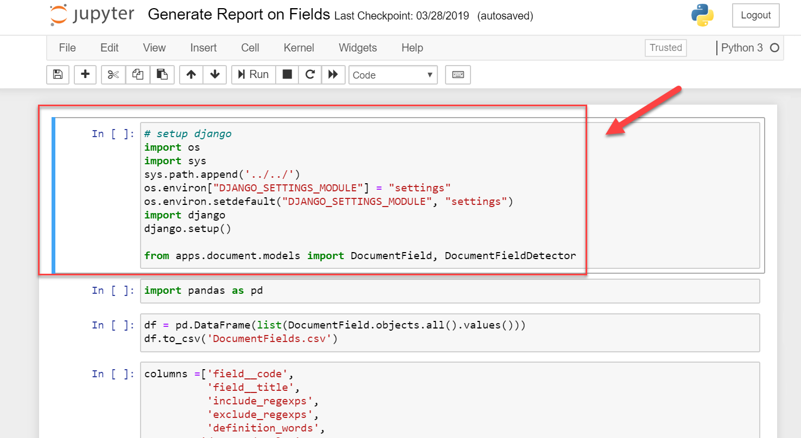

## Using Jupyter Notebooks

[Jupyter Notebooks](https://jupyter.org/) are open-source web applications that allow you to create and share documents that contain live code, equations, visualizations, and explanatory text. You can utilize a Jupyter Notebook to access functions not available in the ContraxSuite UI, to either pull data from ContraxSuite or modify existing code.

This guide is intended to help Technical Admins use Jupyter Notebooks within ContraxSuite. This is a supplement to help work with an existing notebook - this is _not_ a guide on how to write notebooks from scratch, nor is it a tutorial on [Python](https://www.python.org/).

> **WARNING:** Jupyter Notebooks can significantly alter data and system configuration. They can be a very formidable tool, but also have the potential to create unintended consequences. Access to Jupyter Notebooks should be limited to very specific users, and caution should always be taken when utilizing Notebooks.

---

#### How to Deploy Jupyter Notebooks in ContraxSuite

**1.** Access Jupyter for ContraxSuite at `[Your Contraxsuite URL]/jupyter`

**2.** To log in, you will first be prompted for a username and password. You will need to use the Administrator username and password for the system instance you're accessing.

   
  
**3.** You will then be prompted to put in just a password on the Jupyter page. This login will likely be the same Administrator password used in the previous prompt (work with Admins and IT on passwords).

   

**4.** ContraxSuite packages and deploys a set of out-of-the-box Jupyter Notebooks accessible from Jupyter. **Do not put any new files in the root location or the demo location**.

   

**WARNING**: ALL FILES YOU WANT TO KEEP MUST GO IN THE `persistent_volume` DIRECTORY.

---

#### Uploading Jupyter Notebooks

An administrator in ContraxSuite may share Jupyter Notebooks between their team, and their data scientists, and a LexPredict team. In order to use Jupyter Notebooks, you will need to upload them onto your instance of ContraxSuite. Transfer your Jupyter Notebook files first onto the server where you'll be running them, and then you can upload those files to your ContraxSuite instance. To set up Jupyter Notebooks in ContraxSuite, follow these steps:

**1.** Click the "Upload" button in the upper right hand corner, then navigate and choose the file you wish to upload. 

**2.** You will then see the file name listed with a new blue "Upload" button to the right. Click the "Upload" button.

**3.** Once the Notebook is uploaded you will be able to locate it in the `persistent_volume` folder. Double-click on `persistent_volume`, then find the Notebook you're looking for in the list, and double-click on that name as well.

   

   

**4.** The Notebook will open in the interface. The Notebook example below uses Django objects (ContraxSuite uses a DjangoJS backend). The code in the red box contains basic information about the Notebook's Django objects.

   

This is the first "cell" in the notebook. There are multiple subsequent cells following the first. You will need to update the `sys.path.append('../../')` line of this cell to reflect the folder you put the file in. If you are in a sub-folder of the Jupyter Notebook, then the above path would be correct. If you are 2 sub-folders deep, then you would need to change the line to `('../../../')`. If you put your file into the root Jupyter folder, then you will only need `('../')`. 

**5.** To run or apply this Notebook in ContraxSuite, first make sure the correct cell is highlighted. (In the image above you can see the referenced cell is highlighted by a thick blue line and surrounding grey outline.) Hit the "Run" button in the top menu bar. You will initially see a `*` in the brackets to the left of the cell (`In[*]`). When the cell is finished running, this `*` will be replaced by a number. In this case, you will now see a `1` in the brackets after hitting "Run", and will also see some new text has been generated to provide context, as well as any warnings that occurred.

   

**6.** After the first cell runs, the next cell in the sequence will be highlighted.

   

**7.** As you continue to run each subsequent cell, the `[]` will populate with a number, and the next cell will then be highlighted. You will need to hit "Run" on every cell manually, but before you run each cell, you should review output to determine if anything needs to be modified. In the example below, Cell 3 will create an output named `DocumentFields.csv`. You can change the name in the cell if you wish. More importantly, in the next cell there is a list of Fields that will appear as columns in `DocumentFields.csv`. If you want your output to pull values from Fields other than those listed in this cell, you can modify that cell before clicking "Run".

   

**8.** In the below example, "exclude_regexps" has been deleted from the list in Cell 4. The subsequent cell, Cell 5, was also run, resulting in a display of the selected outputs from `DocumentFields.csv`. Note that "exclude_regexps" is not a column header in the `.csv` file.

   

**9.** When you have run all the cells, you will see a blank cell with no content appear as the final cell.

   

**10.** Depending on what actions the Jupyter Notebook executed, you can look in the system for any changes that were applied. In our example so far, the Jupyter Notebook was applied to run a report, pull information from the system, and create a `.csv` file. The line containing the code `to_csv` or `to_excel` will contain a file name, in our example, `DocumentFields.csv`. If there is a path specified, the file will be output to that path. If only a filename is provided, the file will be output to the same folder the code runs from.

   

In this example, the report ran from the `persistent_volume` folder, so the output file will also be located in the `persistent_volume` folder. In addition, the output document, `DocumentFields.csv` has been created and correctly named, and appears in the list. Note the right hand column says it was last modified only seconds ago.

**11.** Finally, to open the document, click on the box to the left of the document name and then click "Download" in the top menu.

   

---

#### Tips for Using Jupyter Notebooks

Sometimes running the code in a particular cell can result in a timeout if it sits for a long time. If this happens, select **Kernel** > **Restart**. This will refresh the connection so the code can run.

   

To run a notebook, click on the top cell, then click "Run", then click on the next cell and click "Run", and so on until there is an error or you get your desired output. Stop if you get errors and don't know why (other than the timeout error specified above, in which case you can just restart the Kernel).