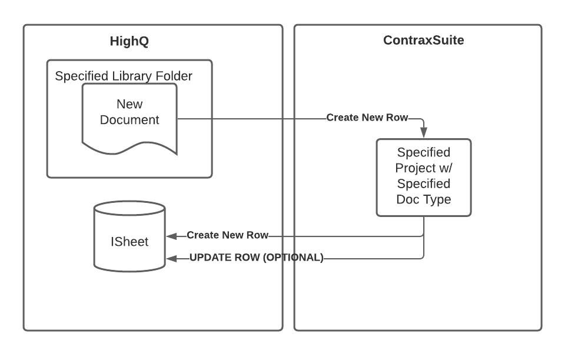

HighQ Integration
*****************

Follow the instructions on this page to integrate your HighQ environment with ContraxSuite.

----

Definitions
===========

+----------------+-----------------------------------------------------------------------------------------------------+
| **Term**       | **Meaning**                                                                                         |
+----------------+-----------------------------------------------------------------------------------------------------+
| (HighQ) File   | The file in HighQ Collaborate; a ``.doc(x)``, ``.pdf``, or ``.txt`` file.                           |
+----------------+-----------------------------------------------------------------------------------------------------+
| Document       | ContraxSuite's :class:`Document<apps.document.models.Document>` model.                              |
+----------------+-----------------------------------------------------------------------------------------------------+
| HighQ Document | A :class:`HighQ Document<apps.highq_integration.models.HighQDocument>` is an object with record of: |
|                |     * a HighQ File                                                                                  |
|                |     * a corresponding ContraxSuite :class:`Document<apps.document.models.Document>`                 |
|                |     * an iSheet row ("item")                                                                        |
+----------------+-----------------------------------------------------------------------------------------------------+

----

Prerequisites
=============

Before beginning, you will need:

* a HighQ Collaborate account
* a HighQ folder containing files, and optionally, subfolders
* a destination project in ContraxSuite
* access to ContraxSuite's administrative menus
* the values for the API fields and HighQ fields listed below

+-------------------------------------+----------------------------------------------------------------------------------------------------------------------------------------------------------------------------+----------------+-------------------------------------------------------------------------------------------------------------------------------------------------------------------------------------------------------------------------------------------------------------------------------+
| **Field**                           | **Description**                                                                                                                                                            | **Deonticity** | **Hints**                                                                                                                                                                                                                                                                     |
+-------------------------------------+----------------------------------------------------------------------------------------------------------------------------------------------------------------------------+----------------+-------------------------------------------------------------------------------------------------------------------------------------------------------------------------------------------------------------------------------------------------------------------------------+
| Title                               | A unique and descriptive name for this HighQ Integration Configuration.                                                                                                    | Required       | N/A                                                                                                                                                                                                                                                                           |
+-------------------------------------+----------------------------------------------------------------------------------------------------------------------------------------------------------------------------+----------------+-------------------------------------------------------------------------------------------------------------------------------------------------------------------------------------------------------------------------------------------------------------------------------+
| Enabled                             | Whether or not this HighQ Integration Configuration is active. This can be toggled on an off. Sychronization tasks will not run unless the HighQ Configuration is enabled. | *Boolean*      | N/A                                                                                                                                                                                                                                                                           |
+-------------------------------------+----------------------------------------------------------------------------------------------------------------------------------------------------------------------------+----------------+-------------------------------------------------------------------------------------------------------------------------------------------------------------------------------------------------------------------------------------------------------------------------------+
| Update Existing iSheet Items?       | Whether or not changes to document field values in ContraxSuite should update iSheet rows in HighQ.                                                                        | *Boolean*      | N/A                                                                                                                                                                                                                                                                           |
+-------------------------------------+----------------------------------------------------------------------------------------------------------------------------------------------------------------------------+----------------+-------------------------------------------------------------------------------------------------------------------------------------------------------------------------------------------------------------------------------------------------------------------------------+
| Get HighQ files from subfolders?    | Whether or not ContraxSuite should get files from subfolders in HighQ.                                                                                                     | *Boolean*      | N/A                                                                                                                                                                                                                                                                           |
+-------------------------------------+----------------------------------------------------------------------------------------------------------------------------------------------------------------------------+----------------+-------------------------------------------------------------------------------------------------------------------------------------------------------------------------------------------------------------------------------------------------------------------------------+
| API Client ID                       | This is an integer provided by HighQ and unique to every client.                                                                                                           | Required       | Provided by HighQ.                                                                                                                                                                                                                                                            |
+-------------------------------------+----------------------------------------------------------------------------------------------------------------------------------------------------------------------------+----------------+-------------------------------------------------------------------------------------------------------------------------------------------------------------------------------------------------------------------------------------------------------------------------------+
| API Secret Key                      | This is a string provided by HighQ.                                                                                                                                        | Required       | Provided by HighQ.                                                                                                                                                                                                                                                            |
+-------------------------------------+----------------------------------------------------------------------------------------------------------------------------------------------------------------------------+----------------+-------------------------------------------------------------------------------------------------------------------------------------------------------------------------------------------------------------------------------------------------------------------------------+
| API Instance URL                    | This is a URL                                                                                                                                                              | Required       | Provided by HighQ.                                                                                                                                                                                                                                                            |
+-------------------------------------+----------------------------------------------------------------------------------------------------------------------------------------------------------------------------+----------------+-------------------------------------------------------------------------------------------------------------------------------------------------------------------------------------------------------------------------------------------------------------------------------+
| ContraxSuite Project                | ContraxSuite will download HighQ files and placec them in this project.                                                                                                    | Required       | We suggest creating a destination project prior to creating a HighQ Configuration.                                                                                                                                                                                            |
+-------------------------------------+----------------------------------------------------------------------------------------------------------------------------------------------------------------------------+----------------+-------------------------------------------------------------------------------------------------------------------------------------------------------------------------------------------------------------------------------------------------------------------------------+
| Assignee                            | If specified, ContraxSuite will automatically assign documents to this user.                                                                                               | Optional       | N/A                                                                                                                                                                                                                                                                           |
+-------------------------------------+----------------------------------------------------------------------------------------------------------------------------------------------------------------------------+----------------+-------------------------------------------------------------------------------------------------------------------------------------------------------------------------------------------------------------------------------------------------------------------------------+
| HighQ Site ID                       |                                                                                                                                                                            | Required       | Query parameter.                                                                                                                                                                                                                                                              |
|                                     |                                                                                                                                                                            |                | Example: ``metaData.siteID=1234``                                                                                                                                                                                                                                             |
+-------------------------------------+----------------------------------------------------------------------------------------------------------------------------------------------------------------------------+----------------+-------------------------------------------------------------------------------------------------------------------------------------------------------------------------------------------------------------------------------------------------------------------------------+
| HighQ Folder ID                     | ContraxSuite will download documents from this folder.                                                                                                                     | Required       | Query parameter.                                                                                                                                                                                                                                                              |
|                                     |                                                                                                                                                                            |                | Example: ``metaData.parentFolderID=56789``                                                                                                                                                                                                                                    |
+-------------------------------------+----------------------------------------------------------------------------------------------------------------------------------------------------------------------------+----------------+-------------------------------------------------------------------------------------------------------------------------------------------------------------------------------------------------------------------------------------------------------------------------------+
| HighQ iSheet ID                     | ContraxSuite will send information to this iSheet.                                                                                                                         | Required       | Query parameter.                                                                                                                                                                                                                                                              |
|                                     |                                                                                                                                                                            |                | Example: ``metaData.sheetId=123``                                                                                                                                                                                                                                             |
+-------------------------------------+----------------------------------------------------------------------------------------------------------------------------------------------------------------------------+----------------+-------------------------------------------------------------------------------------------------------------------------------------------------------------------------------------------------------------------------------------------------------------------------------+
| Synchronization Frequency (minutes) | ContraxSuite will attempt synchronization at fixed intervals of this many minutes.                                                                                         | Required       | N/A                                                                                                                                                                                                                                                                           |
+-------------------------------------+----------------------------------------------------------------------------------------------------------------------------------------------------------------------------+----------------+-------------------------------------------------------------------------------------------------------------------------------------------------------------------------------------------------------------------------------------------------------------------------------+
| iSheet Column Mapping               | Map ContraxSuite fields to iSheet columns.                                                                                                                                 | Required       | Save the HighQ Configuration before completing this field. The form used to populate the necessary data must first make an API call to HighQ, and can only do so once the above values (API Client ID, API Secret Key, and API Instance URL) have been saved to the database. |
+-------------------------------------+----------------------------------------------------------------------------------------------------------------------------------------------------------------------------+----------------+-------------------------------------------------------------------------------------------------------------------------------------------------------------------------------------------------------------------------------------------------------------------------------+

.. TIP::
    Query parameters can be found in the URL.

    * They appear after a question mark ``?`` in the form of ``field1=value1&field2=value2``.
    * For example, in https://en.wikipedia.org/w/index.php?title=Query_string, we see ``title=Query_string``.

----

Configuring a HighQ iSheet
==========================

**1.** Create an iSheet in HighQ Collaborate.

**2.** Add a *File Link* column to the iSheet, as seen below.

  .. figure:: ../../_static/img/guides/PowerUsers/integration_highq/HighQiSheetFileLink.png

**3.** Add other columns to the iSheet as needed. These will correspond to the :class:`DocumentFields<apps.document.models.DocumentField>` of the :class:`DocumentType<apps.document.models.DocumentType>`.

**Optional**: Configure for iSheet choice columns (ContraxSuite Choice Fields)

**4.** In this example, we've created a simple categorization with the letters *A, B, C, D, E,* and *F*.

  .. figure:: ../../_static/img/guides/PowerUsers/integration_highq/HighQiSheetChoiceColumn.png

**5.** The example in the previous step and in this Step 5 contains Choice names in the HighQ iSheet choice column that match verbatim with the ContraxSuite :class:`Document Field<apps.document.models.DocumentField>` Choices, but this verbatim matching is not essential.

  .. figure:: ../../_static/img/guides/PowerUsers/integration_highq/ContraxSuiteDocumentTypeChoices.png

**6.** Continue on to `Initializing the HighQ Configuration`_.

----

Initializing the HighQ Configuration
====================================

**1.** Navigate to **Admin Site** > **Integrations: HighQ** > **HighQ Integration Configurations**:

  .. figure:: ../../_static/img/guides/PowerUsers/integration_highq/Navigate.png

**2.** Click the button in the top right that says "Add HighQ Integration Configuration".

  .. figure:: ../../_static/img/guides/PowerUsers/integration_highq/AddHighQIntegrationConfiguration.png

**3.** Initialize the :class:`HighQ Configuration<apps.highq_integration.models.HighQConfiguration>`. First, populate all the fields shown in the figure below:

  .. figure:: ../../_static/img/guides/PowerUsers/integration_highq/HighQConfigurationInitialize.png
   
**4.** Next, click the **+** next to the "iSheet Column Mapping" drop-down at the bottom of the screen. This will create a new :class:`iSheet Column Mapping<apps.highq_integration.models.HighQiSheetColumnIDMapping>`.

  .. figure:: ../../_static/img/guides/PowerUsers/integration_highq/HighQConfigurationCreateColumnMapping.png

**5.** Initialize the fields in the new :class:`iSheet Column Mapping<apps.highq_integration.models.HighQiSheetColumnIDMapping>`, as shown below. **Note: DO NOT ADD ANY** :class:`HighQ iSheet Column Associations<apps.highq_integration.models.HighQiSheetColumnAssociation>`.

  .. figure:: ../../_static/img/guides/PowerUsers/integration_highq/HighQConfigurationInitializeMapping.png

**6.** Save the newly-created :class:`iSheet Column Mapping<apps.highq_integration.models.HighQiSheetColumnIDMapping>`. While it may seem counter-intuitive to save the :class:`iSheet Column Mapping<apps.highq_integration.models.HighQiSheetColumnIDMapping>` without any :class:`HighQ iSheet Column Associations<apps.highq_integration.models.HighQiSheetColumnAssociation>`, by first saving the entire :class:`HighQ Configuration<apps.highq_integration.models.HighQConfiguration>`, we make it possible for ContraxSuite to request additional data from HighQ and automatically populate association options.

**7.** Save the newly-created :class:`HighQ Configuration<apps.highq_integration.models.HighQConfiguration>`. You will be redirected to HighQ's API authorization page. After selecting "Allow", you will be redirected back to the HighQ Integration Configuration list.

  .. figure:: ../../_static/img/guides/PowerUsers/integration_highq/Authorize.png

**8.** Continue on to `Populating the iSheet Column Mapping`_.

----

Populating the iSheet Column Mapping
====================================

**1.** Select the newly-created :class:`HighQ Configuration<apps.highq_integration.models.HighQConfiguration>` from the HighQ Integration Configuration list.

**2.** For the *iSheet Column Mapping* field, select the newly-created :class:`iSheet Column Mapping<apps.highq_integration.models.HighQiSheetColumnIDMapping>` and click the edit button.

**3.** It should take a moment for the form window to load. Because the API information was recorded when saving the :class:`HighQ Configuration<apps.highq_integration.models.HighQConfiguration>` form, ContraxSuite can now make HTTP requests to HighQ in the background. The loading delay is caused by exactly that; ContraxSuite is fetching a list of the iSheet's columns and will include them as selectable drop-down options!

**4.** Populate the :class:`HighQ iSheet Column Associations<apps.highq_integration.models.HighQiSheetColumnAssociation>`.

**5.** First and foremost, associate the ``document_id`` *ContraxSuite Field Code* with the *File Link* iSheet column. We see this outlined by box (1) in *Figure 10*.

**6.** The remaining :class:`HighQ iSheet Column Associations<apps.highq_integration.models.HighQiSheetColumnAssociation>` can be set, as outlined by box (2) in *Figure 10*. Note that in our example, we use ContraxSuite's ``effective_date_ann`` field code to send the annotation to HighQ.

**7.** Lastly, configuring iSheet choice columns (ContraxSuite choice fields) requires an additional set of steps. Our example is outlined by box (3) in *Figure 10*.  If necessary, continue on to `Populating HighQ iSheet Column Choice Mapping`_.

**8.** Once finished, save the :class:`iSheet Column Mapping<apps.highq_integration.models.HighQiSheetColumnIDMapping>`.

  .. figure:: ../../_static/img/guides/PowerUsers/integration_highq/ContraxSuiteHighQiSheetColumnMapping.png

      Figure 10

----

Populating HighQ iSheet Column Choice Mapping
=============================================

**1.** ContraxSuite stores its choice options as strings. HighQ stores its choice options as ID numbers. We need to reconcile this difference and associate the two with one another.

**2.** Refer to *Figure 8*; using ContraxSuite's built-in :mod:`HighQ API client<apps.highq_integration.utils>`, we can see that the *Category* column has six choices.

  .. figure:: ../../_static/img/guides/PowerUsers/integration_highq/HighQConfigurationiSheetChoiceMapping.png

      Figure 11

**3.** Using the ContraxSuite choice name as the key and the iSheet choice ID number as the value, complete the :class:`HighQ iSheet Column Choice Mapping<apps.highq_integration.models.HighQiSheetColumnChoiceMapping>`. Once finished, save everything.

  .. note::
      A copy of the Jupyter Notebook shown in *Figure 11* can be found in the ``demo/External Integrations`` directory in ContraxSuite versions 1.9 and later.
