## User Roles, Permissions, Passwords

This page contains instructions for administrators and project managers to determine what roles each of their team members should have.

There are two kinds of permissions in ContraxSuite:
* **System-Level Permissions:** This permission level determines a user's access throughout the ContraxSuite server. It is configured in the Django Admin site.
* **Project-Level Permissions:** This permission level determines a user's access within an individual project. It is configured on that individual project's "Settings" page.

---

#### System-Level Permissions

All user accounts must have at least one of the following roles, selected in the Django Admin interface:
  * **Reviewer**: *Project Team Members*. Reviewers have basic access to the server, with the ability to view documents and clauses they are assigned, within projects they are assigned to.
  * **Project Creator**: *Developers/IT/Power Users/Managers/Admins*. All Reviewer permissions, as well as the ability to create new Batch Analysis and Contract Analysis Projects, permission to "soft delete" projects they are Project Owner of, ability to [upload custom Term Sets](../doc_exp/custom_project_terms), and access to projects they did not create if Admin gives them permission. (see ["Project-Level Permissions"](./user_roles.html#project-level-permissions) below).
  * **Project and Doc Type Creator**: *Developers/IT/Power Users/Project Managers/Admins*. All Project Creator permissions, as well as the ability to create and modify Document Types.
  * **Technical Admin**: *(Developers/IT/Project Managers/Admins)*. Full access to Django Admin site, and all projects. Can run complete deletion of items under "Soft Delete Projects" and "Soft Delete Documents". Full access to the frontend user interface.

**IMPORTANT NOTE**: Users added as Reviewers need to be given explicit permission to work on each project. Read on to learn how to set project-level permissions.

#### Project-Level Permissions

Depending on a user's System-Level permission, they will need to be given specific Project-Level permissions on a project-by-project basis. Admins and project managers can choose one of the following Project-Level permissions for each user:
* **Junior Reviewer:** Can only see and edit documents assigned to them. They cannot delete the project or the documents in it, add users or documents to the project, or perform bulk assignment or status changes.
* **Reviewer:** Has all the same access as Junior Reviewer, and can additionally see and edit all documents in the project, regardless of assignment.
* **Reviewer Upload and Manage:** Has all the same access as a Reviewer, and can additionally upload documents and perform bulk assignment and status changes.
* **Project Owner:** Has all the same access as Reviewer Upload and Manage, and can additionally delete the project, delete documents from the project, and add users to the project.

---

#### Adding New Users and Assigning Roles

In order to add users to ContraxSuite, you must have the "Technical Admin" System-Level permission.

**1.** Go to "Data Science" in the main menu and select "Document Explorer".

**2.** Go to "Administration" in the main menu on the left and select "Admin Site" from the submenu.

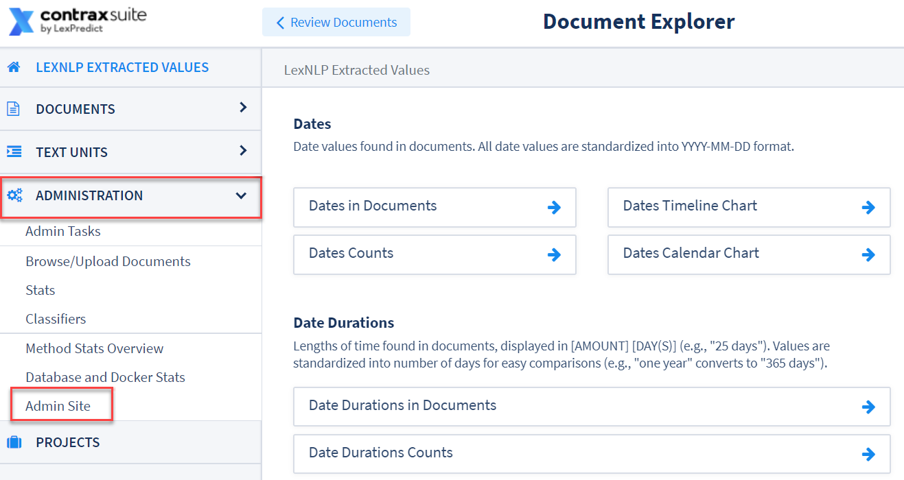

**3.** On the Django Admin site, choose "Users" from the left hand column, and then "Users" again from the submenu.

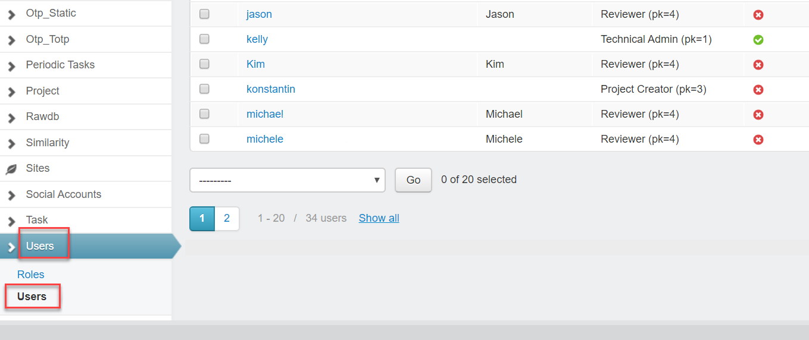

**4.** Select "Add User" in the upper right.

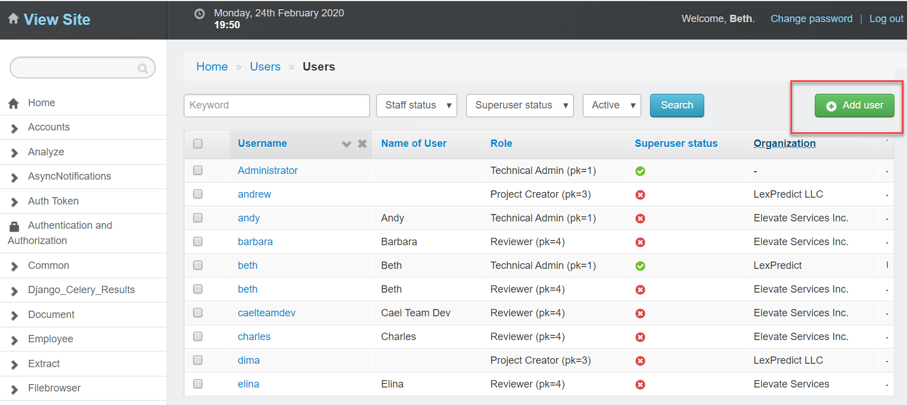

**5.** Input a Username (we recommend using the user's email address), a password, and then confirm the password. Click "Save".

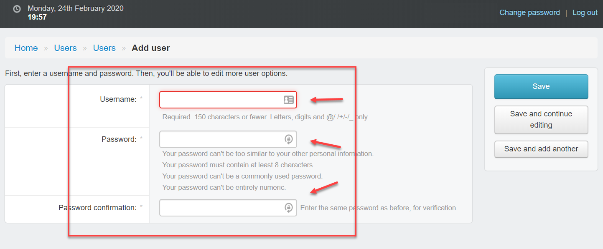

**6.** After clicking "Save" in the previous step, fill in the additional user information on the next page:
  1. **Name of User**: If this has a value, it will always take precedence over *First name/Last name* and *Username*, and display in the UI.
  2. **Role**: Refer back to *[System-Level Permissions](./user_roles.html#system-level-permissions)* above for more.
  3. **Username**: Required. If *Name of User* and *First name/Last name* have no values, this name will display in the UI.
  4. **First name/Last name**: First name and last name for the user. These will appear in the UI if *Name of User* has no value. *First name/Last name* will take precedence over *Username*.
  5. **Email address**: Enter the email a user will login with, and receive notifications to.
  6. **Active**: Should always be checked when adding a new user. This should only be unchecked when deactivating an account.
  7. **Staff Status**: Should be checked if a user needs to create contract types, or needs access to the Document Explorer interface.
  8. **Superuser Status**: It is recommended that only administrators be given Superuser status.

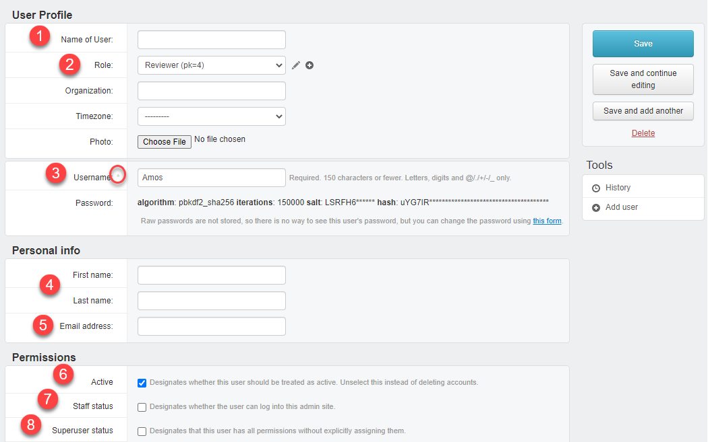

 

**IMPORTANT**: User accounts ***cannot be deleted***, as this could lead to data issues downstream. Instead, admins who want to "remove" a user from a ContraxSuite instance must uncheck the "Active" checkbox to inactivate that user account.

---

#### Assigning Project-Level User Permissions

**1.** Open a Project and go to "Settings".

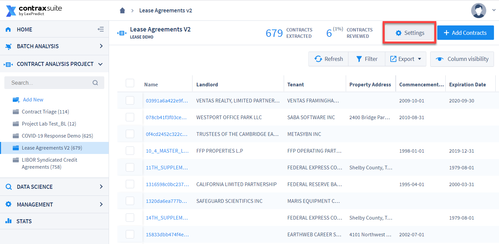

**2.** In the "Add User" form, type ahead to narrow the list of users in the drop-down. Select users you want to add to the project. Click the "+ Add" button once you have selected all the users you want to select.

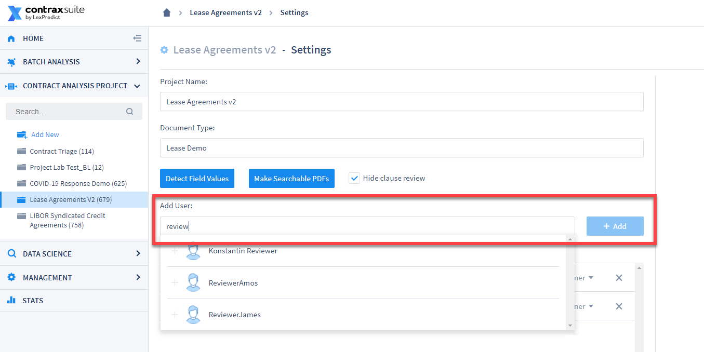

**3.** Choose appropriate Project-Level permissions for the new users you added (they will be set as "Reviewer" by default).

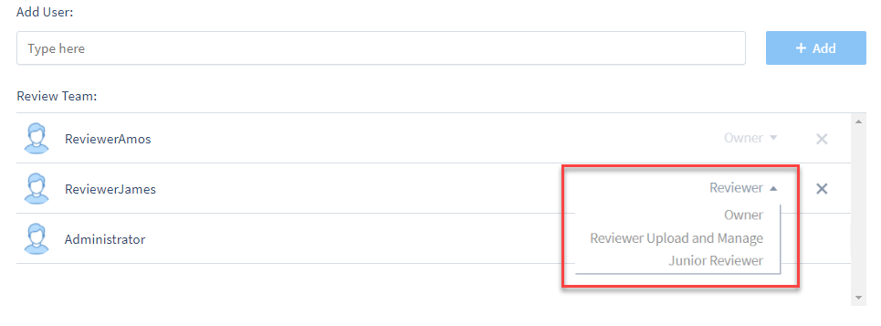

**4.** Select a role for the user:
* *Junior Reviewer*: Can only see and edit documents assigned to them. They *cannot* delete the project and/or documents in it, add users or documents to the project, or perform bulk assignment or status changes.
* *Reviewer*: *Selected by default*. Can see documents, and write or modify Document Fields and extracted values.
* *Reviewer Upload And Manage*: All "Reviewer" permissions, plus the ability to upload documents to that Project. Can also "soft delete" documents. (**Note:** "soft delete" means a user can no longer see the document, but a Project Admin still has access to that document unless and until they complete a separate delete command within the Django Admin Interface).
* *Owner*: All "Review Upload and Manage" permissions, plus the ability to edit the project's Settings, including adding users to the Project.

---

#### Setting/Re-Setting Passwords

Once a user is added and their permissions set, users will receive a confirmation email. After that, new users should follow the instructions below to change their password.

**1.** Go to "Forgot Password" on the login page:

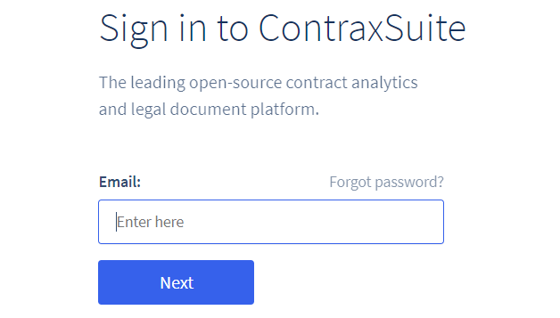

**2.** Input your email address and select "Request reset link":

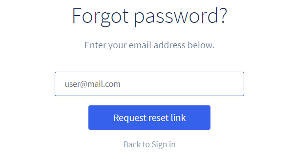

**3.** You will be sent an email with a link to reset your password:

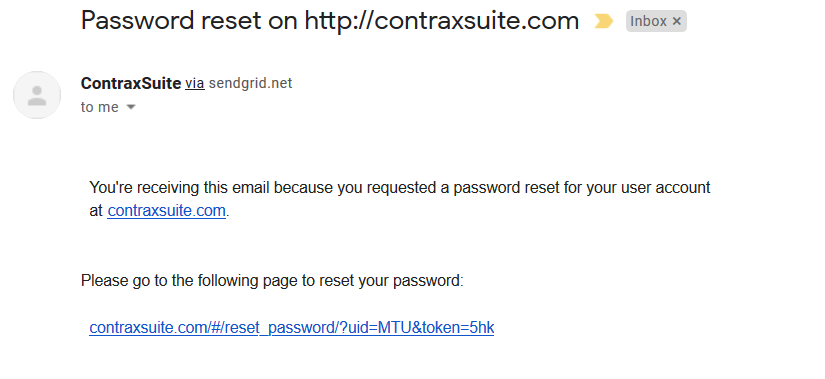

Click the link and follow the instructions to reset your password.

---

#### Supplemental Information on User Types

Different users will have access to different parts of ContraxSuite, depending on their System-Level and Project-Level permissions. Below, we've written some supplementary information on user types, and the ways in which different types of users might interact with ContraxSuite.

###### Reviewers

* Have subject matter expertise for relevant Document Types
* Require minimal user interface training (experienced with other document review/contract management platforms)

###### Power Users and Admins

A power user of ContraxSuite is likely a subject matter expert, and possibly the project manager who directly supervises reviewers. A power user or admin likely does all of the following:
* Determine what Document Types and Document Fields are needed for a project
* Write descriptions for Fields, and configure Document Types and Document Fields
* Determine which Fields are shown or hidden, based on project needs
* Knows how to (or can be trained to) modify Fields and Field Detectors (though this may be covered by IT)
* May have some IT or developer knowledge, but is not the implementation lead on the project

A business analyst or innovation resource acting as a power user or admin may have more advanced training, though not necessarily as much as a developer. Configuring additional aspects of the ContraxSuite interface may mean that a power user or admin has been trained to perform some or all of the following:
* Modify Document Fields and their descriptions
* Change the order in which Fields appear on the page, as well as their [Categories](./create_document_field.html#additional-forms)
* Add automatic extraction for Fields that meet certain simple criteria, with degree of complexity dependent on sophistication of reviewers (see above)
* Add Fields with data that is not automatically extracted, [using formulas](./writing_formulas)
* Manage and update app notifications
* Add or hide Fields, and change labels, in a data visualization. May require working with IT or LexPredict resources on server-side storage of relevant data
* Connect other data visualization tools, such as PowerBI. May require working with IT or LexPredict resources to connect to database
* Build new data models, including customizable data visualization options, which may require working with IT or LexPredict resources

###### IT

Specialist in server maintenance, data storage, and upgrades. An IT resource will likely be responsible for all of the following:
* Setting up the server and performing regular maintenance, which may include migrating or renaming servers
* Implementing system upgrades by taking instruction from LexPredict staff and copy-pasting code into command line
* Monitoring server size and troubleshooting for space needs on virtual machines (VMs)
* Monitoring and updating off-server database backups
* Performing data migrations, if needed

IT specialists are not mandatory on a project, as LexPredict staff can assist in these functions. An IT specialist on a ContraxSuite implementation will be given documentation, including instruction on how to upgrade their own server via a `dev` instance.

###### Developers

There are many ways a developer can add their own custom code. We deploy [Jupyter](https://jupyter.org/) notebooks so that a developer can use the platform to analyze their own documents, without necessarily setting up a complete development environment. Developers can thus:
* Use LexNLP to load a document set and retrieve all of one data type (*e.g.*, every **date** in a document set). This data can be exported to a spreadsheet or a third-party application
* Work with LexPredict resources to ensure that changes they make using Jupyter notebooks are not overwritten during system upgrades

LexPredict has various law firm clients and non-law firm clients with their own data science teams, and they choose our platform because of the many versatile developer tools we offer. For more information on LexNLP Jupyter notebooks, [visit the LexNLP GitHub page](https://github.com/LexPredict/lexpredict-lexnlp/tree/master/lexnlp/extract/en).
