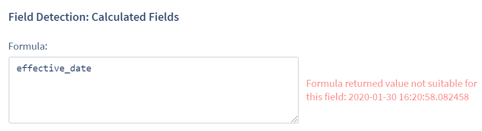
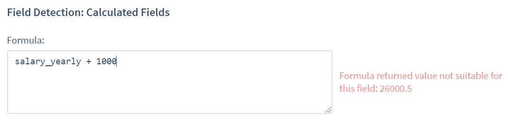
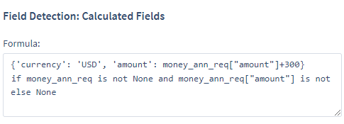

## Writing Formulas

**Formulas are required for all Fields that use calculation rather than regexp Field Detectors.**

In ContraxSuite, multiple Fields within a Document Type can be combined to calculate the value of another Field within that Document Type. Users can write formulas to calculate these values, provided that the data necessary for the calculation is extracted, and not merely text included in an annotation. For example, you can write a formula that uses a Duration Field and a Date Field, but this formula would not be able to include ancillary data from one of those Field's annotations (*e.g.*, the time zone mentioned in the duration) as part of the formula.

A common situation in which a formula might be needed is in the case of expiration dates. Some contracts explicitly state their expiration date. Others might only state the start date and the term length of the contract. For contracts that lack an explicit expiration date, the expiration date can be calculated with a formula that takes the start date and the term. The result is an expiration date not directly extracted from the contract, but nevertheless reliably calculated and then stored as a value.

Let's look at an example of how this would work. Let's say we want to find, or calculate, as many expiration dates as possible in a project. We want to create both an expiration date value to be extracted, *and* a calculated expiration date for those situations where there is no explicitly stated expiration date.

To achieve this, we might follow these steps:

**Step 1.** Create a **"Start Date"** Field:
  * **Field Type:** Date: Non-recurring
  * **Code:** `start_date`
  * Create [Field Detectors](./create_field_detectors) to extract this "Start Date"

**Step 2.** Create a **"Term"** Field:
  * **Field Type:** Duration
  * **Code:** `term`
  * Create [Field Detectors](./create_field_detectors) to extract this "Term"

**Step 3.** Create an **"Expiration Date"** Field:
  * **Field Type:** Date: Non-recurring
  * **Code:** `expiration_date`
  * Create [Field Detectors](./create_field_detectors) to extract this "Expiration Date" from wherever it may be explicitly stated in the document

Once these three Fields have been created, it's time to create the Field that will contain the proper formula:

**Step 4.** Create an **"Expiration Date Calc"** Field:
  * **Field Type:** Date: Non-recurring
  * Field forms:
    * **Value detection strategy:** "No ML. Use formula only."
    * **Depends-on fields:** `start_date`, `term`, and `expiration_date`
    * **Field Detection: Calculated Fields:** Write this formula in the form:
```
    expiration_date if expiration_date \ 
    else start_date + datetime.timedelta(days=term) if term and start_date \
    else None
```

The `datetime.delta` code will calculate the expiration date by adding the number of days in `term` to the date value extracted from `start_date`. Since `expiration_date` is a Date Field, the value will be calculated and stored as a Date value.

**Step 5.** Determine if you want users to see `expiration_date` or not, and whether you want users to be able to edit "Expiration Date Calc" directly. This can be handled one of two ways:
  * **Make "Expiration Date Calc" Read Only:** If you want reviewers to take the time to capture proper annotation highlights (to use the data for further training), make Expiration Date Calc read only. Then, advise reviewers that if they find an explicitly stated expiration date, they should assign it to the `expiration_date` Field. Otherwise, they should populate `start_date` and `term` with proper annotation highlights. Reviewers will never be able to edit "Expiration Date Calc" directly.
  * **Make "Expiration Date" Hidden Always:** If you want answers fast, and if there are only limited benefits to having reviewers manually tag any expiration dates they find, then it might be better to set `expiration_date` to "hidden always". Reviewers will not be able to see or edit the annotations on Expiration Date directly; they will only see the final calculated value for Expiration Date Calc displayed in the Annotator. This method is useful when admins and power users plan to utilize the final calculated values, but not their associated annotations.

---

#### Examples of Formula Writing Errors

The best way to write formulas depends heavily on the Field Types used, and the desired Field Type result. If you want a Date Field result, for example, then you need to have your formula return a Date Field. Error messages in ContraxSuite can provide some guidance on what the Field Type should look like if/when it is misused in the context of the written formula.

For example, if we write a formula that includes an "Effective Date" Field, but that Field is actually a **String** Field rather than a Date Field, we will get an error as soon as we try using it in a formula:

  

You can correct this by replacing the code in the image above with `str(effective_date)`. This will extract the written data from the Field and read it as a String (letters, numbers, symbols) instead of as a Date (only numbers).

Another example of a common error is when you try to do addition with a Currency Field. The error occurs because a Currency Field is not just a number, but a number *and* a currency type like USD or GBP. Assume that `salary_yearly` is a Currency Field:

  

The above error message appears because a Currency Field has both a numeric value and a currency type (*e.g.*, USD), as opposed to one of the Integer Field Types that only have numeric values. In order to add "1000" to the "amount" portion of the Currency Field, you would need to do a calculation on only the "amount" portion of the extracted value, and ensure that the final calculated result is formatted using the criteria outlined in the currency dictionary referenced by the error message (in this case, a `python` dictionary with a "currency" and an "amount". Learn more about [“Python Dictionaries here”](https://www.w3schools.com/python/python_dictionaries.asp)).

An error-free version of the formula might look like this:

  

The calculation works because the 'currency' value of 'USD' is kept separate from the numeric value '300' and the arithmetic performed on it by the formula.

Error messages will supply some information on correct formatting, but here are some of the most common Field Types and the data values to keep in mind as you write formulas:
  * Currency Field: This is a dictionary value (*e.g.*, USD, GBP, JPY) and an amount
  * Related Info: Requires a Boolean value (*i.e.*, True if any annotations found, otherwise False)
  * Date: A value format that can include a Date and/or a Time
  * Duration: Floating Point Number
  * Company, String, Choice, Multi Choice: All of these Fields return string values

---

#### Additional Tips and Troubleshooting

* It's important to remember that any Field you use in a formula must be present in the same Document Type.
* Formulas can break document loading if they do not properly account for null values. Always check that a value "is not None" before you write an operation into a formula (you do not want to divide by 0, for example). Do this with a line of code similar to the following:
  * `field_a` **if** `field_a` **is not None**
* Regularly test document loading while you write formulas, to ensure you have no serious runtime errors.
* Sometimes the operator `==` is needed, while other times the word `is` must be used.
  * Use `is` for: `is None`, `is not None`, `is True`, or `is False`
  * Use the  `==` operator to check the specific value of a Field
* Formulas must be written on one line of logical `python`. The "\\" operator allows you to put in a line break for readability, but due to the one line limitation, **if-then** statements must be written like "result" **if** "condition" **else** "alternative".
* Every formula *must* return a value. Always include a final `else` in a formula (e.g., `else None`) to ensure a value will be returned.
* You must use the exact Code that matches a Field used in a formula as a "depends-on" Field. If you use a Code that is not included in the "depends-on" Fields, you will receive an error message.

---

#### Additional Sample Formulas

**Example #1**

Consider the standard way you might want to write just about any formula. Assume you have a Company, Choice, or String Field, and want to determine whether it has a value:
* If `field_a` exists, and `field_a` has a value, then use that value
* Otherwise, populate `field_a` with 'No Value Found'

We would write this standard code in the following way:
```
    field_a if field_a
    else 'No Value Found'
```

**Example #2**

Assume that a Field called `span_color` is a Company, Choice, or String Field. (Click here for more on [Document Fields](./create_document_field)). Further assume that a function called `eng_color` is a Company, Choice, or String Field. Then consider how to write logic for the following:
* If eng_color is not null and is "red", set `span_color` to "rojo"
* Otherwise, if `eng_color` is not null and is "blue", set `span_color` to "azul"
* Otherwise, if `eng_color` is not null and is "yellow", set `span_color` to "amarillo"
* Otherwise, the Field stays null

Here is how we would write this in code:
```
    'rojo' if eng_color and eng_color == 'red'
    else 'azul' if eng_color and eng_color == 'blue'
    else 'amarillo' if eng_color and eng_color == 'yellow'
    else None
```

This could also be written the following way (logically the same):
```
    'rojo' if eng_color == 'red' \ else 'azul' if eng_color == 'blue' \ else 'amarillo' if eng_color == 'yellow' \ else None
```

**Example #3**

Let's look at a different sort of formula. Assume that `term_find` is a Duration Field, and `commencement_date` and `expiration_date` are both Date Fields. Then consider how to write logic for the following:
* If `term_find` is populated, use that value
* Otherwise, if `commencement_date` and `expiration_date` are populated, subtract `commencement_date` from `expiration_date` to get the length (in days) of the term, and use that value
* Otherwise, the Field stays empty

Here is how we would write this in code:
```
    term_find if term_find
    else (commencement_date - expiration_date).days if commencement_date and expiration_date
    else None
```

**Example #4**

Consider another example formula. Assume that you have a Floating Point Number Field named `number_find`. Then consider how to write logic for the following:
* If `number_find` is populated and greater than 1, use that value
* If `number_find` is less than 1, you want to multiply it by 10
* Otherwise, set the value to 0

This would be written in code as the following:
```
    number_find if number_find and number_find > 1
    else number_find * 10 if number_find
    else 0
```