## Batch Analysis (Document Triage)

Batch Analysis projects are great for whenever a user is not sure what types of documents they have, and wants to perform identification and triage of documents before organizing them and continuing on to Contract Analysis.

---

#### Clusters Tab

Clustering provides a visual aid for users who don't yet know exactly what data they have in their documents, or even what kinds of documents they have. After uploading documents into a Batch Analysis, a user will be able to view the documents in that project arrayed as a series of clusters.

  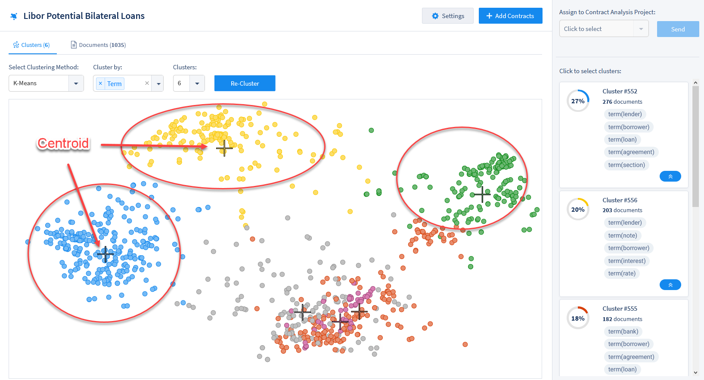

Each document is represented by a dot in the cluster array. When dots at the same color, it is because they contain similar data (*e.g.,* terms, dates, definitions, clauses, *etc.*). The centroid cross within the cluster, meanwhile, represents the mathematical mean of the similar documents that have been clustered together, based on that data type.

You can change the data type used to cluster documents, as well as other parameters of the clustering process, in the top bar of the cluster array.

  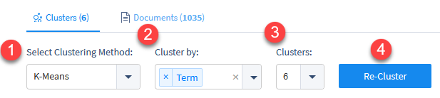

**1. Select Clustering Method:** There are three different mathematical methods users can implement for clustering. Each method provides a slightly different picture of the data. The outbound links listed here provide more information on these three clustering methods:
  * [K-means Clustering](https://en.wikipedia.org/wiki/K-means_clustering)
  * [Minibatch K-means Clustering](https://www.geeksforgeeks.org/ml-mini-batch-k-means-clustering-algorithm/)
  * [Birch Clustering](https://en.wikipedia.org/wiki/BIRCH)

**2. Cluster by:** Choose which Data Entities to use for calculating clusters. You can select more than one Data Entity to produce more specific clusters.
  * Term
  * Text
  * Currency name
  * Currency value
  * Date
  * Definition
  * Duration
  * Party
  * Geoentity

**3. Clusters:** Choose the number of clusters to be calculated. Each cluster will be assigned a different color. Changing this setting can be especially useful if you know, for example, that you have documents from four separate countries, or that you have three different types of documents, or that you have eight different clients. This is also important when choosing how and where to send clusters to Contract Analysis projects.

**4. Cluster/Re-Cluster:** Click this button to re-cluster documents after changing your settings. This may take a second, or close to a minute, depending on how many documents are in your Batch project.

Note also that you can open the document associated with a specific dot in a cluster by hovering over and clicking the filename that appears.

  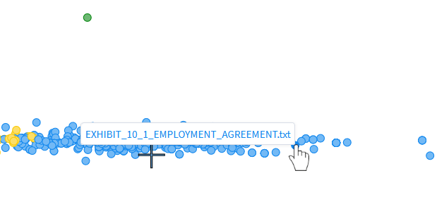

###### Editing Clusters

Once your documents are clustered the way you want, you can name clusters by hovering over the cluster name.

  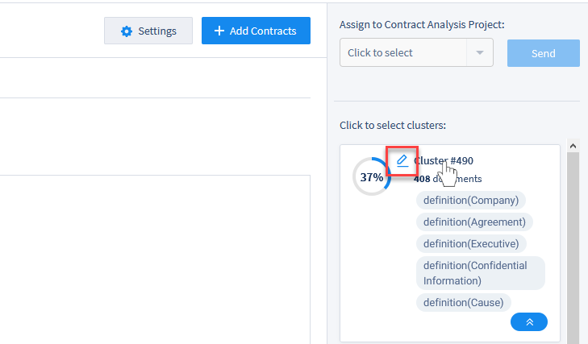

Enter a new name for the cluster and click the green "checkmark" (or click the red "x" to revert).

###### Sending Clusters to Contract Analysis Projects

After clustering your documents, you can easily send an entire cluster to an already existing Contract Analysis project. Find the cluster you want to send, and click on it. A blue border will appear around that cluster's information.

  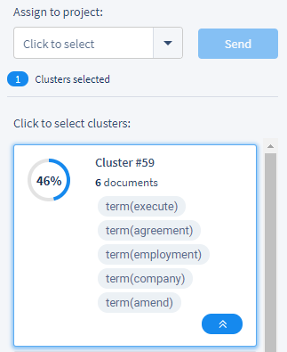

Next, use the drop-down menu at the top right of the screen (top center, above) that says, "Click to select". All Contract Analysis projects that you have access to will be listed in the drop-down. Select the cluster you wish to send, and click "Send" to send those documents from the Batch Analysis and into the chosen Contract Analysis project for more in-depth review and training.

Once your Contract Analysis project has all the documents you want to send to it from the Batch Analysis, you can [start reviewing those documents](./contract_analysis).

---

#### Documents Tab

Clicking the "Documents" tab in the top left of a Batch Analysis Project will take you to the Document Grid View.

  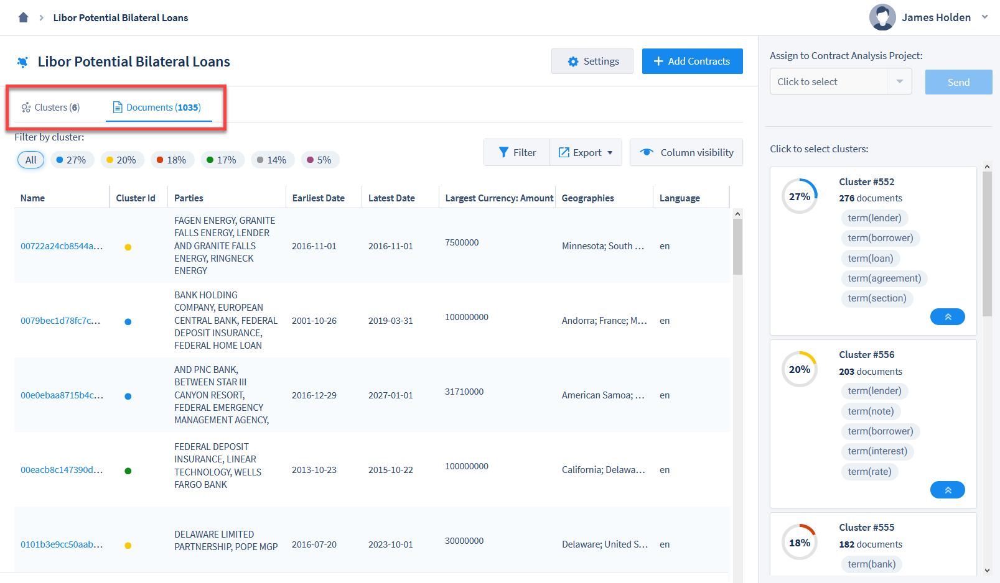

Documents are listed in the Grid with different columns representing Data Entities, including a column for Cluster ID with a matching colored circle. In the top right of the Documents Grid, there are several options for customizing the Grid.

  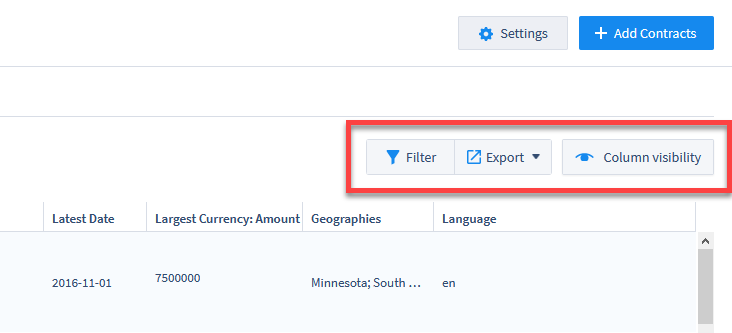

* **Filter:** This option allows you to filter the Documents Grid using individual searches in any of the visible columns. For example, typing "< 5000000" in a Currency Field will show only those documents that have extracted currency values of under 5,000,000. Use in combination with Column Visibility to conduct targeted searches within an entire project.
* **Export:** You can export a spreadsheet of all the data contained in the Documents Grid, based on which Filters and Columns you've chosen to display.
* **Column Visibility:** Change which Fields are visible in the Documents Grid. Use in combination with Filters to conduct targeted searches within an entire project.

---

#### Annotator

As with Contract Analysis projects, clicking on a document's name in the Documents Grid will open that document in the Annotator. The document's text is displayed, with passages of text highlighted based on standard extracted Data Entities. The available Data Entities are also available as clustering options:
  * Currencies
  * Dates
  * Definitions
  * Durations
  * Parties
  * Geoentities

The Annotator displays the highlighted text from which ContraxSuite has automatically extracted these standard Data Entities. The blue highlights in the main pane show where the data was found in the document, while the index on the right pane shows which Fields extracted the data. The image below shows a document in the Batch Annotator.

  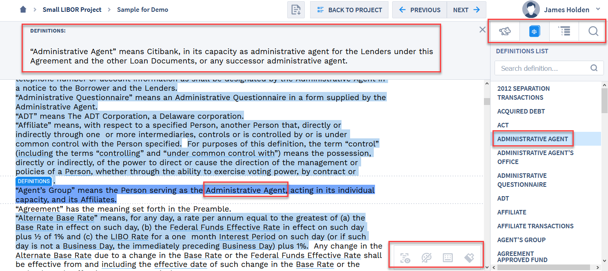

* In the top left there is a collapsible "Definitions" panel, which shows definitions of specific words and phrases in the document, based on the Definition Data Entities found within the document.
* In the top right, the Batch Annotator screen defaults to showing "Quick Data" in the right pane. The "Quick Data" pane contains an index of the Data Entities listed above.
* At the bottom right of the main viewing pane, there is an icons panel with different user features.

###### Icons Panel

The Icons Panel in the bottom right contains a legend with 4 icons:

  

**1.** **Text Highlights On/Off:** By default, users will see highlights in the Annotator Screen for any text unit that has a value extracted from it. If you wish to hide these highlights for all of the text in the document, click this icon to toggle highlights on or off.

**2.** **Color-Coded Entities On/Off:** Enable or disable color-coding of the six Data Entities listed above.

  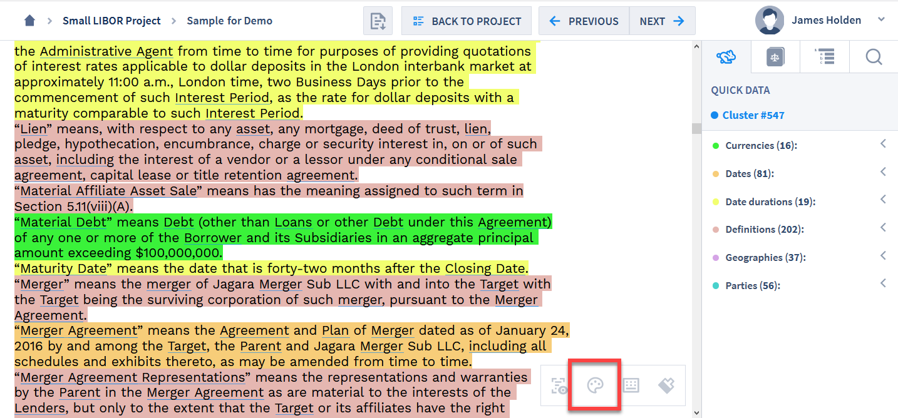

Each color is assigned by default, but you can change the color associated with a Quick Data Entity by hovering over the color circle next to the Date Entity in the Quick Data right pane.

  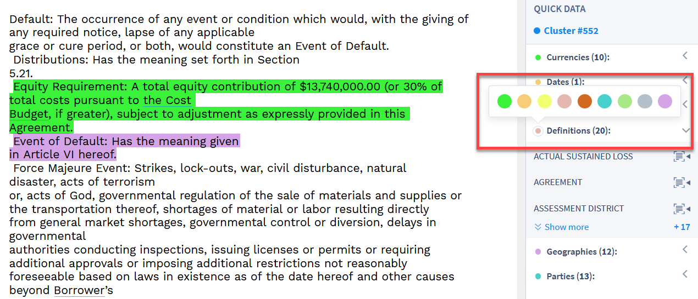

**3.** **Keyboard Shortcuts On/Off:** Click this icon to show a list of keyboard shortcuts available in the Batch Annotator. To hide this panel, click the **"X"** in the upper right corner.

  

**4.** **Styles Tab:** Click this icon to display a list of different style options (background color + font style). To hide this panel, click the **"X"** in the upper right corner.

  

###### Viewing Tabs

There are four main viewing tabs in the right pane of the Batch Analysis screen:

  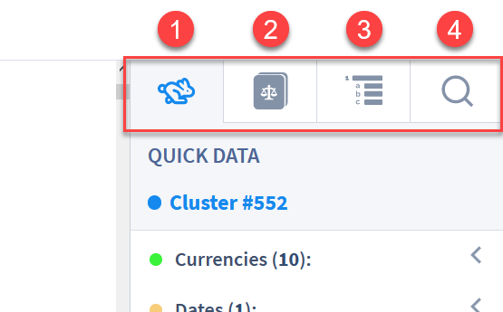

**1. Quick Data**: This is an index of standard Data Entities (such as Currencies, Dates, Date Durations, Definitions, Parties, *etc.*) in the document.

**2. Definitions**: This tab displays a list of defined terms within a document, extracted from the structure of the document. This includes any internal lists of definitions contained within the document itself.

**3. Section Navigation**: This tab displays a document's internal sections and sub-sections. Users can quickly navigate to different sections in the document by clicking on a section or sub-section in this list.

**4. Search**: This tab allows users to conduct a simple search within the document for specific words or phrases. Users can choose to search via regular text, or via [regular expressions](https://en.wikipedia.org/wiki/Regular_expression).