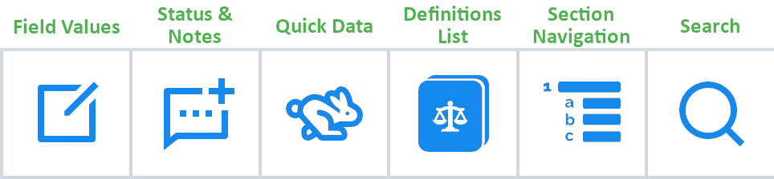

## Contract Analysis (Document Review)

Document reviewers in ContraxSuite typically upload documents to Batch Analysis for quick triage before sending documents to Contract Analysis projects. Reviewers can either upload documents to a Batch Analysis, or upload them straight into a Contract Analysis project if they wish to skip the triage of Batch Analysis.

---

#### Document Grid View

Reviewers primarily use the Contract Analysis interface when they interact with documents. To get started, open up a Contract Analysis project from the main menu (left pane). You'll be taken to the Document Grid View, which looks something like this:

  

Several Field Types will be displayed automatically, such as:
* **Name:** The filename of a document
* **Assignee:** The user who has been assigned to review that particular document. Typically an admin or power user will assign reviewers to a project, but permission can be given to reviewers to self-assign documents as well.
* **Status:** There are five statuses that can be given to a document, depending on what stage it's at in a project's workflow. Statuses are manually assigned.
    * *Loaded*: A document that has been successfully uploaded to a Contract Analysis project will have this as its default status.
    * *Not Started*: A reviewer has been assigned to a document, but wishes to indicate that they have not started reviewing that document yet.
    * *In Review*: The reviewer is currently reviewing the document
    * *Completed*: The reviewer has completed reviewing the document. Field Values cannot be edited when a document is marked *Completed*.
    * *Excluded*: The reviewer has determined that the document cannot be reviewed, or should not be reviewed. Often, this status is used when a document is not scanned and parsed correctly, or it does not belong in the project in the first place and was included by mistake. Field Values cannot be edited when a document is marked *Excluded*.

Note: The list of Status choices is configurable to adjust to specific work flows.

Reviewers have several tools at their disposal for modifying the look of the Document Grid View.

  

* **Refresh:** If you've uploaded new documents, or changed other settings, but do not see the changes to the Document Grid View, click "Refresh" before troubleshooting in other ways.
* **Filter:** This option allows you to filter the Document Grid View using individual searches for any of the visible columns. For example, typing "<5000000" in a Currency Field will show only those documents that have extracted currency values of under 5,000,000. Use in combination with *Column Visibility* to conduct targeted searches within an entire project of documents.
* **Export:** You can export a spreadsheet of all the data contained in the Document Grid View.
* **Column Visibility:** Change which Fields are visible in the Document Grid View. Use in combination with **Filter** to conduct targeted searches within an entire project of documents.

  

---

#### Annotator Screen

Clicking on a document in the Document Grid View will open that document in the **Annotator**. Once you've opened a document in the Annotator, you will see the document displayed in plain text, with Fields and Field Values displayed by default in the right index pane.

The Annotator highlights text from which ContraxSuite has extracted data. The highlights in the main viewing pane show where the data was found in the document, while the right index pane shows the extracted data in its associated Field. The data extracted for a specific field is dependent on its Field Type. (ie. Date, Geography, Company, etc.) Relevant data is extracted and placed inside [Document Fields](../power_users/create_document_field) based on the [Field Detectors](../power_users/create_field_detectors) written by admins and power users. For example, in the picture below, the phrase **"the 1st day of October, 1996,"** was extracted as the "Document Date".

  

This date was successfully extracted because a "Date" Field Type was created, with a Field Detector written to extract date values. ContraxSuite searched for patterns within this document's text that looked like dates, in this case translating "the 1st day of October, 1996". Because this is a "Date" Field, ContraxSuite then automatically extracted that date into a standardized format of "1996-10-01". This is just a simple example of how Field Detectors can be configured to find and extract virtually any kind of data that might be contained in a document.

###### Navigation in Contract Analysis Projects

There are six main viewing tabs in the Contract Analysis screen.
  
  

* **Field Values**: This tab contains forms for all Document Fields assigned to the Document Type. This tab is where the bulk of review work in the Annotator takes place.
* **Status & Notes**: This tab contains Status options for the document being reviewed (*See "Status" above*), as well as a space for reviewers and power users to take notes on specific passages of text in a document.
* **Quick Data**: This is an index of various standard data (such as Currencies, Dates, Date Durations, Definitions, Parties, *etc.*) in the document.
* **Definitions**: This tab displays a document's internal list of definitions/defined terms. The selected term will appear in a header window, so that users can navigate elsewhere in the document while keeping the definition visible.
* **Section Navigation**: A document's internal sections and sub-sections will be displayed in this tab so that users can quickly navigate to different sections in the document.
* **Search**: Conduct a simple search within the document for specific words or phrases. Users can choose a normal word search, or search via regular expressions.

###### Manual Extraction

Fields and Field Detectors written by admins and power users may not always capture and extract all of the correct data, all of the time. In the event that a Field Detector *does not* correctly extract the right data and use it to populate the correct Field, a reviewer can use the Annotator to find the correct passage of text, highlight it, and manually assign the correct value to the correct Field. Doing so will collect data accesssible for future improvements to the system.

**1.** Check document for any [Document Fields](../power_users/create_document_field) that are missing data and annotations, or that do not have the correct data or annotations. (This may be because of under-inclusive [Field Detectors](../power_users/create_field_detectors).)

**2.** Drag the cursor over the passage of text you wish to assign to a Field. After selecting the text, it will be highlighted in orange.

  

**3.** Once your text passage is highlighted, click the Field in the right index pane that you wish to assign that text to. Depending on the chosen Field's type, the relevant data within the passage will be automatically extracted. Other Field Types - such as Choice, Multi-choice, or String Fields - will prompt you to manually enter a value in the form. Related Info type fields do not contain a corresponding data value.

**4.** Data reviewer highlights and annotations will be saved, and can be tracked for future improvements to the system in regard to automatic field detection accuracy. New annotations will also be reflected in the data that is extracted from documents and stored in the database.