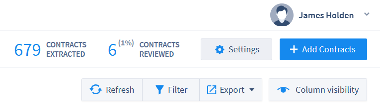
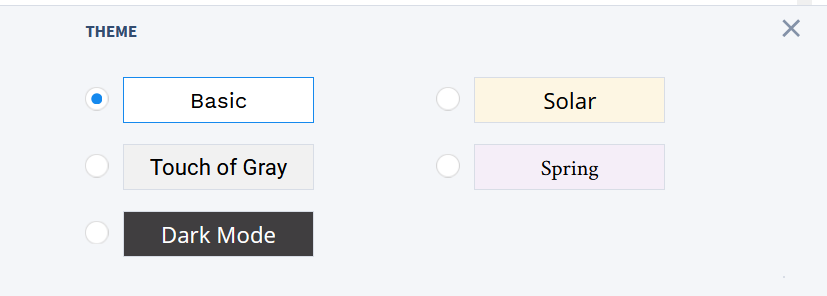

## Contract Analysis (Document Review)

Document reviewers in ContraxSuite typically upload documents to Batch Analysis for quick triage before sending documents to Contract Analysis projects. Reviewers can either upload documents to a Batch Analysis, or upload them straight into a Contract Analysis project if they wish to skip the triage of Batch Analysis.

---

#### Document Grid View

Reviewers primarily use the Contract Analysis interface when they interact with documents. To get started, open up a Contract Analysis project from the main menu (left pane). You'll be taken to the Document Grid View, which looks something like this:

  

Several Field Types will be displayed automatically, such as:
* **Name:** The filename of a document
* **Assignee:** The user who has been assigned to review that particular document. Typically an admin or power user will assign reviewers to a project, but permission can be given to reviewers to self-assign documents as well.
* **Status:** There are five statuses that can be given to a document, depending on what stage it's at in a project's workflow. Statuses are manually assigned.
    * *Loaded*: A document that has been successfully uploaded to a Contract Analysis project will have this as its default status.
    * *Not Started*: A reviewer has been assigned to a document, but wishes to indicate that they have not started reviewing that document yet.
    * *In Review*: The reviewer is currently reviewing the document
    * *Completed*: The reviewer has completed reviewing the document. Field Values cannot be edited when a document is marked *Completed*.
    * *Excluded*: The reviewer has determined that the document cannot be reviewed, or should not be reviewed. Often, this status is used when a document is not scanned and parsed correctly, or it does not belong in the project in the first place and was included by mistake. Field Values cannot be edited when a document is marked *Excluded*.

Note: The list of Status choices is configurable to adjust to specific work flows.

Reviewers have several tools at their disposal for modifying the look of the Document Grid View.

  

* **Refresh:** If you've uploaded new documents, or changed other settings, but do not see the changes to the Document Grid View, click "Refresh" before troubleshooting in other ways.
* **Filter:** This option allows you to filter the Document Grid View using individual searches for any of the visible columns. For example, typing "<5000000" in a Currency Field will show only those documents that have extracted currency values of under 5,000,000. Use in combination with *Column Visibility* to conduct targeted searches within an entire project of documents.
* **Export:** You can export a spreadsheet of all the data contained in the Document Grid View.
* **Column Visibility:** Change which Fields are visible in the Document Grid View. Use in combination with **Filter** to conduct targeted searches within an entire project of documents.

  

---

#### Annotator Screen

Clicking on a document in the Document Grid View will open that document in the **Annotator**. Once you've opened a document in the Annotator, you will see the document displayed in plain text, with Fields and Field Values displayed by default in the right index pane.

The Annotator highlights text from which ContraxSuite has extracted data. The highlights in the main viewing pane show where the data was found in the document, while the right index pane shows the extracted data in its associated Field. The data extracted for a specific field is dependent on its Field Type. (ie. Date, Geography, Company, etc.) Relevant data is extracted and placed inside [Document Fields](../power_users/create_document_field) based on the [Field Detectors](../power_users/create_field_detectors) written by admins and power users. For example, in the picture below, the phrase **"the 1st day of October, 1996,"** was extracted as the "Document Date".

  

This date was successfully extracted because a "Date" Field Type was created, with a Field Detector written to extract date values. ContraxSuite searched for patterns within this document's text that looked like dates, in this case translating "the 1st day of October, 1996". Because this is a "Date" Field, ContraxSuite then automatically extracted that date into a standardized format of "1996-10-01". This is just a simple example of how Field Detectors can be configured to find and extract virtually any kind of data that might be contained in a document.

###### Definitions

In the document display, you will also see some words that are underlined. These are terms that are defined within the context of the document itself. If you click on an underlined word/phrase, the internal definition of that word will be displayed at the top of the Annotator screen.

  

You can also search the Definitions list in the right pane by using the search bar.

###### Annotator Tabs

There are six different viewing tabs in the Contract Analysis Annotator.
  
  

**1. Field Values**: This tab contains forms for all Document Fields assigned to the Document Type. This tab is where the bulk of review work in the Annotator takes place.

**2. Status & Notes**: This tab contains Status options for the document being reviewed (*See "Status" above*), as well as a space for reviewers and power users to take notes on specific passages of text in a document.

**3. Quick Data**: This is an index of standard Data Entities (such as Currencies, Dates, Date Durations, Definitions, Parties, *etc.*) in the document.

**4. Definitions**: This tab displays a list of defined terms within a document, extracted from the structure of the document. This includes any internal lists of definitions contained within the document itself. (*See "Definitions" above for more*)

**5. Section Navigation**: This tab displays a document's internal sections and sub-sections. Users can quickly navigate to different sections in the document by clicking on a section or sub-section in this list.

**6. Search**: This tab allows users to conduct a simple search within the document for specific words or phrases. Users can choose to search via regular text, or via [regular expressions](https://en.wikipedia.org/wiki/Regular_expression).

###### Icons Panel

In the bottom right corner of the Annotator screen, there is a legend containing 3 icons:

  

**1.** **Text Highlights On/Off:** By default, users will see highlights in the Annotator Screen for any text unit that has a value extracted from it. If you wish to hide these highlights for all of the text in the document, click this icon to toggle highlights on or off.

**2.** **Keyboard Shortcuts On/Off:** Click this icon to show a list of keyboard shortcuts available in the  Annotator Screen. To hide this panel, click the **"X"** in the upper right corner.

  

**3.** **Styles Tab:** Click this icon to display a list of different style options (background color + font style). To hide this panel, click the **"X"** in the upper right corner.

  

#### Manual Extraction in Contract Analysis

Fields and Field Detectors written by admins and power users may not always capture and extract all of the correct data, all of the time. In the event that a Field Detector *does not* correctly extract the right data and use it to populate the correct Field, a user in the Annotator can find the correct passage of text, highlight it, and manually assign that highlighted text to the correct Field. Doing so will extract any data from the highlighted passaged that is applicable to that Field's Type (*e.g.,* highlighting a paragraph that contains a name and then clicking an empty Company or Person Field will populate that Field with that name, in the right pane).

**1.** Check document for any [Document Fields](../power_users/create_document_field) that are missing data and annotations, or that do not have the correct data or annotations. (This may be because of under-inclusive [Field Detectors](../power_users/create_field_detectors).) Then drag the cursor over the passage of text you wish to assign to a Field. After selecting the text, it will be highlighted in orange.

  

**2.** Once your text passage is highlighted, click the Field in the right pane that you wish to assign that text to. Depending on the chosen Field's type (*e.g.*, Date or Duration Fields), the relevant data within the passage will be automatically extracted. Other Field Types - such as Choice, Multi-choice, or String Fields - will prompt you to manually enter a value in the form. Related Info Fields, meanwhile, will not prompt user to fill in a data value.

**3.** If the text you want to highlight for a particular Field is already highlighted and associated with a different Field, a prompt will appear that says **"+ Set to..."**. Click the **"+ Set to..."** button and repeat the process outlined in Step 2. 

  

**4.** You can also delete the highlight associated with a Field, by clicking on the highlighted text and instead clicking the **"X"** button next to the **"+ Set to..."**  button. Be sure that the highlighted Field tab displays the name of the Field for which you want to remove the highlight, then click on the **"X"**.

  

**5.** After clicking the **"X"**, the highlight will disappear, and that text will no longer be associated with the Field. In the image above, the highlight is associated with the Field "IBOR Definition Multi". In the image below, after clicking the **"X"** button, that Field is no longer associated with this highlight.

  

**6.** Data reviewer highlights and annotations will be saved, and can be tracked for future improvements to the system in regard to automatic field detection accuracy. New annotations will also be reflected in the data that is extracted from documents and stored in the database.