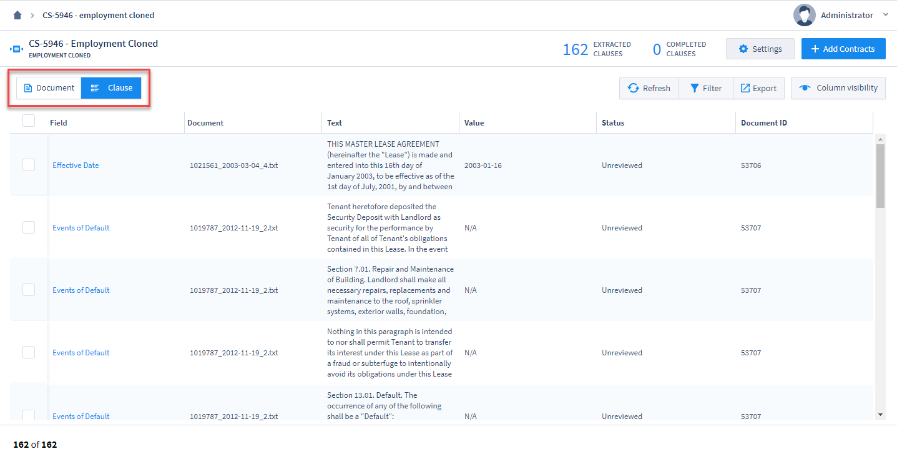
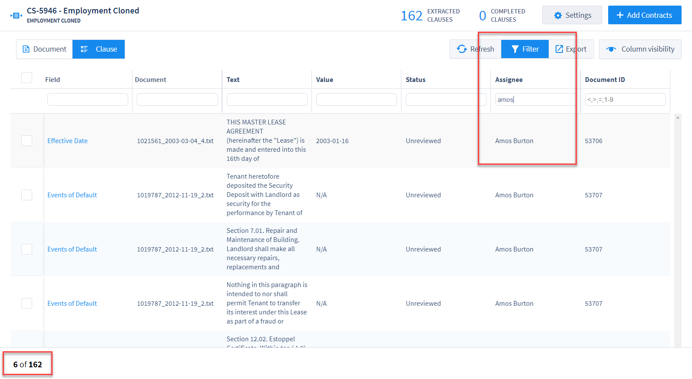
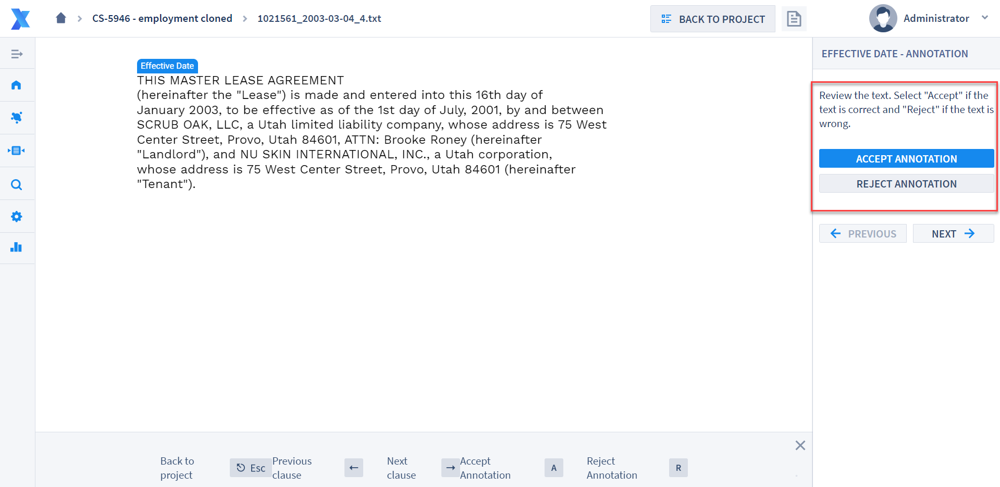
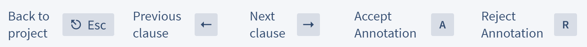

## Contract Analysis (Clause Review)

All Contract Analysis projects have the option to turn on the Clause Review workflow. This allows Reviewers, and other users, in a given project to review individual clauses extracted by the Fields/Field Detectors in a simple, user-friendly workflow, choosing to either "Accept" clauses that contain the correct values extracted by Fields/Field Detectors, or "Reject" any values that were incorrectly extracted.

Reviewers should follow the basic process outlined below for accessing the clauses they are responsible for reviewing.

---

#### Clause Grid View

Once you've logged in to ContraxSuite, click "Contract Analysis Project" and find the project you wish to work on. *Note: Technical Admins must assign Reviewers to individual projects, and then may also assign individual clauses to Reviewers.*

**1.** Click the "Clause" button to see the Clause Grid View.

  

The Clause Grid View is virtually identical to the Document Grid View, with just a few exceptions:
* The grid rows represent individual clauses extracted by Fields/Field Detectors, rather than whole documents
* The "Export" button in the top right of the Clause Grid only has one option: export Grid data (with or without Filters) into a `.xslx` file.

**2.** Engage Filters and filter the "Assignee" column for your name, to see only those clauses that are assigned to you.

  

With Filters engaged, only those clauses that have been filtered will appear once you enter the Clause Workflow.

###### Clause Workflow

Clicking any clause in the Clause Grid will open that clause in the Clause Workflow. Review the text of the clause extracted by that particular Field, and than click either "Accept Annotation" or "Reject Annotation". Depending on the type of Field, clicking "Accept Annotation" will display the value currently assigned to the Field. If the value is correct, click "Next" to go to the next clause in the workflow. You may also make changes to the value at this time.

  

Hot keys for the Clause Annotator are as follows:

  

* `ESC` - Return to Clause Grid
* Left arrow - Previous clause in the list
* Right arrow - Next clause in the list
* "A" - Accept Annotation
* "R" - Reject Annotation

###### Some General Guidelines for Clause Reviewers

If the majority of the text displayed is a proper representation of the clause desired, it's generally a good idea to "Accept Annotation". Meanwhile, a too-large block of text that requires a Reviewer to scavenge for the specific clause, it's generally a good idea to "Reject Annotation".