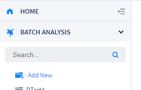
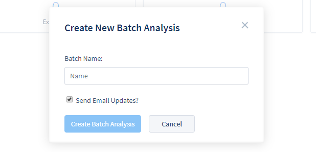
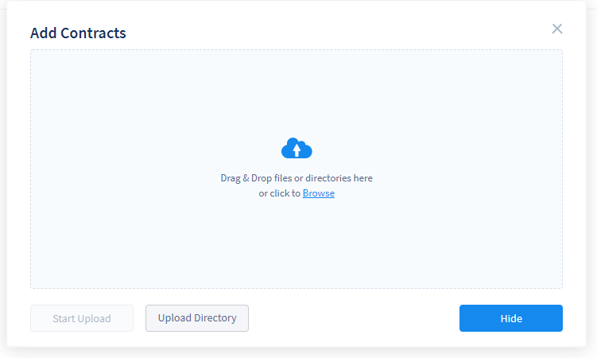
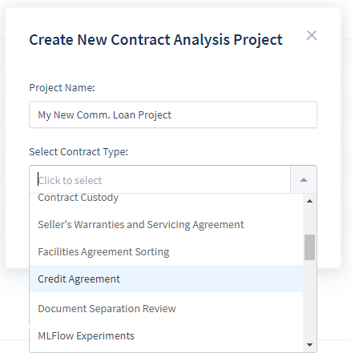
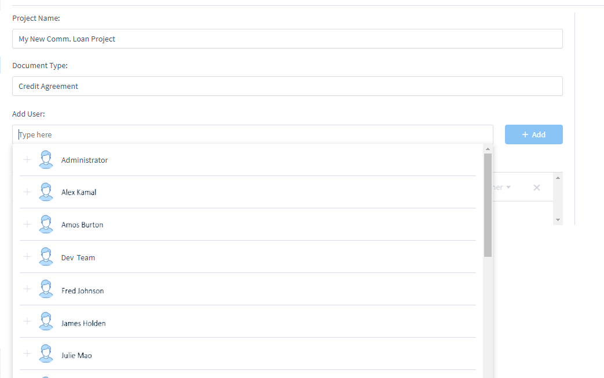
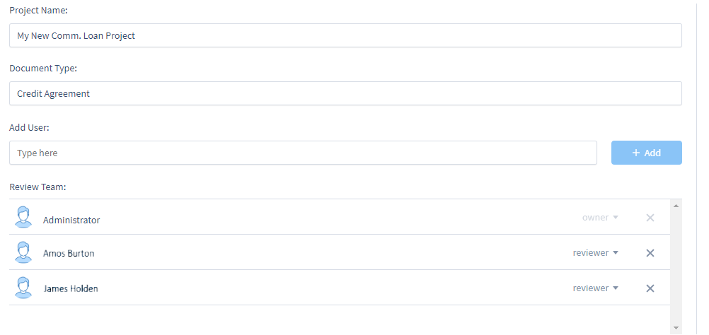
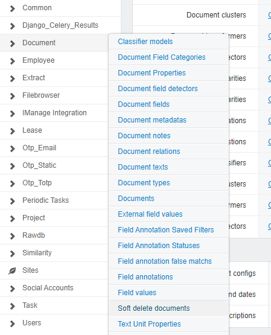

## Creating and Managing Projects

When you first log in to ContraxSuite, you'll see that there are two general types of projects that you can create: [Batch Analysis](#batch-analysis) and [Contract Analysis](#contract-analysis).

  

Clicking on "New Batch Analysis" or "New Contract Analysis Project" will open up a project creation pop-up.

---

#### Batch Analysis

You can also go to "Batch Analysis" in the main menu (left pane) and click "Add New". You do not need to select a [Document Type](./../power_users/create_document_type) for Batch Analysis, as Batch Analysis is used for those situations when you may not know exactly what kind of documents you're uploading.

  

  

In the "Create New Batch Analysis" pop-up, type in the name you would like for your new Batch Analysis. You can also check the box underneath the name form in order to receive an email when your document uploading and parsing is completed, and your documents are ready to analyze. After naming your project and clicking "Create Batch Analysis", you will be taken to the "Add Contracts" pop-up.

  

Browse for the specific documents you want, or drag and drop documents into the window. To add an entire folder of documents, click "Upload Directory". Click the "Start Upload" button. If you want to add more documents from other locations later, just click the "Add Contracts" button in the top right of the main viewing pane.

Your documents will be uploaded rather quickly, though times may vary depending on the size and number of documents. Once documents are uploaded, ContraxSuite will begin parsing. Parsing usually takes a bit more time, but you can navigate away from the ContraxSuite page while parsing is ongoing, and return to your project after parsing is complete.

Once your documents are uploaded into your Batch Analysis project, clicking on your new project will take you to the [Clustering page](./batch_analysis).

---

#### Contract Analysis

To create a Contract Analysis project, click on "New Contract Analysis Project" from the homescreen, or click on "Contract Analysis Project" in the main menu (left pane) and click "Add New". In the pop-up, choose a name for your project, and choose a [Document Type](../power_users/create_document_type).

  

After naming your project and clicking "Create Project", you will be taken to the "Add Contracts" pop-up.

  

Browse for the specific documents you want, or drag and drop documents into the window. To add an entire folder of documents, click "Upload Directory". Click the "Start Upload" button. If you want to add more documents from other locations later, just click the "Add Contracts" button in the top right of the main viewing pane.

Once you have created a Contract Analysis project, if you are an admin or power user, you may want to set up permissions for reviewers and other resources who will be using this project. To do this, click "Settings" in the upper right of the main viewing screen for the project.

  

On the Settings page, you can change the project name. The Document Type is listed underneath the project name (though you **cannot** change the Document Type after the project has been created). If you would like to add a reviewer to the project, you can select a reviewer from the "Add User" drop-down. All eligible reviewers will be listed in alphabetical order by their first name. You can either scroll through the drop-down, or type the first few letters of the reviewer you're looking for into the search bar.

  

The reviewers you've selected to add to the project will be listed in the search bar. Once you've selected the reviewers you want to add to the project, click the "+ Add" button. The added reviewers will be displayed in the "Review Team" list, with their ranks (*e.g.*, "Reviewer", "Owner") listed next to their name.

  

If you have administrator privileges, you can change the rank of individuals in a project to expand or contract their permissions (*e.g.*, Reviewers cannot add Document Types or Fields; if you wanted to give a reviewer the permission to create Document Types or Fields, you would need to upgrade their rank here).

#### Deleting Documents

Users can delete a Batch Analysis or a Contract Analysis Project in ContraxSuite by opening the project and selecting **Settings** > **Delete Project**.

ContraxSuite's machine learning algorithms can only be successful at learning and improving over time if documents are not completely removed upon deletion. If a reviewer deletes a document, this document will no longer appear in the project in question; however, that document will be still be maintained at the database level to ensure that machine learning is not negatively impacted without administrator approval.

Fully deleting documents from a ContraxSuite instance requires administrator approval. This extra level of approval ensures that a user does not accidentally delete documents that contain information valuable to algorithms that power users or project administrators wish to maintain for ongoing and future projects.

If you are an administrator who wishes to completely remove a deleted document from a project, follow the steps below. **Note:** *To permanently delete a document from any project, you must first delete it from that project in the main ContraxSuite UI*

**1.** In the main menu, navigate to "Data Science" and then click "Document Explorer".

  

**2.** In the "Document Explorer" interface, navigate to "Administration" and then to "Admin Site".

  

**3.** From the Admin Site, navigate to "Document" and then to "Soft delete documents".

  

**4.** Use the search bar to search for the individual filename. You can also search via the project name or the Document Type.

  

**5.** Select the documents you wish to delete, select "Delete checked documents" in the choice form below, then click "Go".

  

**6.** A confirmation page will appear.

  

Double-check that you have not selected documents you did not intend to select. Click "go back" to return to the search and selection screen. Click "Yes, I'm sure" to delete your selected documents. This process may take several seconds, or up to several minutes, depending on the size and number of documents chosen.

---

Click the "Next" button below to learn more about Batch Analysis projects. For more on how to review documents, [click here](./contract_analysis).