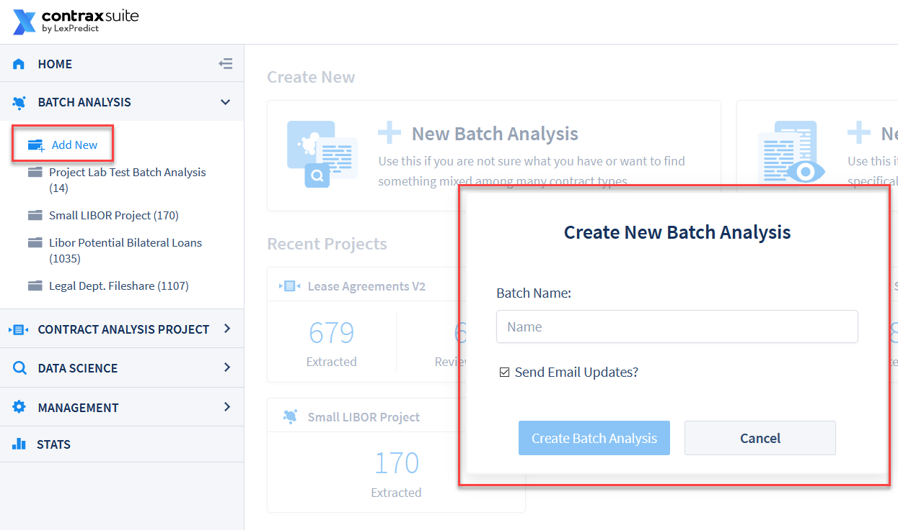
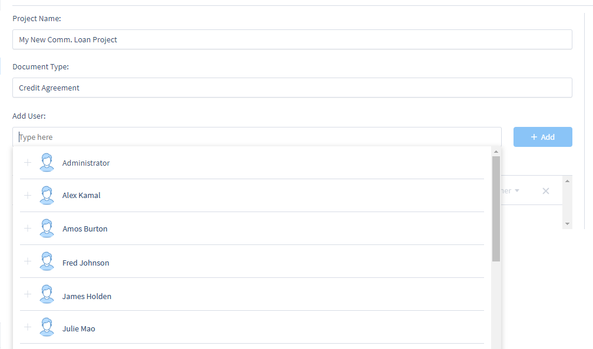

## Creating and Managing Projects

When you first log in to ContraxSuite, you'll see that there are two general types of projects that you can create: [Batch Analysis](#batch-analysis) and [Contract Analysis](#contract-analysis).

  

Clicking on "New Batch Analysis" or "New Contract Analysis Project" will open up a project creation pop-up.

---

#### Batch Analysis

You can also go to **Batch Analysis** in the main menu on the left and click **Add New**. You do not need to select a [Document Type](./../power_users/create_document_type) for Batch Analysis, as Batch Analysis is used for those situations when you may not know exactly what kind of documents you're uploading.

  

In the "Create New Batch Analysis" pop-up, type in the name you would like for your new Batch Analysis. Check the box underneath the name form in order to receive an email when your document uploading and parsing is completed and your documents are ready to analyze (this box is checked by default). After naming your project and clicking "Create Batch Analysis", you will be taken to the "Add Contracts" pop-up.

  

Browse for the specific documents you want, or drag and drop documents into the window. To add an entire folder of documents, click "Upload Directory" (*Note: If uploading a `.zip` folder, treat it as a file and either click "Browse" and browse for the `.zip` folder, or drag-and-drop the folder into the pop-up window*). Click the "Start Upload" button. If you want to add more documents from other locations later, just click the "Add Contracts" button in the top right of the main viewing pane.

Upload times may vary depending on the size and number of documents. Once documents are uploaded, ContraxSuite will begin parsing. Parsing usually takes a bit more time, but you can navigate away from the ContraxSuite page while parsing is ongoing, and return to your project after parsing is complete.

Once your documents are uploaded into your Batch Analysis project, clicking on your new project will take you to the [Clustering page](./batch_analysis). If you clicked the checkbox to receive email updates, you will receive an email when uploading and parsing is complete.

---

#### Contract Analysis

To create a Contract Analysis project, click on "New Contract Analysis Project" from the homes page, or click on **Contract Analysis Project** in the main menu and click **Add New**.

  

In the pop-up, choose the following:

* Give your project a **Project Name**.
* Choose a **[Document Type](../power_users/create_document_type)**.
* For Technical Admins, clicking **Advanced** will display options for choosing either the Default Term Set (recommended), or [uploading custom term sets](../doc_exp/custom_project_terms).

**Note on Custom Term Sets**: Default legal terms are all always extracted at document upload, and these terms are used by LexNLP extractors to find and annotate default Data Entities. ContraxSuite allows Admin and Power Users to upload a [custom term set](../doc_exp/custom_project_terms), and it can be selected as part of the document upload process to have the system extract those Terms in addition to, or instead of, the default terms. (*Note: This affects clustering by Terms, and will also have an effect on machine learning down the line.*)

After naming your project and clicking "Create Project", you will be taken to the "Add Contracts" pop-up.

  

Browse for the specific documents you want, or drag and drop documents into the window. To add an entire folder of documents, click "Upload Directory" (*Note: If uploading a `.zip` folder, treat it as a file and either click "Browse" and browse for the `.zip` folder, or drag-and-drop the folder into the pop-up window*). Click the "Start Upload" button. If you want to add more documents from other locations later, just click the "Add Contracts" button in the top right of the main viewing pane.

Once you have created a Contract Analysis project, if you are an admin or power user, you may want to set up permissions for reviewers and other resources who will be using this project. To do this, click "Settings" in the upper right of the main viewing screen for the project.

  

On the Settings page, you will see the following project-level information:
* Project Name - Change a Project Name using the form.
* Document Type - A Document Type ***cannot*** be changed once a project is created.
* Detect Field Values - Click this button to re-run Field Detectors on a project (*see [Running Detect Field Values](./create_manage.html#running-detect-field-values) below*).
* Make Searchable PDFs - Click this button to process PDFs for searchability.
* Toggle "Clause-Level Review" (*see [the Clause Review page](./contract_clause_analysis) for more*)
* An "Add User" form. Click the form for a drop-down list of all eligible users, listed in alphabetical order by first name (*see below*).
* A list of users already assigned to the project, with their permission level accessible via a drop-down to the right (Administrators are able to change a user's permissions).
  * **Junior Reviewer:** Can only see and edit documents assigned to them. They cannot delete the project or the documents in it, add users or documents to the project, or perform bulk assignment or status changes.
  * **Reviewer:** Has all the same access as Junior Reviewer, and can additionally see and edit all documents in the project, regardless of assignment.
  * **Reviewer Upload and Manage:** Has all the same access as a Reviewer, and can additionally upload documents and perform bulk assignment and status changes.
  * **Project Owner:** Has all the same access as Reviewer Upload and Manage, and can additionally delete the project, delete documents from the project, and add users to the project.

To add users to a project, type in the **Add User** form to search for users in a drop-down list of all users with access to the ContraxSuite instance.

  

The users you've selected to add to the project will be listed in the search bar. Once you've selected all users you want to add to the project, click the **+ Add** button. The new users will now be displayed in the "Review Team" list, with their ranks (*e.g.*, "Owner", "Can upload", or "Reviewer") listed next to their name.

  

If you have administrator privileges, you can change the rank of individuals in a project to expand or contract their permissions (*e.g.*, Reviewers cannot add Document Types or Fields; if you wanted to give a reviewer the permission to create Document Types or Fields, you would need to upgrade their rank here).

*For more on user permissions, jump to the [User Roles](../power_users/user_roles) page.*

---

#### Deleting Documents

Users can delete a Batch Analysis or a Contract Analysis Project in ContraxSuite by opening the project and selecting **Settings** > **Delete Project**.

ContraxSuite's machine learning algorithms can only be successful at learning and improving over time if documents are not completely removed upon deletion. If a reviewer deletes a document, this document will no longer appear in the project in question; however, that document will be still be maintained at the database level to ensure that machine learning is not negatively impacted without administrator approval. Requiring administrator approval before fully deleting documents ensures that users do not accidentally erase documents that contain information valuable to algorithms produced for ongoing and future projects.

If you are an administrator, and wish to completely remove deleted documents from a project, follow the steps below. **Note:** *To permanently delete a document from any project, you must first delete it from that project in the main ContraxSuite UI*

**1.** In the main menu, go to **Data Science** > **Document Explorer**.

  

**2.** In the Document Explorer's main menu, go to **Administration** > **Admin Site**.

  

**3.** From the Admin Site, go to **Document** and then find **Soft delete documents**.

  

**4.** Use the search bar to narrow the list of individual documents. You can also search via project name or Document Type.

  

**5.** Select the documents you wish to delete, select "Delete checked documents" in the choice form below, and click the "Go" button.

  

**6.** A confirmation page will appear.

  

Double-check that you have not selected documents you did not intend to select. Click "go back" to return to the search and selection screen. Click "Yes, I'm sure" to delete your selected documents. This process may take several seconds, or up to several minutes, depending on the size and number of documents chosen.

---

#### Running "Detect Field Values"

Users often create Document Types, Fields, and Field Detectors, then create a project, and then upload documents to that project, only to discover later that they need to make changes to their Fields and/or Field Detectors.

ContraxSuite parses uploaded documents, then runs Field Detectors to extract data and populate the data in the Grid Views and Annotator. If you make changes to any Fields and/or Field Detectors, re-running this task will allow you to see the effects of any and all changes you've made. Follow the steps below to detect, or re-detect, Field Values in a project.

**1.** Open a project in the Grid View and click "Settings" in the upper right corner.

  

**2.** On the Settings page, click "Detect Field Values".

  

**3.** A pop-up modal window will appear in which you can select specific options for how the system should re-run detection:

  

* **Select Level**: You can either choose "Select Documents" to select individual documents in the project to re-run detection for, or select "Whole Project".
* **Existing Field Data**: 
  * *Maintain Reviewed Data*: Projects and documents marked "Completed" or "Excluded", and any Field data that has been modifed by users, will not be altered.
  * *Delete all field data from project and run fresh extraction*: Excluding projects and documents marked "Completed" or "Excluded", all Field data will be erased and Fields will be re-populated by current Fields and Field Detectors.
* **Do not write detected values to DB**: Checking this box means that the task will not write any extracted values to the database. *Recommended for testing.*

**4.** Click "Run Field Detector" once you have selected parameters. A new pop-up will appear that displays the progress of the detection task.

  

**5.** When the detection task has reached 100%, a new pop-up will appear that displays a log of all the individual system tasks that were conducted for this task. Click the "Copy Logs" button to copy this information. This information may be useful for IT personnel or Technical Admins who are troubleshooting individual Fields and Field Detectors. When logs are successfully copied, the "Copy Logs" button will change to say "Copied!".

  
  
---

#### Running "Make Searchable PDFs"

Some documents are not searchable, often because they are scanned images in `pdf` format that do not contain any metadata and so are not searchable using `CTRL + F`. ContraxSuite makes it easy to turn un-searchable PDFs into searchable PDFs, using a simple process similar to "Detect Field Values" above.

**1.** Open a project in the Grid View and click "Settings" in the upper right corner.

  

**2.** On the Settings page, click "Make Searchable PDFs".

  

**3.** A pop-up modal window will appear in which you can select either the Whole Project, or specific documents, to convert into searchable PDFs:

  

**4.** Click "Process PDFs". A new pop-up will appear that displays the progress of the task.

  

**5.** When the task has reached 100%, a new pop-up will appear with the option to copy the logs from the system tasks that were conducted for this task. This information may be useful for IT personnel or Technical Admins who are troubleshooting parsing and processing issues. When logs are successfully copied, the "Copy Logs" button will change to say "Copied!".

  IMAGE PENDING