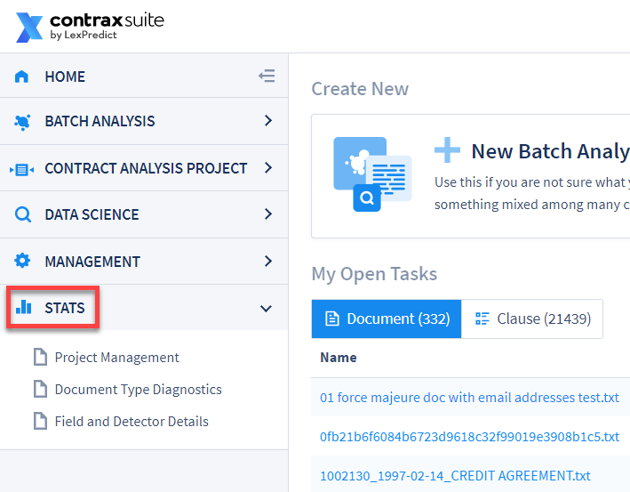

## Stats

To access statistics and graphics about project-level data, documents, Fields, Field Detectors, and more, go to the **Stats** page from the main menu. You will see a drop-down showing three types of Stats pages that you can choose from:
* Project Management
* Document Type Diagnostics
* Field and Detector Details

  

---

#### Project Management Page

Go to **Stats** in the main menu, and go to **Project Management**. The following page will be displayed.

  

The Project Management Stats page displays:
1. A **Project Stats** table
2. A second table displaying **Users/Roles**
3. A **Project Statuses** pie chart that dynamically displays project-level statuses from the Project Stats table, including when Filters are engaged.

The "Project Stats" table displays high-level project-related information, and can be filtered by pressing the "Filter" button in the top right of the table.

  

* **Projects**: This column shows all projects in the ContraxSuite instance.
* **Doc Type**: This column shows the chosen Document Type for each project.
* **Total Documents**: This column shows the total documents in the project.
* **% Complete**: This column expresses, as a percent, the number of documents within the project that have been marked "Completed".
* **% In Progress**: This column expresses, as a percent, the number of documents within the project that have been marked "In Progress".
* **% Loaded**: This column expresses, as a percent, the number of documents within the project that have been uploaded.
* **Total Clauses**: This column shows the number of individual clauses in the document that can be discretely seen in Clause Level Review for that project.
* **% Clauses Approved**: This column expresses, as a percent, the number of clauses within the project that have been marked "Approved".
* **% Clauses Rejected**: This column expresses, as a percent, the number of clauses within the project that have been marked "Rejected".
* **% Clauses Unreviewed**: This column expresses, as a percent, the number of clauses within the project that have not yet been reviewed.
* **AVG. OCR RATING**: This column shows a rating, from 0 to 9, that represents the average of how well OCR was run on the documents in the project, with "0" being the least precise, and "9" being the most precise.

The "Users/Roles" table displays high-level user-related information, and can be filtered by pressing the "Filter" button in the top right of the table.

  

* **Users**: This column shows each username on the ContraxSuite instance, alphabetical by default.
* **Role**: This column displays the [Role](../power_users/user_roles.html#contraxsuite-user-permissions) that this user has been assigned.
* **Total Projects**: This column displays the number of projects that the user has been added to the Reviem Team for.
* **Total Docs Assigned**: This column displays the number of documents that have been assigned to the user.
* **% Docs Complete**: This column expresses, as a percent, the proportion of documents that the user has marked "Completed".
* **% Docs To-Do**: This column expresses, as a percent, the proportion of documents that the user has not yet marked "Completed" or "Excluded".
* **Total Clauses Assigned**: This column displays the number of clauses that are assigned to the user (this number includes clauses assigned that are in documents that may NOT be assigned to the user).
* **% Clauses Complete**: This column expresses, as a percent, the proportion of clauses assigned to the user that the user has marked "Completed".
* **% Clauses To-Do**: This column expresses, as a percent, the proportion of clauses assigned to the user that the user has not yet marked "Completed" or "Excluded".

Finally, the "Project Statuses" pie chart dynamically displays project-level statuses from the Project Stats table, including when Filters are engaged. Click the "Export" button to download either a JPG or PNG image of the pie chart.

  

---

#### Document Type Diagnostics Page

The Document Type Diagnostics page displays high-level information at the Document Type level. The page will at first display no data. Select a Document Type from the drop-down menu to select one of the Document Types on the ContraxSuite instance.

  

After selecting a Document Type, two pie charts will appear:
* **Detection Strategy**: This pie chart displays the percentage of Fields in the Doc Type of each type of [Detection Strategy](../power_users/create_document_field.html#field-detection-general).
* **Field Data**: This pie chart displays the percentage of Fields in the Doc Type by their [Field Type](../power_users/create_document_field.html#general).

  

Scrolling down the page after the pie charts, users will see a series of bar charts. Each bar represents a Field in the Document Type. The bar chart has sections of multiple colors, displaying the following aspects of the Field:
* **Total** number of annotations/extractions for that Field, across the entire ContraxSuite instance.
* The number of annotations/extractions that are unreviewed and still **To-Do** at the clause level.
* The number of annotations/extractions that are **Rejected** at the clause level.
* The number of **System Generated Accepted** clauses for that Field.
* The number of **User Generated** annotations/extractions for that Field.

  

---

#### Field and Detector Details

The "Field and Detector Details" page displays high-level information related to Fields and Field Detectors across the entire ContraxSuite instance.

  

This page contains one table of Field Detector information, which can be filtered by engaging the "Filter" button in the top right of the table.

  

Engaging Filters will dynamically re-draw the three charts on the page. The charts display the following information:
* **Detection Strategy**: This pie chart displays the percentage of Fields in the entire ContraxSuite instance of each type of [Detection Strategy](../power_users/create_document_field.html#field-detection-general).
* **Field Detectors**: This bar chart displays the top 6 Document Types within the ContraxSuite instance, by number of Fields and Field Detectors.
* **Hidden Fields**: This bar chart displays the top 7 Document Types within the ContraxSuite instance, by the percentage of that Doc Type's Fields that are marked "Hide Until" or "Hidden Always".

Click the "Export" button to the top right of any of the charts to download either a JPG or PNG image of the pie chart.